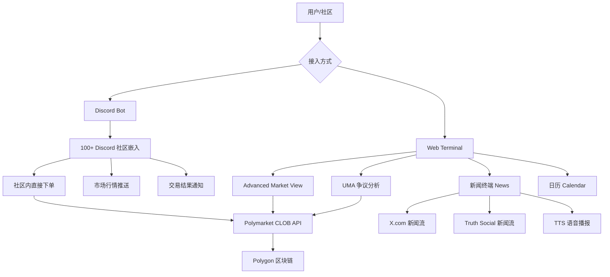
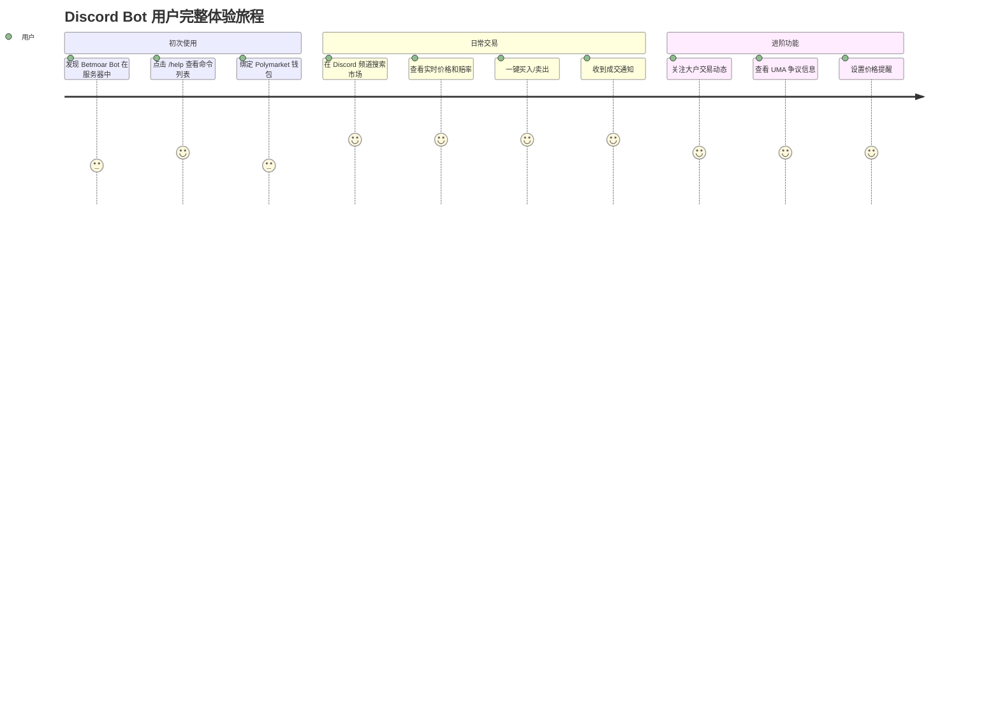
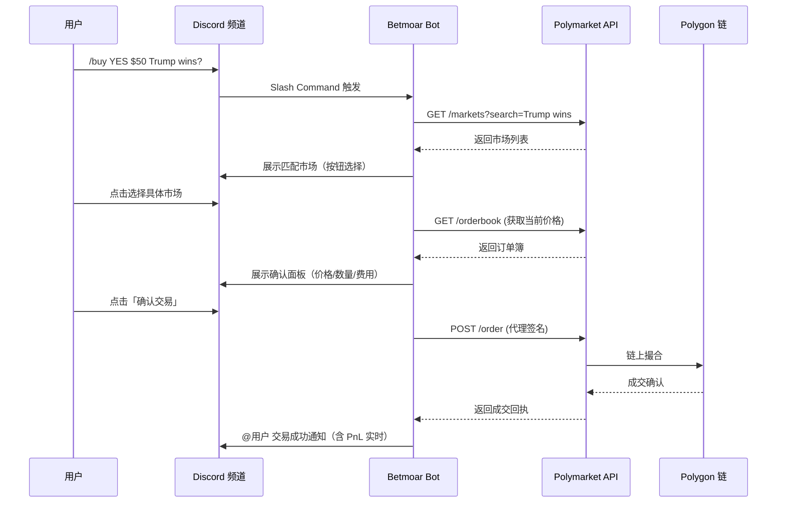
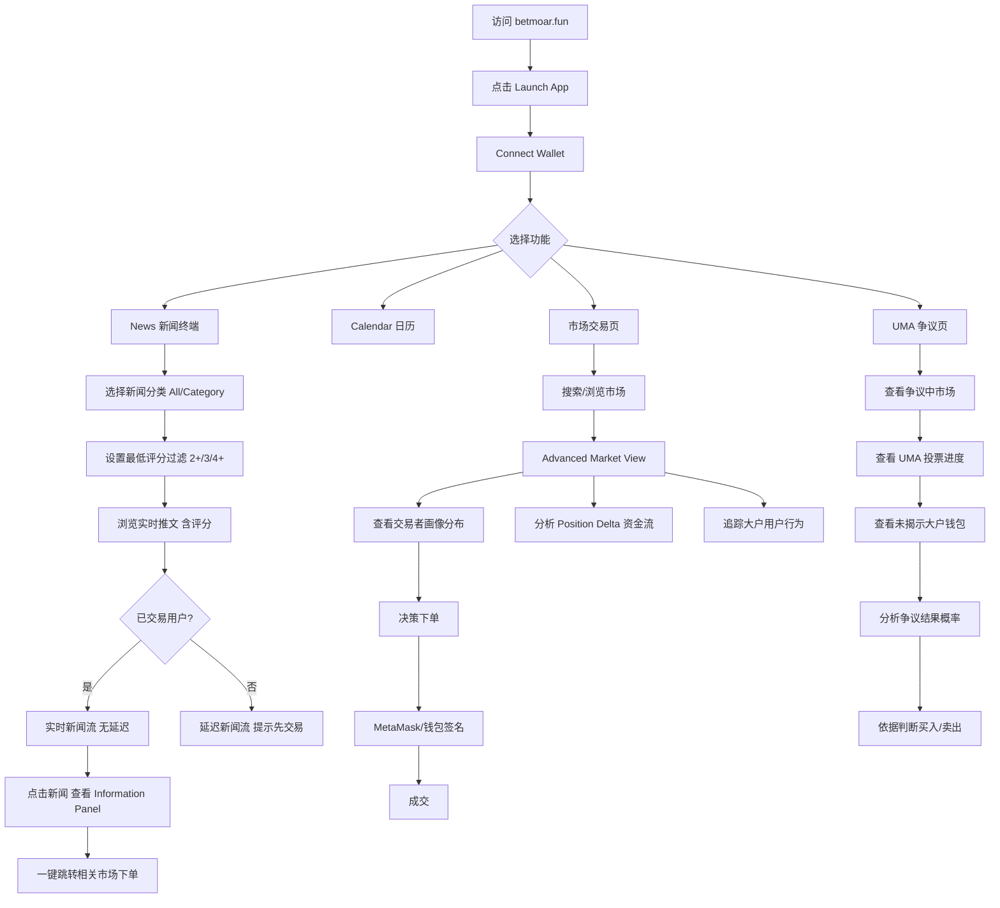
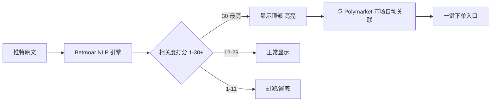
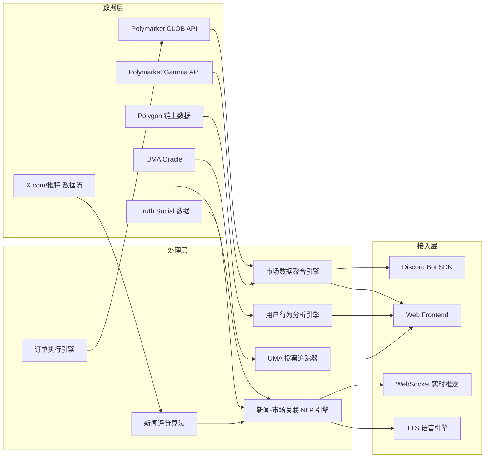
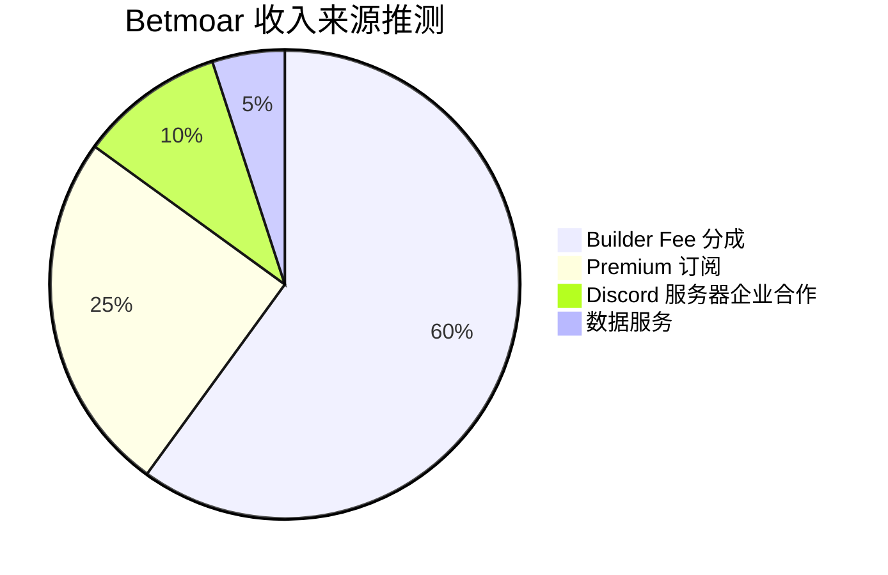

# Betmoar.fun — 深度分析报告

> 数据日期：2026-03-24  
> Polymarket Builder Program 排名：**#1**  
> 近1月交易量：**$208.08M**  
> 累计交易量：**$2,160,684,459**  
> 累计用户利润：**$33,836,880**  
> 公司主体：**Betmoar Innovation Limited**

---

## 1. 市场情况

### 1.1 市场定位
Betmoar 定位为 **预测市场社区基础设施提供商**，核心切入点是 Discord 生态——用户无需离开 Discord 即可在社区中直接交易 Polymarket。同时提供独立 Web 交易终端（Web Terminal）。

官网口号：「Bet Bigger. Faster. Smarter.」

### 1.2 市场规模与地位
- Polymarket Builder Program **排名第一**，月交易量 $208M，是第二名 PolyCop ($52.9M) 的 **约 4 倍**
- Polymarket **官方指定 Discord Bot 服务商**（官网明确写明 "official bot provider for Polymarket"）
- 服务 **100+ Partner Discord 服务器**（首页 JS 动态加载，具体数字待确认）
- 累计交易量超 **$21.6 亿**

### 1.3 竞争格局
- Discord Bot 赛道：Betmoar 处于绝对垄断地位，无直接竞争者
- Web 终端赛道：与 Polymtrade、Stand.trade、Kreo 竞争，但 Betmoar 功能更综合
- 差异化壁垒：UMA 争议分析是独特功能，新闻评分系统全市场唯一

---

## 2. 业务架构

### 2.1 核心业务模块

| 模块 | 描述 | 战略价值 |
|------|------|----------|
| Discord Bot | 社区嵌入式交易 | 流量入口，最大差异化 |
| Web 终端 | 专业交易界面 | 深度用户留存 |
| UMA 集成 | 争议市场分析 | 独特护城河 |
| 新闻终端 | 实时新闻+市场映射+评分 | 信息差优势 |
| 日历 | 即将到来的市场事件 | 辅助决策 |

---

## 3. 用户体验路径

### 3.1 Discord Bot 用户路径

### 3.2 Discord Bot 详细交互流程

### 3.3 Web 终端用户路径

### 3.4 新闻终端评分机制（实测数据）

**实测新闻评分样例（2026-03-24）**：
| 新闻来源 | 内容摘要 | 评分 |
|---------|---------|------|
| @ajenews | UN rights council debate on Iran's Gulf attacks | **30** |
| @cgtneurope | Explosions reported west of Jerusalem | **29** |
| @cgtneurope | Russia concerns about Iran war Caspian Sea | **30** |
| @cgtneurope | Qatar foreign ministry statement | **6** |

---

## 4. 技术架构

### 4.1 技术栈推断
- **Bot 框架**：Discord.js (Node.js)
- **区块链交互**：ethers.js / Polygon Web3 Provider
- **API 集成**：Polymarket CLOB REST + WebSocket
- **新闻处理**：X.com API + NLP 关键词匹配 + 评分算法
- **TTS**：Web Speech API 或云端 TTS (AWS Polly / Google TTS)
- **前端**：React/Next.js（推测）
- **公司主体**：Betmoar Innovation Limited（英国或开曼注册）

---

## 5. 核心功能与交易技术壁垒

### 5.1 功能一：Discord 嵌入式交易
- Slash Command 和 Button 交互直接下单
- 支持市场搜索、价格查询、下单、持仓查看
- **壁垒**：Polymarket 官方认证 + 100+ 服务器关系网络，竞争对手难以复制渠道信任

### 5.2 功能二：Advanced Market View
- 交易者画像快速分解（大户/散户分布）
- 高级交易记录分析与用户追踪
- 市场 Position Delta 分析（资金流向）
- **壁垒**：链上历史数据积累越多越精准，早进入者数据优势明显

### 5.3 功能三：UMA 争议市场分析（独家）
- 深度追踪 UMA 投票过程与讨论
- 实时显示未揭示投票的大户钱包
- 争议市场直觉化界面
- **壁垒**：UMA 协议理解门槛极高，整个 Builder 生态唯一做此功能的平台

### 5.4 功能四：新闻交易终端（实测详情）
- **实时推特流**：聚合 @ajenews、@cgtneurope 等主流新闻账号
- **评分系统（1-30+）**：NLP 算法评估新闻与预测市场相关性
- **分类过滤**：All / Min Score 2+ / 3 / 4+ 多级过滤
- **Delayed Feed 机制**：必须先连接钱包并在 Betmoar 交易，否则只能看延迟流（强制留存）
- **Information Panel**：点击新闻展示详细分析 + 关联市场入口
- **TTS 语音播报**：重要新闻自动朗读，不错过任何信息
- **壁垒**：评分算法 + 强制交易门槛 = 双重锁定

### 5.5 综合壁垒评估

| 壁垒类型 | 评分(1-10) | 说明 |
|---------|-----------|------|
| 渠道壁垒 | 9.5 | 官方认证 Discord Bot，100+ 服务器关系网络 |
| 数据积累 | 8 | 链上历史 + 用户行为数据持续积累 |
| 功能深度 | 8.5 | UMA 分析是独特护城河，其他平台不做 |
| 技术壁垒 | 7 | 技术可复制，但工程量大 |
| 品牌认知 | 9 | 预测市场社区中认知度极高 |
| 网络效应 | 8.5 | 更多社区→更多用户→更多数据→更好产品 |

---

## 6. 商业模式

### 6.1 收入来源
1. **Builder Fee 分成**：通过 Polymarket Builder Program，每笔交易约 0.5-1% 分成
   - 月交易量 $208M × 0.5% = **$1.04M/月**（理论测算）
2. **Premium 订阅**：新闻实时流需先交易解锁，高级分析功能可能付费
3. **Discord 服务器企业合作**：为大型社区提供定制 Bot 的 B2B 收入

### 6.2 商业模式画布

| 要素 | 内容 |
|------|------|
| 价值主张 | 让社区用户无需离开 Discord 即可参与预测市场；专业交易者获得信息优势工具 |
| 客户细分 | Discord 社区管理员（B2B）+ 活跃预测市场交易者（B2C）|
| 渠道 | Discord Bot、Web 终端、X.com 社媒 |
| 收入流 | Builder Fee 分成、订阅收费、企业合作 |
| 核心资源 | Polymarket 官方认证、链上数据积累、UMA 协议理解深度、新闻评分算法 |
| 核心活动 | Bot 维护、数据分析、新闻关联算法优化 |
| 关键合作 | Polymarket 官方、UMA 协议、Discord 平台、X.com |
| 成本结构 | 服务器基础设施、API 调用成本、团队开发维护 |

---

## 7. 待确认问题

- [ ] Discord Bot 的钱包托管方案？用户私钥如何保管（MPC/托管/代理签名）？
- [ ] Builder Fee 具体费率与 Polymarket 的分成比例？
- [ ] Premium 订阅定价？
- [ ] 首页「0 Community Members / 0 Partner Discord Servers」为何显示 0？JS 动态加载问题？
- [ ] 100+ Partner Discord Servers 具体有哪些？规模如何？
- [ ] TTS 使用的是浏览器原生还是云端服务？
- [ ] 团队规模和融资情况？Betmoar Innovation Limited 注册地？
- [ ] Calendar 功能的具体内容（404 无法访问）？

---

## 8. 总结

Betmoar 是 Polymarket Builder 生态中最成功的案例，月交易量 $208M 占整个生态约 **40% 份额**：

1. **渠道创新**：切入 Discord 这个加密社区最活跃平台，而非建另一个 Web 交易所
2. **官方背书**：Polymarket 官方认证，极高渠道壁垒
3. **功能差异化**：UMA 分析 + 新闻评分终端，全市场唯一
4. **网络效应**：越多社区接入→越多用户→越多数据→产品越好
5. **强制留存机制**：新闻实时流需先交易解锁，形成精妙的用户转化漏斗
