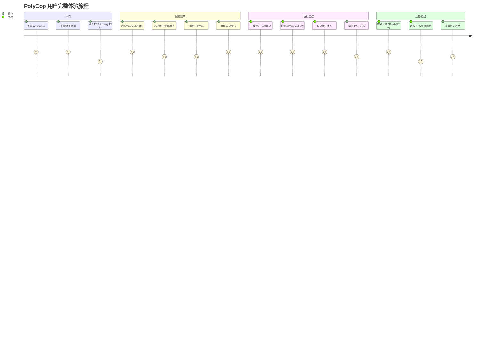
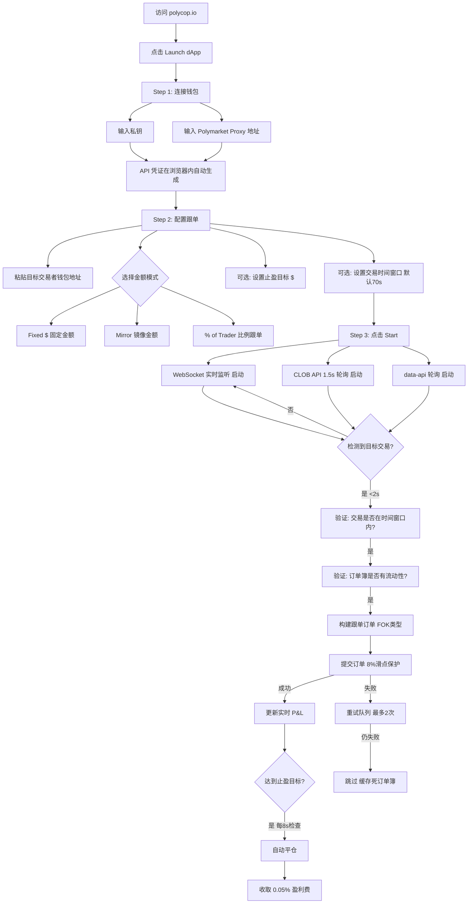
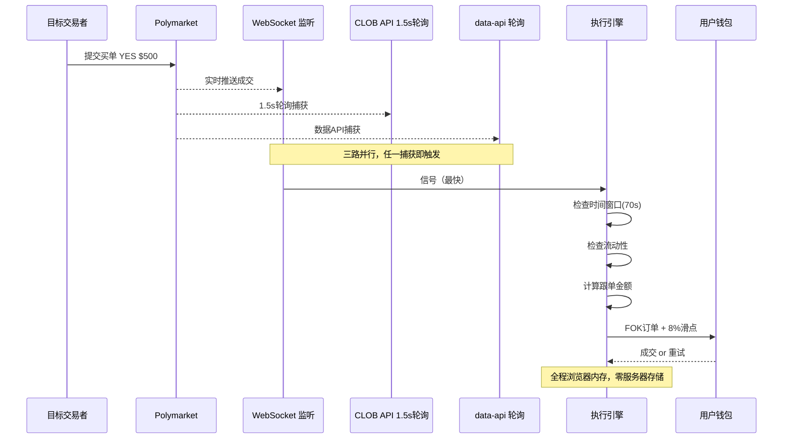
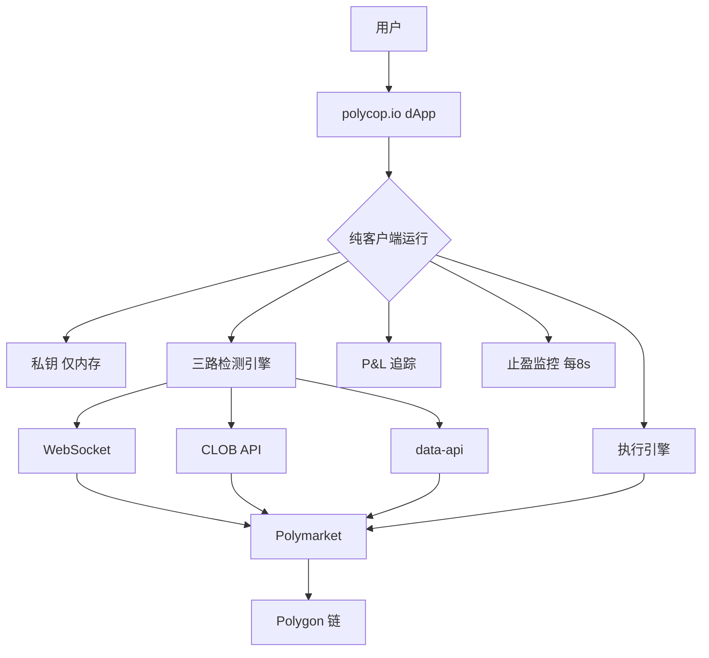
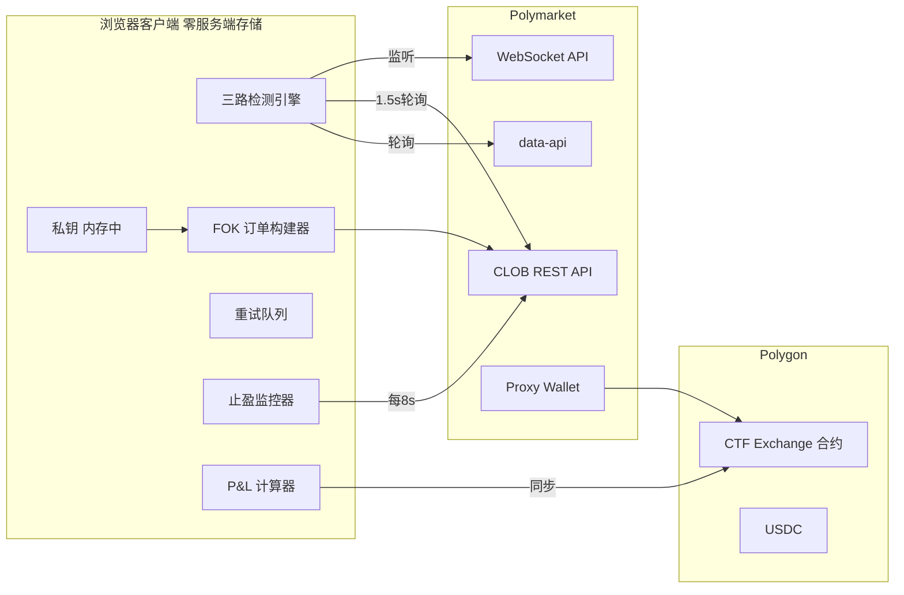
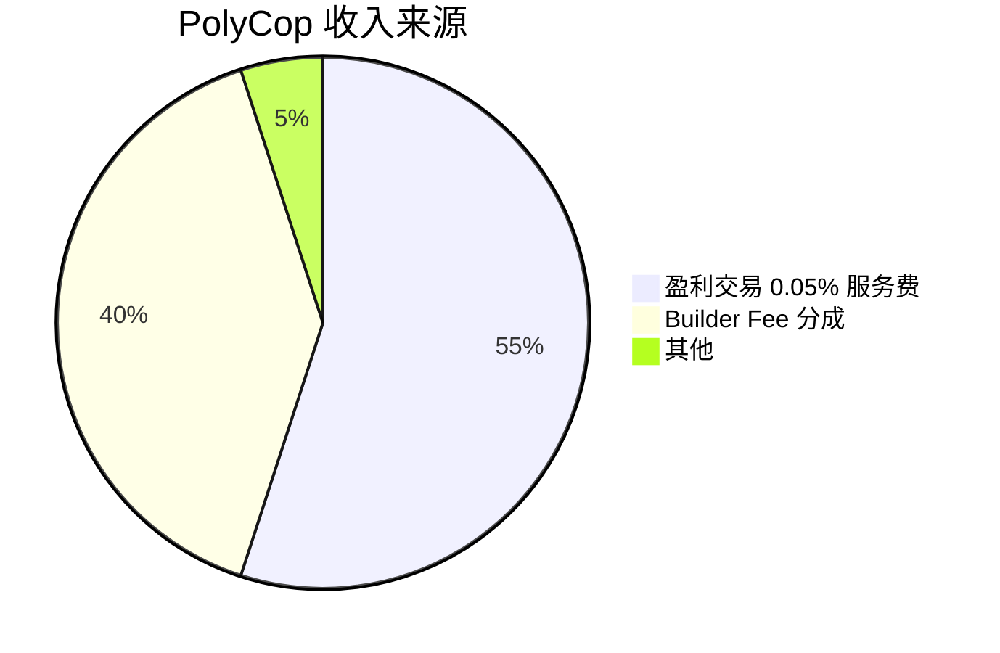

# PolyCop — 深度分析报告

> 数据日期：2026-03-24  
> Polymarket Builder Program 排名：**#2**  
> 近1月交易量：**$52.93M**  
> 官网：**polycop.io**

---

## 1. 市场情况

### 1.1 市场定位
PolyCop 定位为 **完全客户端侧的 Polymarket 复制交易 dApp**。口号：「BEAST MODE — 3 Detection Sources，Copy Any Trader on Polymarket Instantly」。

**核心主张**：
- 无需注册，连接钱包即用
- 所有数据和私钥仅在浏览器内存中运行，服务端零存储
- 收费仅在盈利时收取 0.05%（亏损不收费）

### 1.2 市场规模与地位
- Builder Program 排名 **第二**，月交易量 $52.93M
- 复制交易赛道领头羊，交易量约是 Polygun（同类 Telegram Bot）的 2 倍
- 完全无服务端存储，纯 dApp 架构

### 1.3 竞争格局
- **直接竞争**：Polygun（Telegram Bot 跟单，$27.4M），Stand.trade Copy Trade 模块
- PolyCop 专注 Web 端纯客户端，Polygun 专注 Telegram 托管模式，两者定位不同
- **差异化核心**：PolyCop 是「自托管 + 纯客户端」，Polygun 是「托管 + 跨链入金」

---

## 2. 用户体验路径

### 2.1 完整用户旅程

### 2.2 三步快速开始流程

### 2.3 三路并行检测架构（核心技术）

---

## 3. 业务架构

### 3.1 核心业务模块

| 模块 | 描述 | 技术特点 |
|------|------|----------|
| 三路并行检测 | WS + CLOB + data-api 同时监听 | <2s 检测速度 |
| FOK 订单执行 | Fill-or-Kill，全成或全撤 | 8% 滑点保护 |
| 顺序执行队列 | 防止同时多单耗尽余额 | 防余额透支 |
| 死市场缓存 | 跳过无流动性市场 | 减少无效尝试 |
| 止盈监控 | 每 8 秒检查所有持仓 | 自动平仓 |
| 实时 P&L | 链上同步持仓 + 未实现盈亏 | 实时更新 |

---

## 4. 技术架构

### 4.1 安全模型（重要）
- **私钥不离开浏览器**：用于程序化签名和执行，无需每次弹出钱包确认
- **无服务端存储**：PolyCop 不存储任何用户数据或凭证
- **风险**：用户必须将私钥输入浏览器，存在浏览器扩展/XSS 风险
- **与 Polygun 的区别**：Polygun 是托管式（私钥给 Polygun 服务器），PolyCop 是纯客户端

---

## 5. 核心功能与交易技术壁垒

### 5.1 三模式金额控制

| 模式 | 说明 | 适用场景 |
|------|------|----------|
| Fixed $ | 每次跟单固定金额，如 $50 | 稳健跟单 |
| Mirror | 完全镜像目标交易者金额 | 高信任跟单 |
| % of Trader | 按目标金额的百分比，如 50% | 比例控仓 |

### 5.2 交易年龄过滤（70s 窗口）
- 仅执行 70 秒内的新鲜交易信号，过期信号自动跳过
- 防止因网络延迟导致追高或踏空

### 5.3 技术壁垒评估

| 壁垒类型 | 评分(1-10) | 说明 |
|---------|-----------|------|
| 检测速度 | 9 | 三路并行 <2s，业界领先 |
| 安全模型 | 8 | 零服务端存储，用户信任度高 |
| 执行可靠性 | 8 | FOK + 重试 + 死市场缓存，完善的容错 |
| 盈利对齐 | 9 | 仅盈利收费 0.05%，与用户利益高度一致 |
| 先发数据积累 | 6 | 无服务端无历史数据积累（弱点）|
| 聪明钱发现 | 5 | 用户需自己找要跟的地址（弱点）|

---

## 6. 商业模式

### 6.1 收入模式
1. **盈利服务费 0.05%**：仅对盈利交易收费，亏损不收
   - 这是核心商业模式，与用户利益高度对齐
   - 月交易量 $52.93M，假设 60% 盈利 → $52.93M × 60% × 0.05% ≈ **$15.9k/月**
2. **Builder Fee 分成**：通过 Polymarket Builder Program 获得分成
   - $52.93M × 0.5% ≈ **$264k/月**
   - Builder Fee 是主要收入来源

### 6.2 与 Polygun 商业模式对比

| 维度 | PolyCop | Polygun |
|------|---------|--------|
| 架构 | 纯客户端 | 服务端托管 |
| 私钥 | 用户浏览器内存 | Polygun 服务器 |
| 收费 | 0.05% 盈利费 + Builder Fee | 1% 全交易量手续费 |
| 入金 | 需自有 Polygon USDC | 支持 4 链自动桥接 |
| 聪明钱发现 | 用户自选地址 | 内置 Smart Wallets 榜单 |

---

## 7. 待确认问题

- [ ] Stats 页面的具体数据（总用户数、总复制交易次数）？
- [ ] 「聪明钱」地址如何发现？是否有推荐社区/列表？
- [ ] 是否支持多地址同时跟单？
- [ ] Blog 中是否有进一步的技术文档？
- [ ] 团队背景和所在地？
- [ ] 是否计划加入 Smart Money 榜单（避免用户需自己找地址）？

---

## 8. 总结

PolyCop 的真实产品与初步调研预期有重大差异：

1. **完全客户端架构**：无服务端存储，与 Polygun 托管模式形成鲜明对比
2. **「BEAST MODE」三路检测**：WebSocket + CLOB + data-api 并行，<2s 检测速度是核心技术壁垒
3. **盈利对齐收费**：0.05% 仅收盈利交易，用户信任度极高
4. **FOK 订单 + 8% 滑点**：确保高填充率，工程设计完善
5. 月交易量 $52.93M（#2），在 Builder 生态中占约 **10% 份额**

**最大风险**：用户需手动寻找要跟踪的「聪明钱」地址，产品未提供发现机制，是明显短板。
