# Polymtrade — 深度分析报告

> 数据日期：2026-03-24  
> Polymarket Builder Program 排名：**#3**  
> 近1月交易量：**$28.30M**  
> 官网：**polym.trade**  
> 文档：**docs.polym.trade**  
> ⚠️ **重要更正**：Polymtrade 是**移动端优先（iOS + Android）**的交易终端，而非纯 Web 产品

---

## 1. 市场情况

### 1.1 市场定位
Polymtrade 定位为 **Polymarket 的第一个专属移动交易终端**，同时提供 Web 界面。口号：「Your gateway to mobile prediction markets」。

核心主张：
- **4x 更快**的网站性能（相比 Polymarket 官方）
- **移动原生 UI**（iOS App Store + Google Play 均已上线）
- **AI 驱动洞察**（55K+ 已解决市场数据训练）
- **自托管交易**（用户连接自有钱包，每笔交易自签名）

### 1.2 市场规模与地位
- Builder Program 排名 **第三**，月交易量 $28.30M
- Polymarket **唯一有原生 iOS + Android App** 的 Builder
- 三人团队，中欧，非 VC 支持
- 累计已销毁 **126.6M $PM** 代币

### 1.3 竞争格局
- **移动端**：唯一有原生 App 的 Builder，无直接竞争者
- **Web 端**：与 Stand.trade、Kreo 竞争，但 Polymtrade 移动端为核心差异
- **AI 功能**：内置 AI 预测，与 PolyTraderPro 等纯交易终端形成差异
- **Kalshi 支持**（路线图中）：即将对标 Kreo

---

## 2. 用户体验路径

### 2.0 注册、入金、交易、提现、领奖全流程（详细）

#### 2.0.1 注册流程（Web + 移动端）

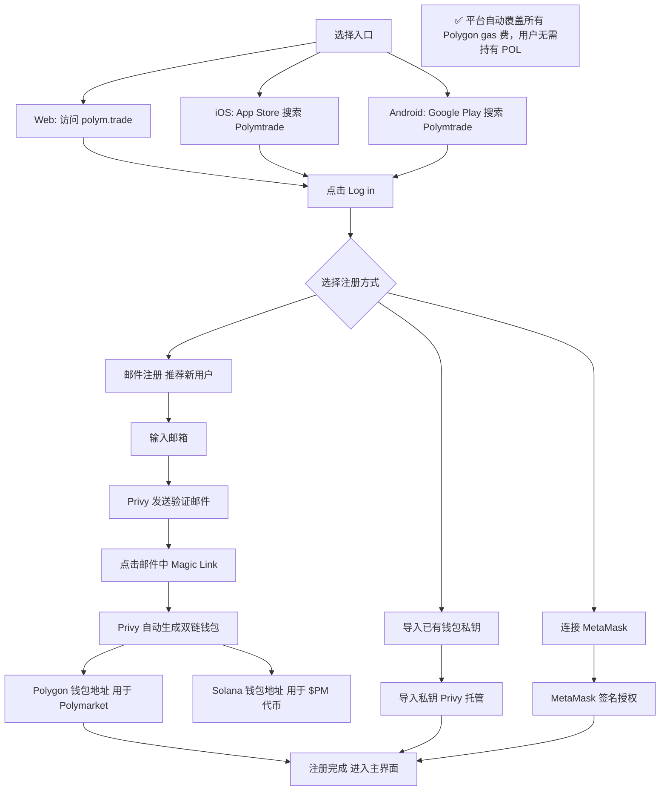

#### 2.0.2 入金流程（MoonPay 法币 + 加密货币）

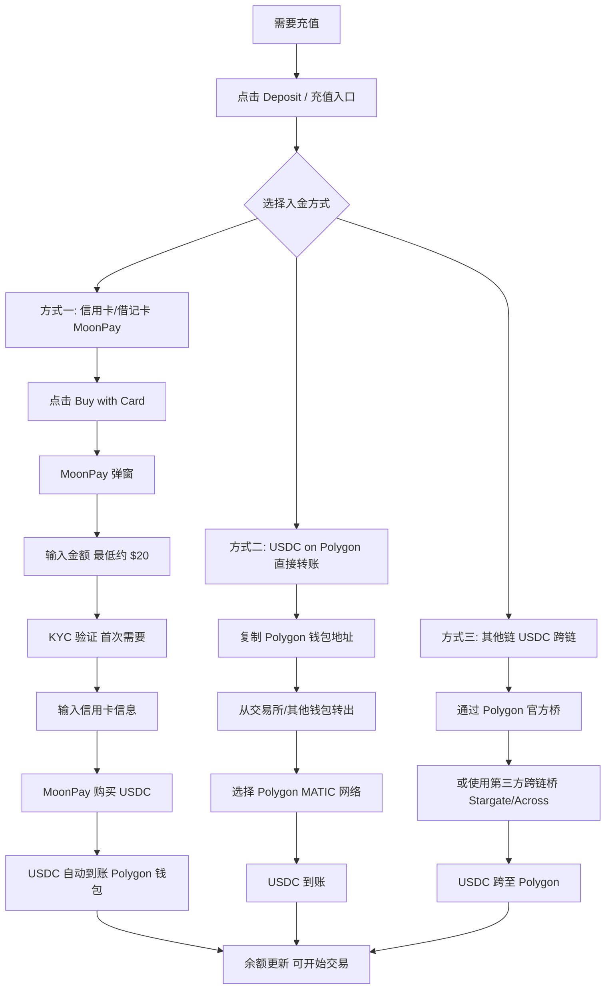

#### 2.0.3 交易执行流程（合并签名，零 gas）

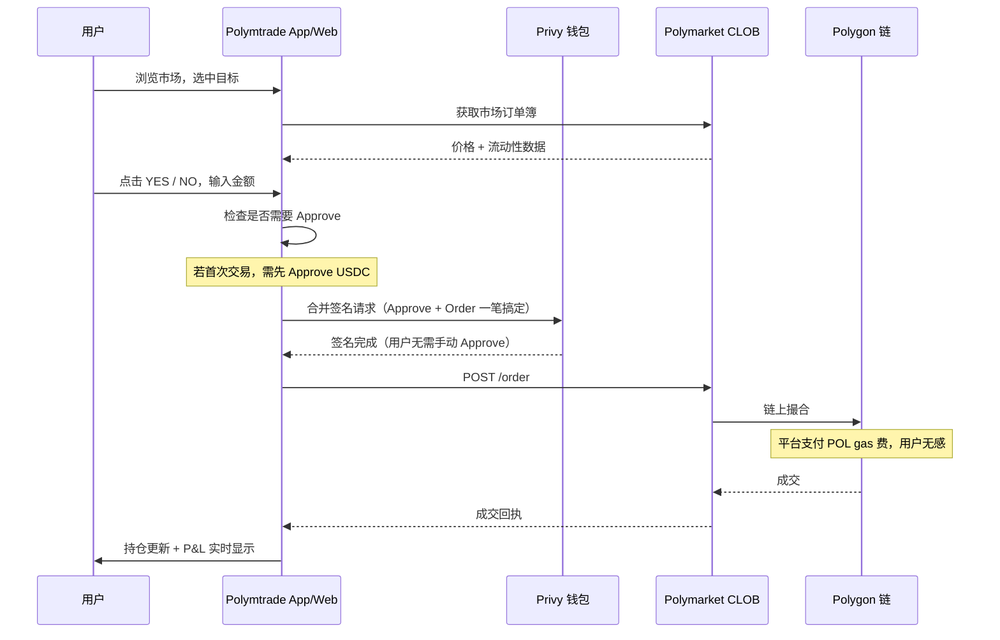

#### 2.0.4 $PM 代币持有/领奖流程

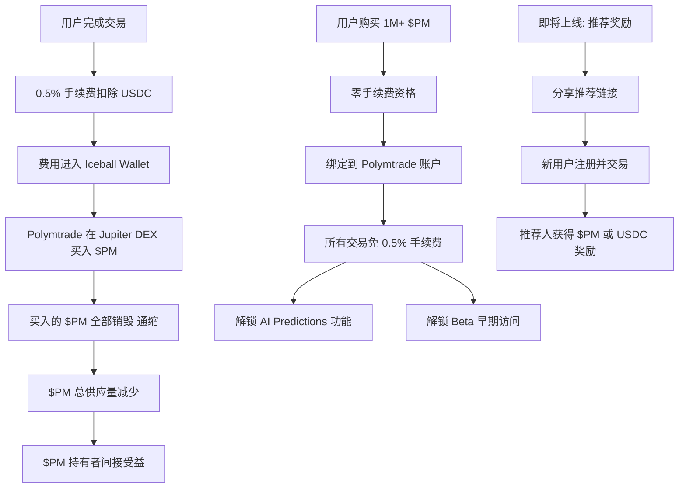

#### 2.0.5 提现流程

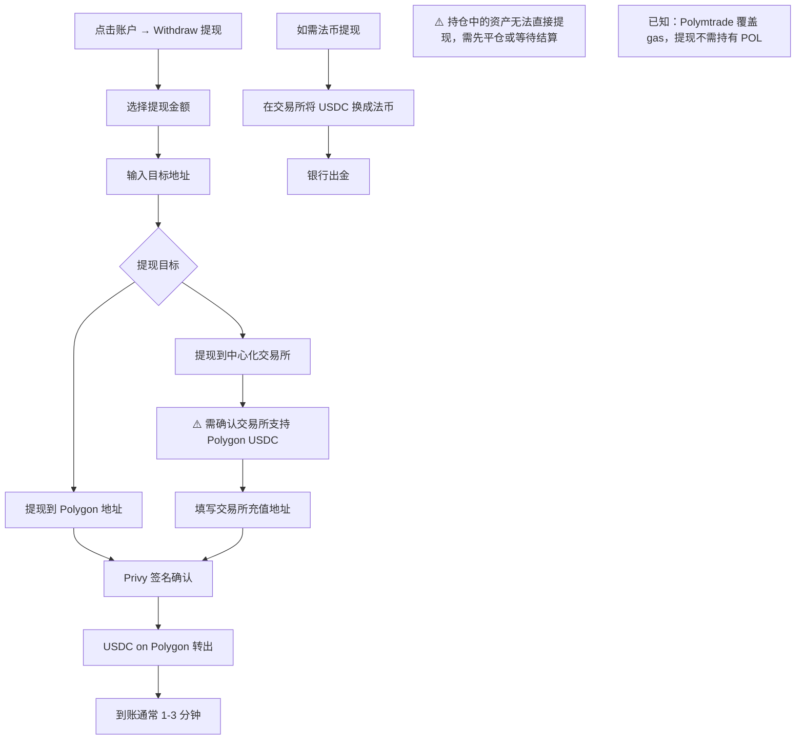

#### 2.0.6 市场结算 → 收益到账流程

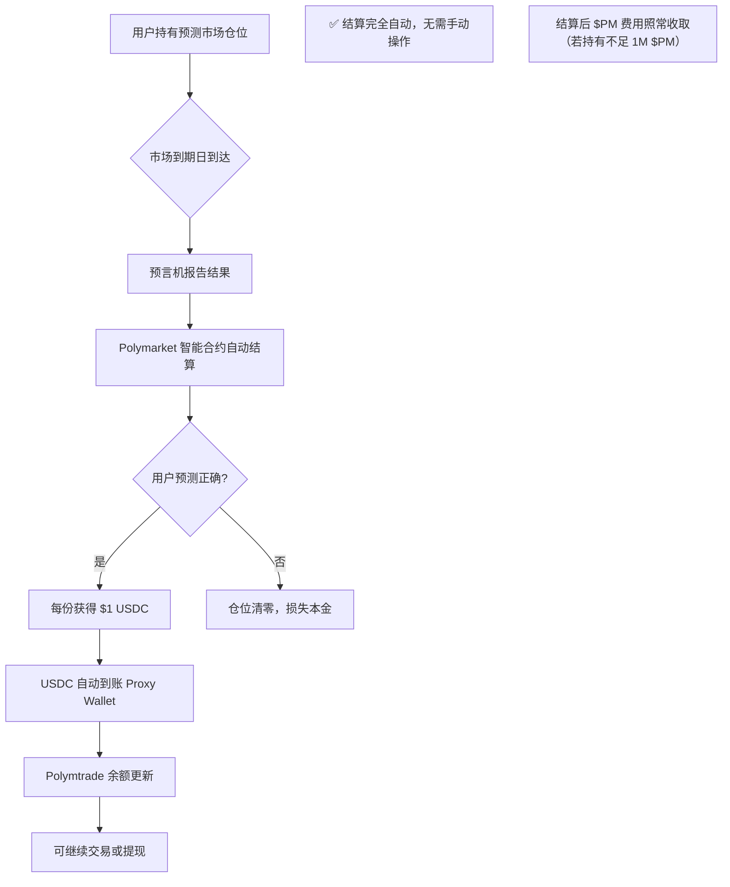

### 2.1 完整用户旅程

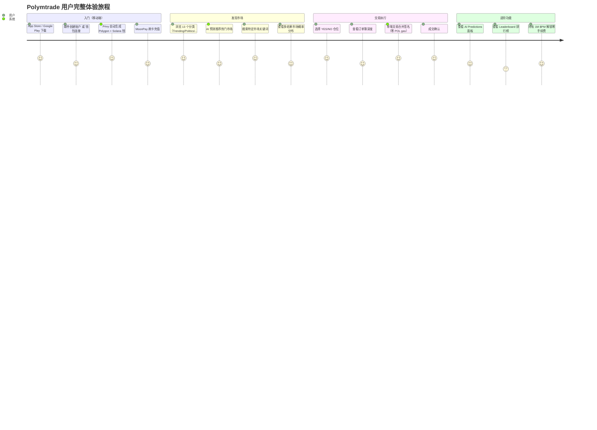

### 2.2 Web 端交易流程

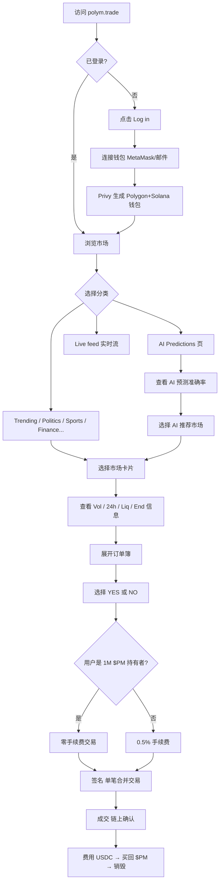

### 2.3 移动端 App 流程

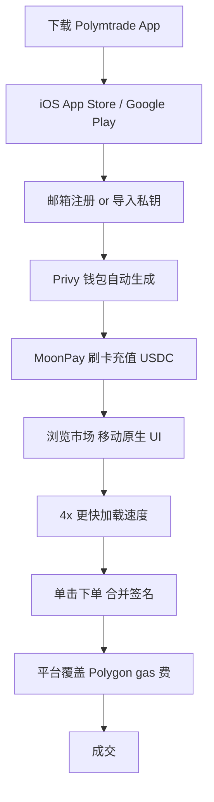

### 2.4 $PM 代币持有者特权路径

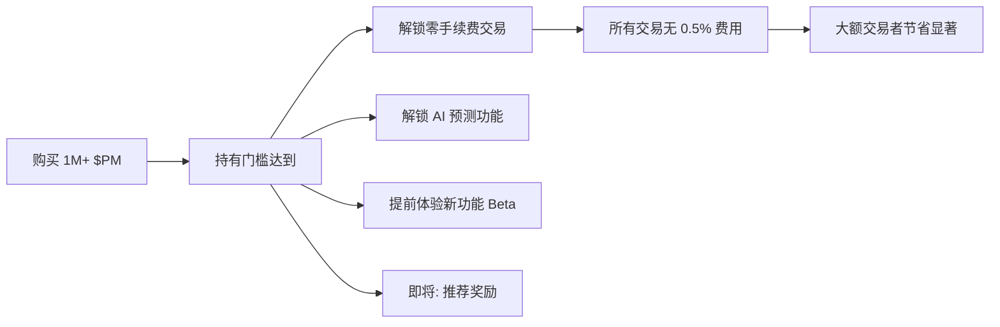

---

## 3. 业务架构

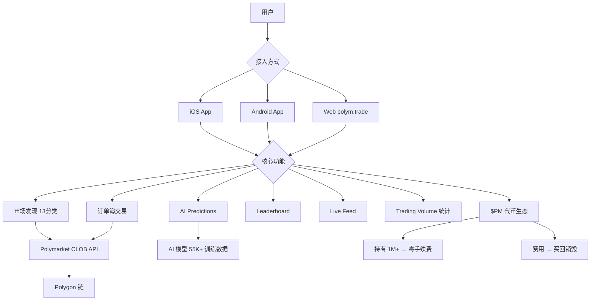

### 3.1 核心业务模块

| 模块 | 状态 | 描述 |
|------|------|------|
| iOS App | ✅ App Store | 移动原生交易终端 |
| Android App | ✅ Google Play | 移动原生交易终端 |
| Web Terminal | ✅ polym.trade | PC/平板网页版 |
| AI Predictions | ✅ 上线 | 55K+ 市场训练，准确率展示 |
| Leaderboard | ✅ 上线 | 交易量排行（实测有 60+ 用户）|
| Fees Dashboard | ✅ 上线 | 实时显示费用/回购/销毁数据 |
| Copy Trading | 🚧 路线图 | 即将上线 |
| Kalshi 聚合 | 🚧 路线图 | 多平台聚合计划 |
| $PM CEX 上市 | ✅ AscendEX | 已在中心化交易所上线 |

---

## 4. 技术架构

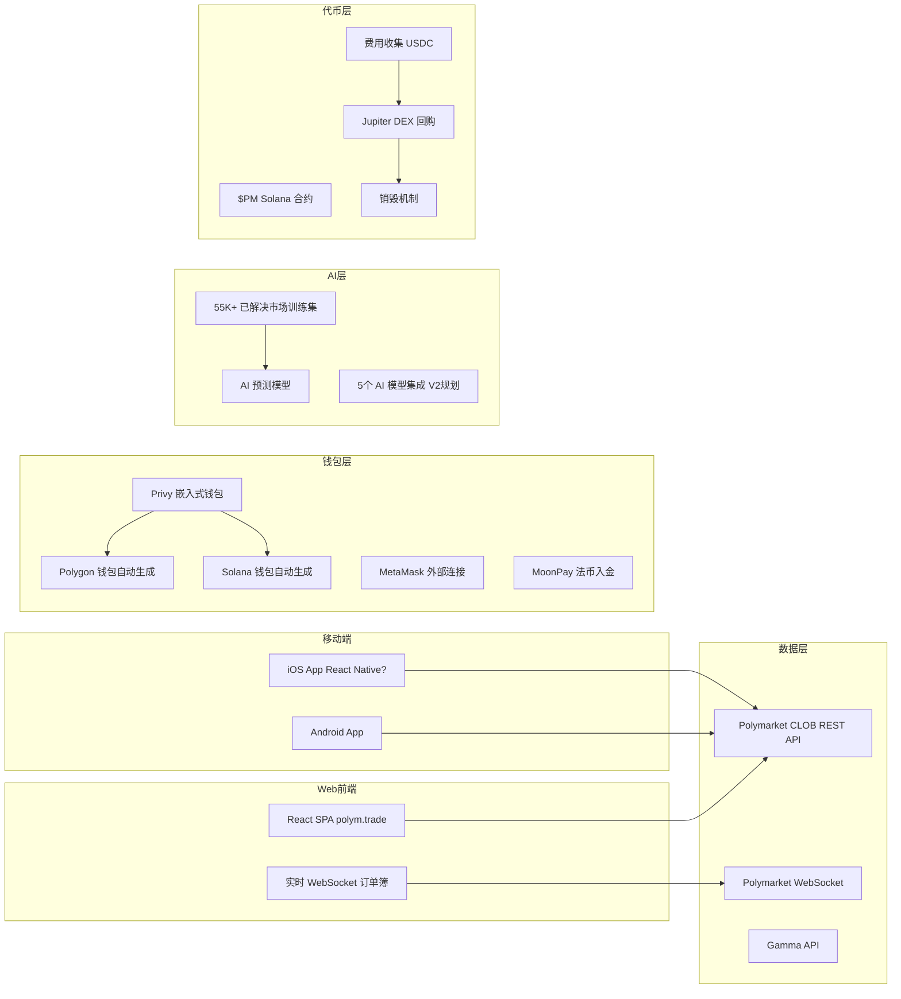

### 4.1 关键技术特点
- **Privy 钱包**：一键邮件注册自动生成 Polygon + Solana 双链钱包，极低门槛
- **零 POL gas**：平台全额覆盖用户 Polygon gas 费，用户无感
- **合并签名**：将充值准备、授权、交易合并为单笔签名，减少交互步骤
- **4x 速度**：直接调用 Polymarket API，无多余渲染层
- **团队**：3 人（设计/后端/前端），中欧，10+ 年加密经验，非 VC 支持

---

## 5. $PM 代币经济（完整）

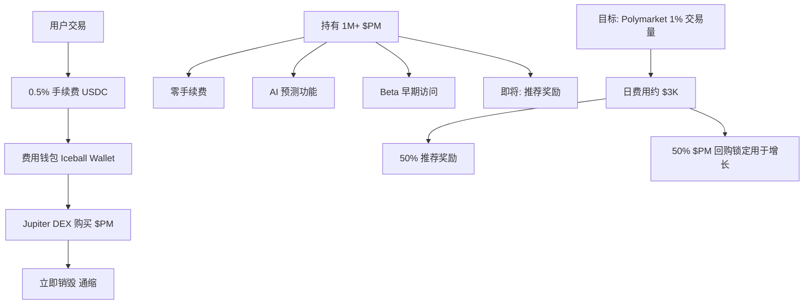

### 5.1 $PM 代币详情（实测数据）

| 属性 | 数值 |
|------|------|
| **合约地址（Solana）** | `3BWA5RBXyPXuMGZmVL8Snefu573FMJNGpsVi79baiBLV` |
| **主池地址** | `ArujGJh4KPrH5xD8zxweVaN7R9sf4mgT46wd865Eq47j` |
| **发射平台** | Believe（Solana）|
| **团队控制权** | 无（团队不控制合约）|
| **交易所** | Jupiter DEX（Solana）+ AscendEX（CEX）|
| **累计销毁** | 126.6M $PM（截至 2026-03-24）|
| **持有门槛** | 1,000,000 $PM = 零手续费 + AI 功能 |
| **费率** | 0.5% 买卖双向（$PM 持有者免）|

### 5.2 实测费用/销毁数据（2026年3月）

| 日期 | 收费（USDC）| 买回 $PM | 销毁 $PM |
|------|------------|---------|--------|
| 03/24 | 14 | 55K | 55K |
| 03/21 | 88 | 359K | 359K |
| 03/20 | 37 | 153K | 153K |
| 03/19 | 412 | 1.6M | 1.6M |
| 03/18 | 339 | 1.3M | 1.3M |
| 03/08 | 306 | 1.7M | 1.7M |

---

## 6. 核心功能与交易技术壁垒

### 6.1 功能深度对比

| 功能 | Polymtrade | Polymarket 官方 |
|------|-----------|---------------|
| 移动 App（iOS/Android）| ✅ | ❌ |
| 加载速度 | 4x 更快 | 基准 |
| AI 市场预测 | ✅ 55K+ 训练 | ❌ |
| 法币入金（MoonPay）| ✅ | ❌ |
| 零 gas 费 | ✅ 平台覆盖 | ❌ |
| 合并签名 | ✅ | ❌ |
| 代币激励 | ✅ $PM | ❌ |
| Kalshi 聚合 | 🚧 路线图 | ❌ |
| Copy Trading | 🚧 路线图 | ❌ |

### 6.2 AI Predictions 功能（实测）
- 基于 55K+ 已解决 Polymarket 市场训练
- 显示每个市场的 AI 预测方向（正确/不确定/准确率）
- V2 规划：整合 5 个顶级 AI 模型
- 持有 1M+ $PM 方可访问
- 当前准确率显示为 0%（可能是刚重置或数据加载问题）

### 6.3 Leaderboard（实测数据）
- 排名第一：0xE61...F251，2010 笔交易，$3,573,919 交易量
- 排名第二：0x150...fB2A，309 笔交易，$3,011,406 交易量
- 显示 Rank / User / Trades / Volume 四列

### 6.4 技术壁垒评估

| 壁垒类型 | 评分(1-10) | 说明 |
|---------|-----------|------|
| 移动端先发优势 | 9 | 唯一有原生 App 的 Builder |
| AI 预测功能 | 7 | 55K+ 训练数据，门槛较高 |
| $PM 代币经济 | 8 | 通缩模型 + 零费用激励，用户黏性强 |
| 零 gas + 合并签名 | 8 | 极简用户体验，门槛最低 |
| 技术执行 | 7 | 三人团队，产出效率极高 |
| 路线图广度 | 8 | Kalshi 聚合 + Copy Trading 即将推出 |

---

## 7. 商业模式

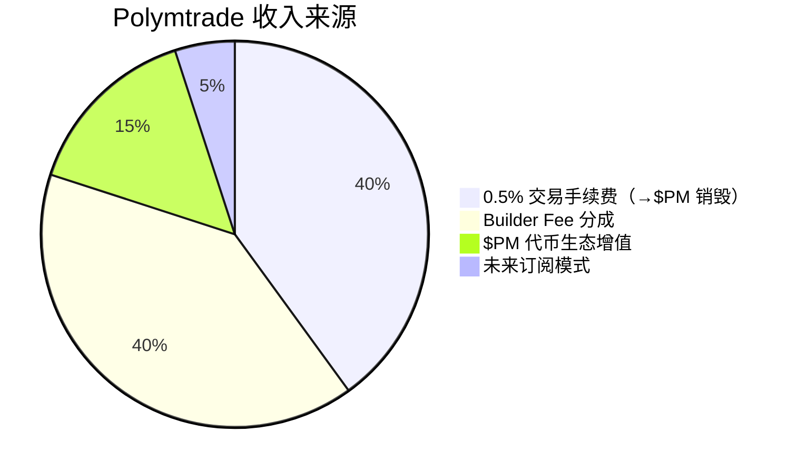

### 7.1 收入测算
1. **0.5% 交易手续费**：收 USDC → 全部用于回购销毁 $PM（当前非直接利润，而是代币价值支撑）
2. **Builder Fee 分成**：$28.30M × 0.5% ≈ **$141k/月**
3. **未来订阅模式**（路线图）：$PM 代币销毁换订阅资格，通缩驱动
4. **目标**：达到 Polymarket 1% 交易量 → 日费 $3K → 持续回购销毁

### 7.2 路线图（已完成 vs 规划中）

**已完成**：iOS + Android App、AI 预测模型、AscendEX CEX 上市、MoonPay 集成、零 gas 费、合并签名、Leaderboard、评论系统、高级搜索、费用透明仪表盘

**即将推出**：
- Kalshi 市场交易
- Polymtrade V2 设计（进行中）
- 多平台市场聚合
- 跨平台套利（$PM 持有者）
- Prediction Bot V2（5个 AI 模型）
- 订阅模式（$PM 销毁解锁）
- App 内直接购买 $PM
- Copy Trading

---

## 8. 待确认问题

- [ ] $PM 当前价格和市值？（DexScreener 未返回数据，需直接访问 Jupiter）
- [ ] AI Predictions 准确率目前显示 0%，原因？
- [ ] iOS App 目前审核状态（文档显示「currently in App Store verification」）？
- [ ] Kalshi 集成的预计上线时间？
- [ ] Copy Trading 具体设计方案（托管还是非托管）？
- [ ] AscendEX 上的 $PM 交易量和价格？
- [ ] 三人团队如何分工？是否计划扩招？

---

## 9. 总结

Polymtrade 是整个 Builder 生态中**最被低估的产品**，真实情况远比「Web 交易终端」复杂得多：

1. **移动端唯一**：iOS + Android 原生 App，填补 Polymarket 移动端空白
2. **完整代币经济**：$PM 通缩模型（0.5% 费用 100% 回购销毁），逻辑闭环
3. **AI 差异化**：55K+ 市场训练的预测模型，V2 将整合 5 个 AI
4. **极致用户体验**：零 gas、合并签名、MoonPay 法币入金、4x 速度
5. **野心路线图**：Kalshi 聚合 + 跨平台套利 + Copy Trading + 订阅模式
6. **3 人精干团队**：非 VC，中欧，10+ 年经验，执行效率极高

月交易量 $28.3M（#3），考虑到仅 3 人团队，人均产出极为惊人。
