# Polygun — 深度分析报告

> 数据日期：2026-03-24  
> Polymarket Builder Program 排名：**#4**  
> 近1月交易量：**$27.44M**  
> ⚠️ **网站状态**：polygun.io / polygun.app 等域名均无法访问，无 Wayback Machine 存档

---

## 1. 市场情况

### 1.1 市场定位
Polygun 定位为 **Telegram 端预测市场交易机器人**，让用户无需打开浏览器，直接在 Telegram 中完成浏览市场、买卖仓位、复制顶级交易者等全套操作。

核心差异：
- **Telegram 原生**：参考 Solana Meme 币领域 Bot（Bonk Bot、Trojan）打法
- **托管式钱包**：用户充值后由 Polygun 代理签名执行
- **1% 全交易量手续费**：收费模式透明直接
- **自动跨链桥**：支持 Polygon/Solana/ETH/BNB 四链入金

### 1.2 市场规模与地位
- Builder Program 排名 **第四**，月交易量 $27.44M
- Telegram Bot 赛道中交易量最高的 Polymarket 接入平台
- 合作超过 **100+ 个项目**
- ⚠️ 网站当前无法访问，产品状态待确认

### 1.3 竞争格局

| 维度 | Polygun（Telegram）| PolyCop（Web dApp）|
|------|-------------------|-------------------|
| 架构 | 托管式 Bot | 纯客户端 dApp |
| 私钥 | Polygun 服务器保管 | 用户浏览器内存 |
| 收费 | 1% 全交易量 | 0.05% 仅盈利 |
| 入金 | 4链自动桥接 | 需自备 Polygon USDC |
| 聪明钱 | 内置 Smart Wallets 榜单 | 用户自己找地址 |
| 跨链 | ✅ 自动 | ❌ 不支持 |

---

## 2. 用户体验路径

### 2.0 注册、入金、交易、提现、领奖全流程（详细）

#### 2.0.1 注册流程（Telegram Bot）

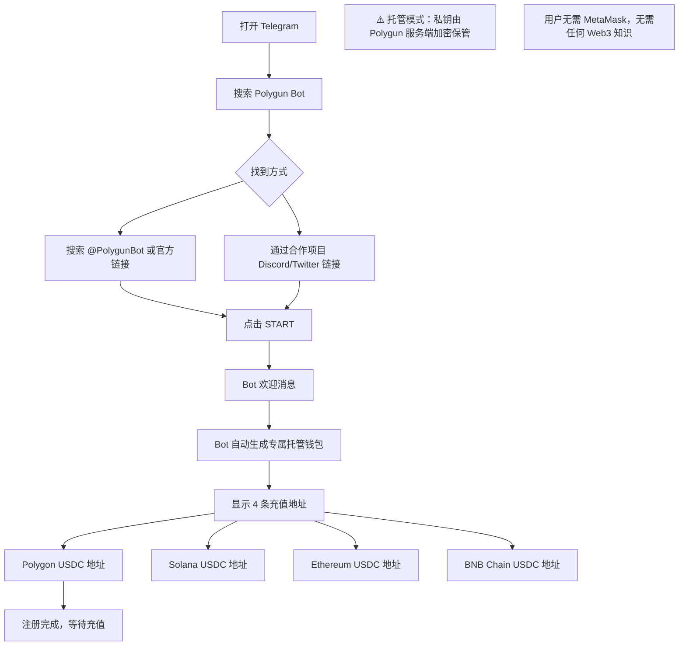

#### 2.0.2 入金流程（4 链自动跨链）

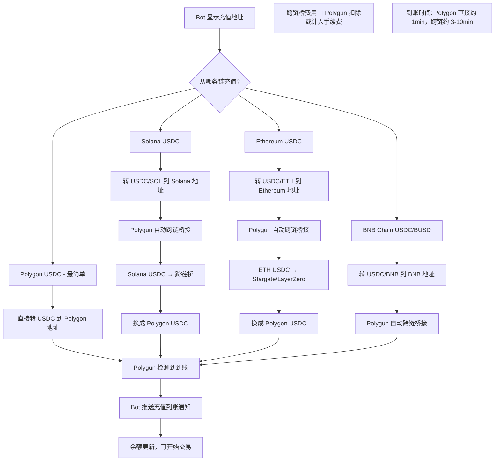

#### 2.0.3 交易执行流程

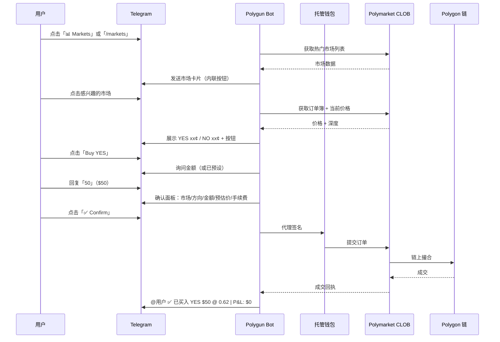

#### 2.0.4 复制交易流程

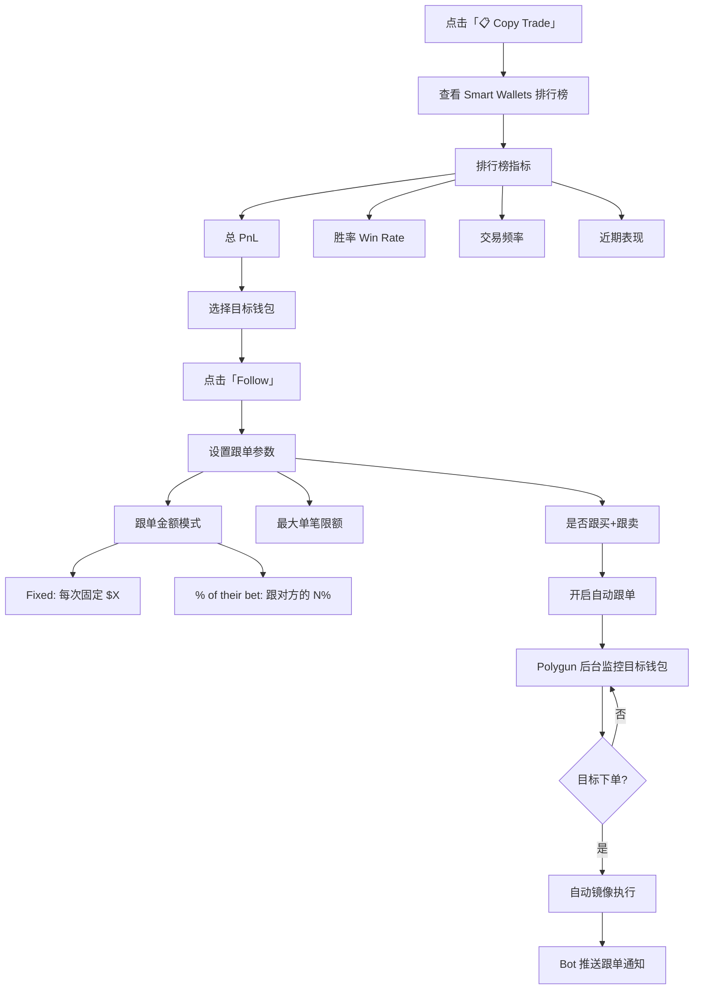

#### 2.0.5 限价单设置

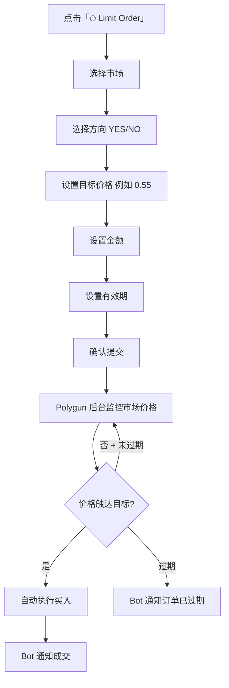

#### 2.0.6 PnL 卡片生成 + 病毒传播

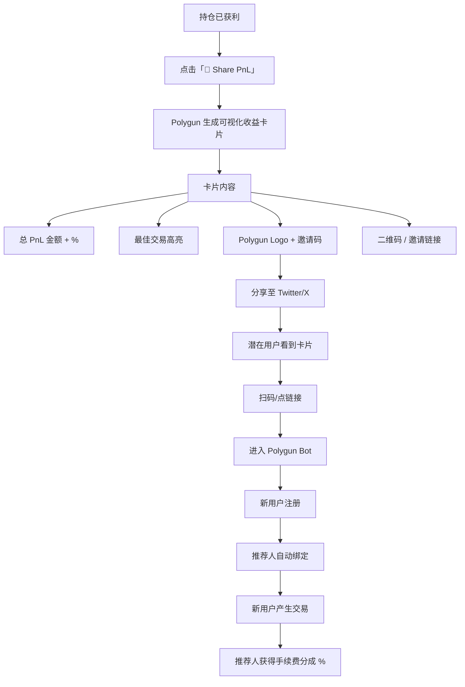

#### 2.0.7 提现流程

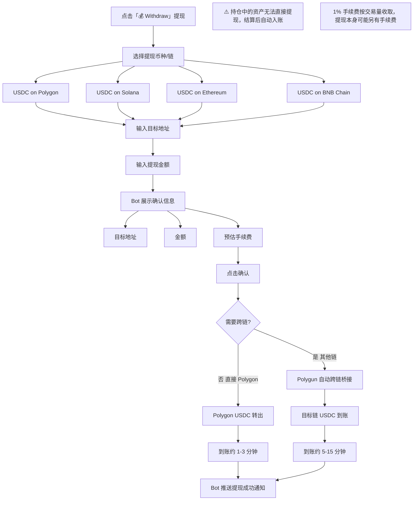

#### 2.0.8 推荐奖励领取

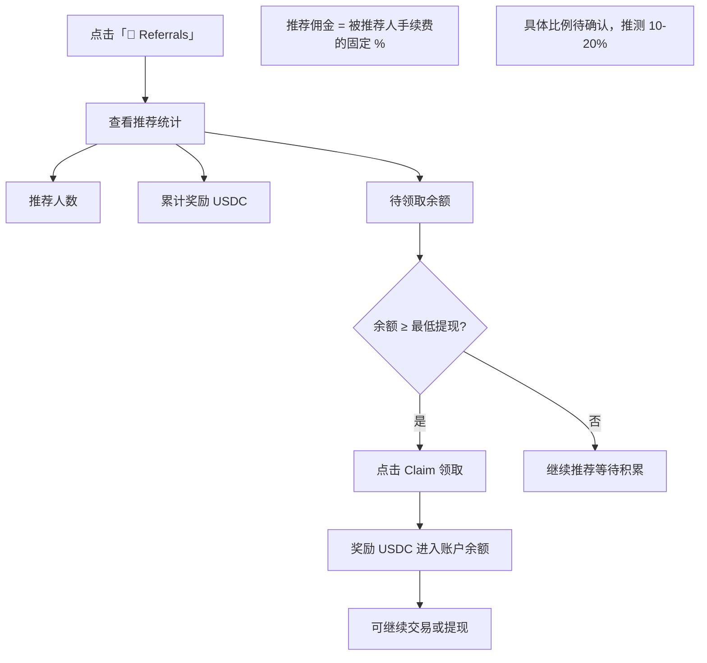

### 2.1 完整用户旅程

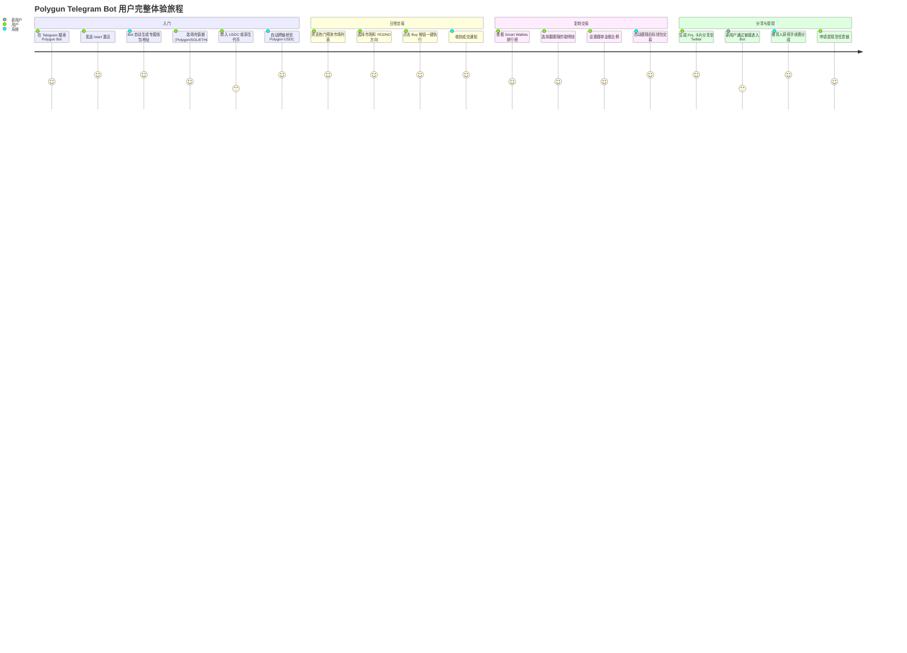

### 2.2 详细交互流程

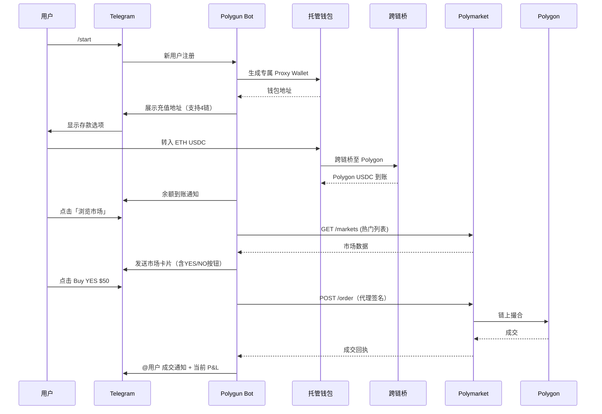

### 2.3 PnL 卡片病毒传播机制

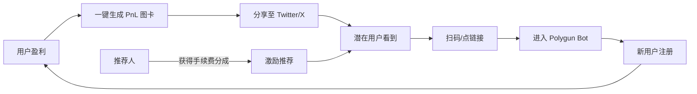

### 2.4 复制交易流程

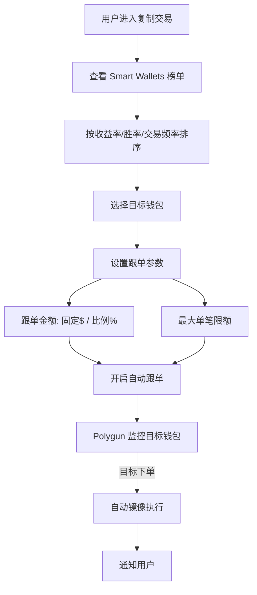

---

## 3. 业务架构

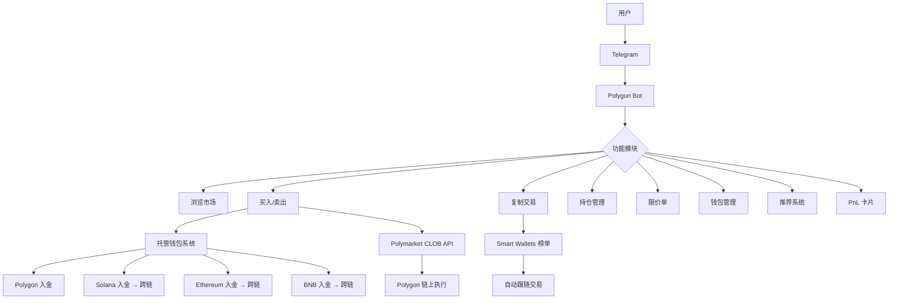

---

## 4. 技术架构

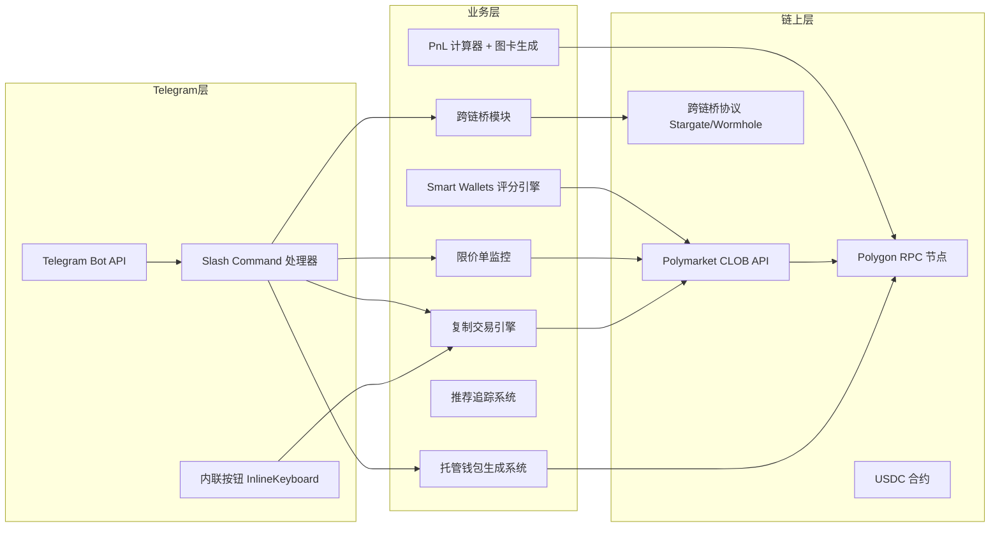

### 4.1 托管钱包架构

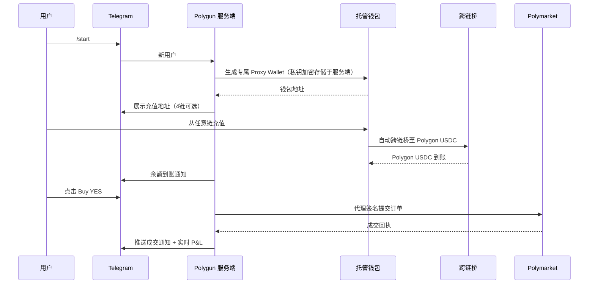

### 4.2 技术栈推断
- **Bot 框架**：Python-telegram-bot 或 Telegraf (Node.js)
- **钱包生成**：ethers.js，私钥服务端加密存储（AES-256 或 KMS）
- **跨链桥**：Stargate Finance / LayerZero（支持 4 链）
- **API**：Polymarket CLOB REST + WebSocket
- **Smart Wallets 评分**：链上历史数据 + 胜率/盈利率加权算法
- **PnL 卡片生成**：Canvas API 或 puppeteer 截图

---

## 5. 核心功能与交易技术壁垒

### 5.1 功能清单（基于 Polymarket 官方 Builder 数据）

| 功能 | 描述 | 技术实现 |
|------|------|----------|
| 即时买卖 | Telegram 内一键执行 | 托管签名 + CLOB API |
| 复制交易 | 跟随 Smart Wallets 自动镜像 | WebSocket 监听 + 延迟执行 |
| 限价单 | 设定目标价格自动执行 | 后端轮询市场价格 |
| 多链入金 | Polygon/SOL/ETH/BNB → 自动桥 | 跨链桥协议集成 |
| PnL 卡片 | 可分享的收益图卡 | Canvas/截图生成 |
| 推荐系统 | 邀请返佣 | 链上追踪 + 分成计算 |
| 持仓管理 | 查看所有持仓和历史 | CLOB API + 链上同步 |

### 5.2 技术壁垒评估

| 壁垒类型 | 评分(1-10) | 说明 |
|---------|-----------|------|
| Telegram 渠道 | 8 | 用户习惯迁移成本高，Bot 使用习惯难改变 |
| 跨链桥集成 | 7 | 4 链自动桥接，技术门槛较高 |
| 病毒增长机制 | 8 | PnL 卡片 + 推荐分佣，形成强增长飞轮 |
| Smart Wallets 数据 | 6 | 评分积累有壁垒，但算法可复制 |
| 100+ 项目合作 | 7 | 合作渠道网络形成分发壁垒 |
| 托管安全风险 | -2 | 私钥托管于服务端，信任成本高 |

---

## 6. 商业模式

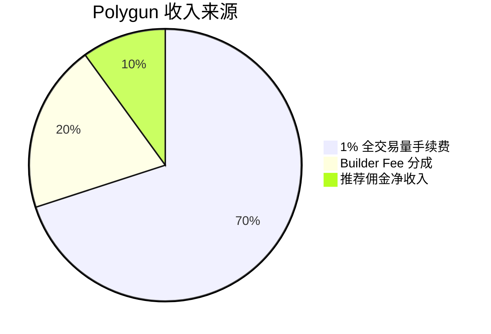

### 6.1 收入测算
- 月交易量 $27.44M × 1% = **$274k/月** 手续费收入
- 同时叠加 Builder Fee 分成（Polymarket 给的约 0.5%）
- 实际毛利需扣除：跨链桥 gas 费、服务器、推荐佣金支出

### 6.2 与 PolyCop 商业模式对比

| 维度 | Polygun | PolyCop |
|------|---------|--------|
| 收费模式 | 1% 全交易量（含亏损）| 0.05% 仅盈利 |
| 用户体感 | 固定成本，可预期 | 与用户利益对齐 |
| 月收入（测算）| ~$274k | ~$16k + Builder Fee |
| 信任模型 | 服务端托管私钥 | 浏览器内存，零服务端 |
| 门槛 | 极低（Telegram 直接用）| 需自备 Polygon USDC |

---

## 7. 待确认问题

- [ ] Polygun 当前真实网址（所有已知域名均失效，产品是否已停止运营？）
- [ ] 私钥保管方式（服务端加密存储 vs MPC vs TEE？）
- [ ] 跨链桥使用的具体协议（Stargate / Wormhole / 自建？）
- [ ] Smart Wallets 评分算法的具体指标和权重？
- [ ] 100+ 合作项目具体是哪些？合作方式？
- [ ] PnL 卡片生成技术实现？
- [ ] 限价单实现：后端轮询 vs WebSocket 监听？
- [ ] 团队规模和地理位置？
- [ ] 日活用户数量？
- [ ] 网站下线原因？产品是否仍在运营？

---

## 8. 总结

Polygun 是 Telegram Bot 赛道的标杆，成功复制了 Solana Meme 币 Bot（如 Photon、Trojan）的打法：

1. **极低门槛**：多链入金 + Telegram 原生，无需任何 Web3 知识
2. **病毒增长**：PnL 卡片 + 推荐分佣，形成强大增长飞轮
3. **复制交易**：内置 Smart Wallets 榜单，降低研究门槛
4. **1% 费率**：透明收费，用户为便利性买单

月交易量 $27.44M（#4），是 Telegram 渠道的绝对第一。

⚠️ **风险**：网站全部域名失效，产品状态不明。若已停止运营，则排行榜数据为历史数据。托管式私钥是核心信任风险点。
