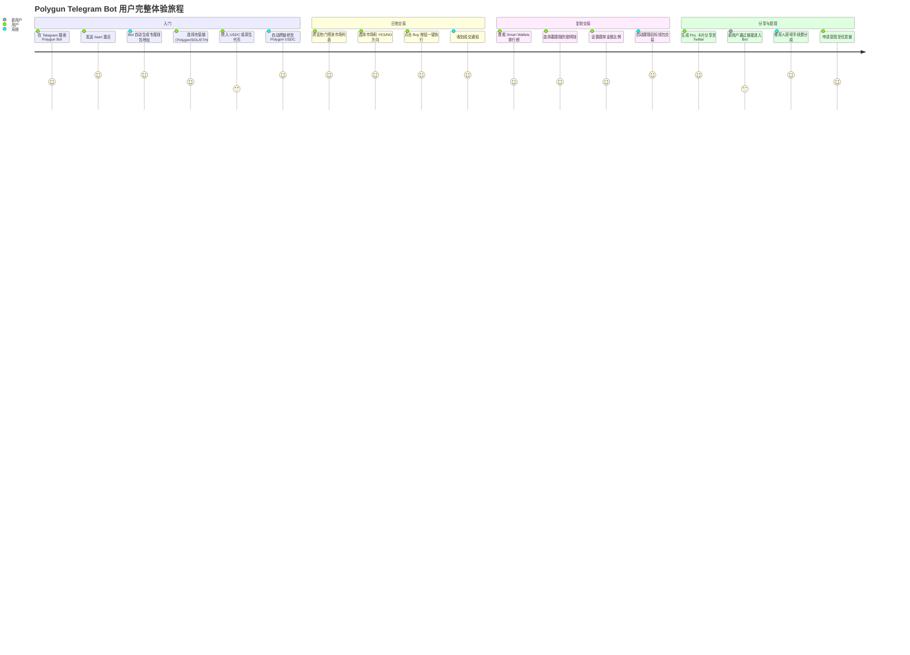
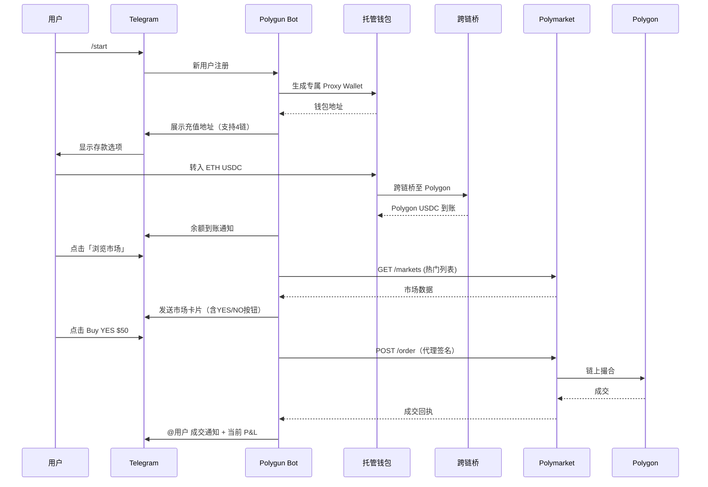
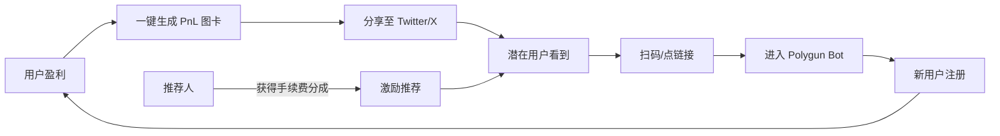
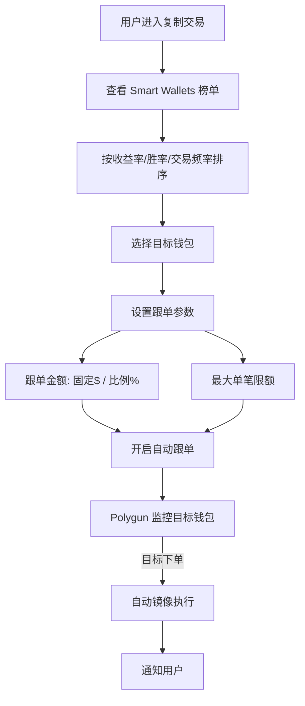
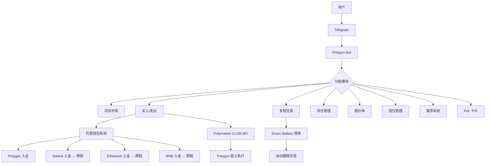

# Polygun — 深度分析报告

> 数据日期：2026-03-24  
> Polymarket Builder Program 排名：**#4**  
> 近1月交易量：**$27.44M**  
> ⚠️ **网站状态**：polygun.io / polygun.app 等域名均无法访问，无 Wayback Machine 存档

---

## 1. 市场情况

### 1.1 市场定位
Polygun 定位为 **Telegram 端预测市场交易机器人**，让用户无需打开浏览器，直接在 Telegram 中完成浏览市场、买卖仓位、复制顶级交易者等全套操作。

核心差异：
- **Telegram 原生**：参考 Solana Meme 币领域 Bot（Bonk Bot、Trojan）打法
- **托管式钱包**：用户充值后由 Polygun 代理签名执行
- **1% 全交易量手续费**：收费模式透明直接
- **自动跨链桥**：支持 Polygon/Solana/ETH/BNB 四链入金

### 1.2 市场规模与地位
- Builder Program 排名 **第四**，月交易量 $27.44M
- Telegram Bot 赛道中交易量最高的 Polymarket 接入平台
- 合作超过 **100+ 个项目**
- ⚠️ 网站当前无法访问，产品状态待确认

### 1.3 竞争格局

| 维度 | Polygun（Telegram）| PolyCop（Web dApp）|
|------|-------------------|-------------------|
| 架构 | 托管式 Bot | 纯客户端 dApp |
| 私钥 | Polygun 服务器保管 | 用户浏览器内存 |
| 收费 | 1% 全交易量 | 0.05% 仅盈利 |
| 入金 | 4链自动桥接 | 需自备 Polygon USDC |
| 聪明钱 | 内置 Smart Wallets 榜单 | 用户自己找地址 |
| 跨链 | ✅ 自动 | ❌ 不支持 |

---

## 2. 用户体验路径

### 2.1 完整用户旅程

### 2.2 详细交互流程

### 2.3 PnL 卡片病毒传播机制

### 2.4 复制交易流程

---

## 3. 业务架构

