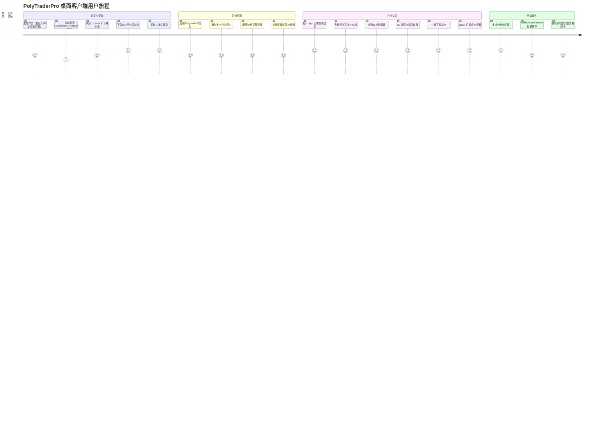
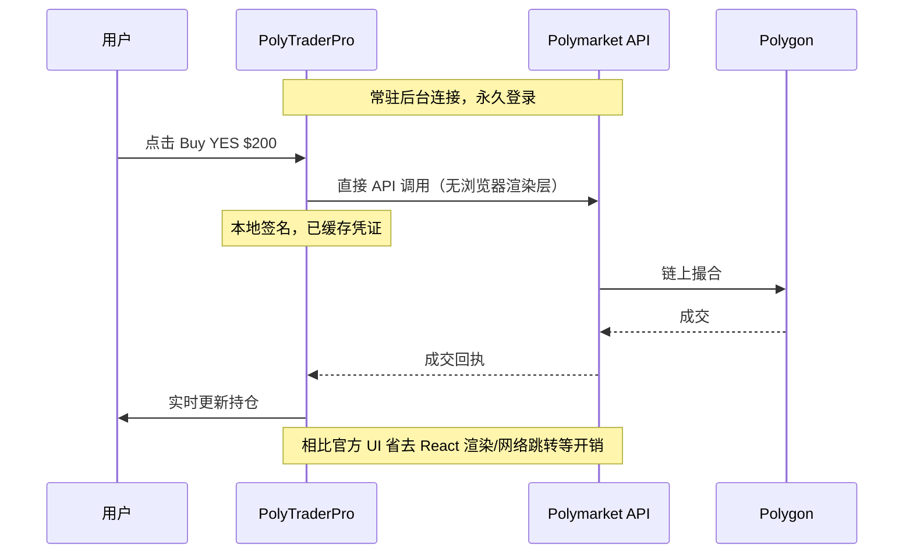
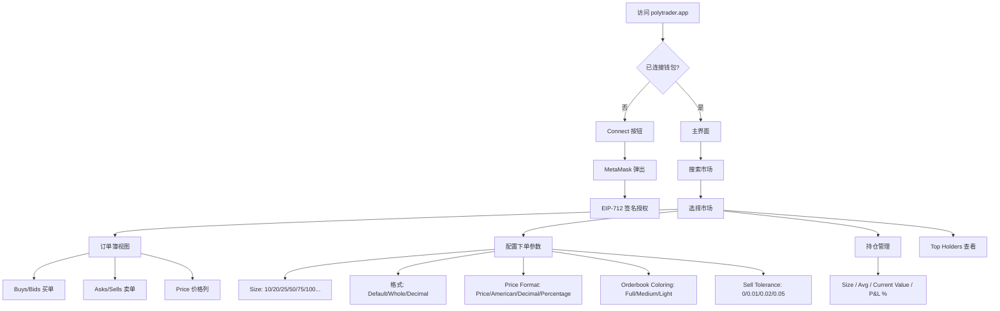
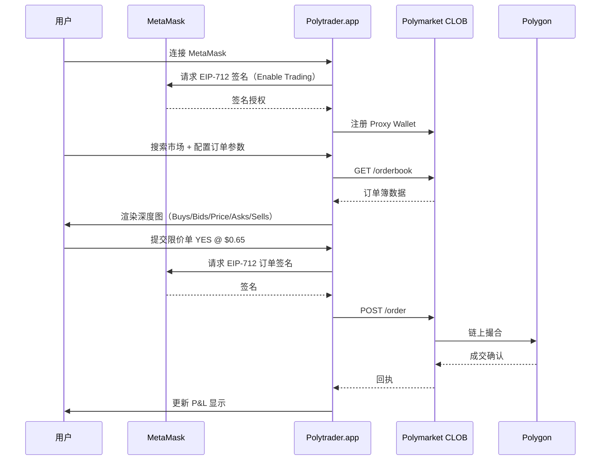
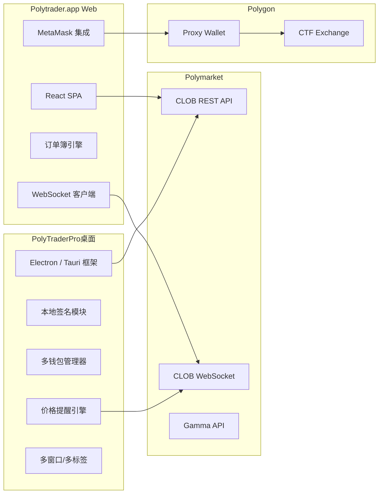
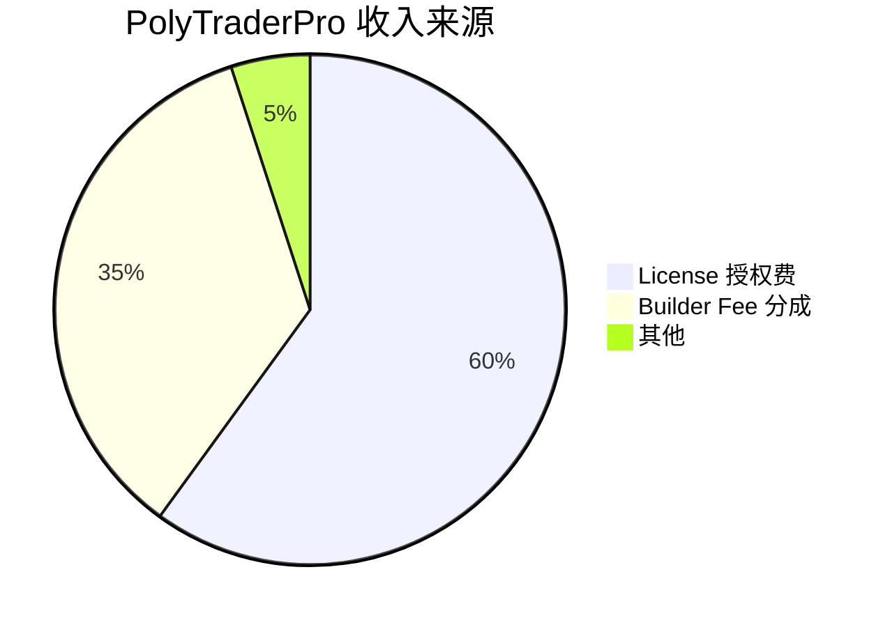
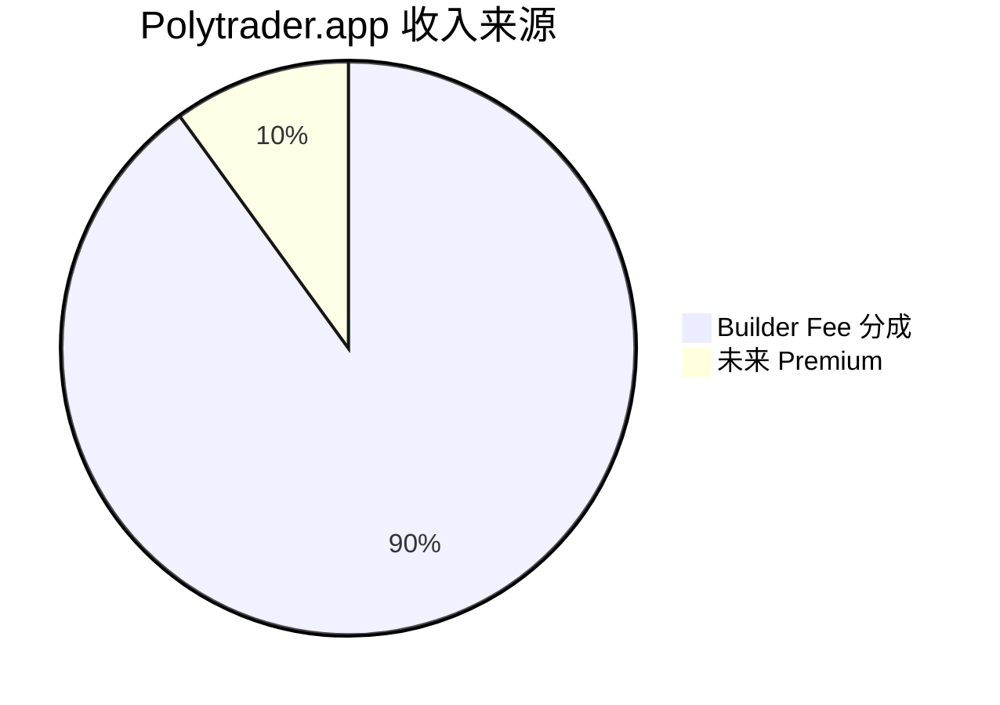

# PolyTraderPro & Polytrader.app — 深度分析报告

> 数据日期：2026-03-24  
> PolyTraderPro — Builder Program 排名：**#5**，近1月交易量：**$17.96M**  
> Polytrader.app — Builder Program 排名：**#15**，近1月交易量：**$3.35M**  
> PolyTraderPro 官网：**polytraderpro.com**  
> Polytrader.app 官网：**polytrader.app**

---

## 1. 重要更正：两款完全不同的产品

| 维度 | PolyTraderPro | Polytrader.app |
|------|--------------|----------------|
| 形态 | **桌面客户端**（Mac/Win/Linux）| **Web 浏览器终端** |
| 收费 | **License 付费制**（邮件购买）| **免费** Beta |
| 钱包 | Magic Link + MetaMask + 外部钱包 | MetaMask（自托管）|
| 速度 | **5x 更快**于 Polymarket UI | 标准 Web3 速度 |
| 移动端 | ❌ 仅桌面 | ❌ 仅桌面浏览器 |
| 团队关系 | **不同团队**（两个独立产品）| 独立 |

---

## 2. PolyTraderPro — 桌面客户端深度分析

### 2.1 产品定位
口号：「Trade Faster. Smarter. Without Friction.」

核心主张：
- 5x 速度 + 大户背书 + License 门槛 = 高质量专业用户护城河
- 由 $2M+ 盈利大户 Aenews2 联合设计，产品与顶级用户需求高度对齐
- 价格提醒 + 多钱包 + 误操作保护，是做市商不可或缺的工具

**Polytrader.app** 是**自托管专业 Web 终端**的代表：
- 完全自托管，私钥安全性最高，适合大资金用户
- 丰富的订单簿配置（格式/容差/颜色），面向专业做市商
- Top Holders 功能是市场情绪分析利器

两者合计月交易量 **$21.3M**（#5 + #15），在 Builder 生态中合计约 **4% 份额**。
**5x 更快**：直接调用 Polymarket API，最小化开销，速度远超官方 UI
- **零摩擦**：永久登录，无需每次重连
- **跨平台**：Mac / Windows / Linux 三平台支持
- **多钱包**：无限钱包连接，秒级切换
- **License 制**：专业工具，付费使用

**用户背书（实测获取）**：
- Legendary trader **Aenews2**（$2M+ 总盈利）：「I helped design PolyTrader Pro to maximize my own trading advantages. I haven't used Polymarket's UI ever since.」
- Trader **EatPrayLove**：「I always loved Polymarket, but didn't always love the UI. Now I can enjoy it with minimal frustration.」
- Trader **BigMike11**：「Smooth. Efficient. Reliable. Order execution far faster. Every second counts in trading.」

### 2.2 9 大核心功能（实测）

| 功能 | 详情 |
|------|------|
| **1. 多钱包管理** | 无限钱包连接，Magic Link/MetaMask/外部钱包，秒级切换 |
| **2. 交易历史** | 完整交易记录，整体 + 单市场维度统计 |
| **3. 市场浏览** | 流畅滚动浏览，快速定位关注市场 |
| **4. 核心交易** | 下单、持仓管理、实时更新，一站式 |
| **5. Split/Merge/Convert** | 拆分/合并份额，NO 份额转换（负风险市场）|
| **6. 价格提醒** | 流动性添加到指定价格时发出提示音，可自定义声音和数量 |
| **7. Maker 订单成交提醒** | 显示所有挂单成交，支持多钱包同时监控 |
| **8. 多标签/多窗口** | 同时监控多个市场 |
| **9. 误操作保护** | 大额交易前可选确认弹窗，按持仓比例或金额自定义阈值 |

### 2.3 用户体验路径



### 2.4 交易执行流程（5x 速度优势来源）



### 2.5 价格提醒系统详解

```mermaid
flowchart TD
    A[用户设置价格提醒] --> B[指定市场 + 目标价格]
    B --> C[选择提示音类型]
    C --> D[App 后台持续监控订单簿]
    D --> E{有流动性添加到目标价格?}
    E -->|是| F[触发提示音 beep]
    F --> G[用户立即查看]
    G --> H[判断是否下单]
    E -->|否| D
    Note: 可为每个市场设置多个提醒
```

---

## 3. Polytrader.app — Web 终端深度分析

### 3.1 产品定位
- **Public Beta**，完全免费
- 自托管：连接 MetaMask，私钥不离开用户设备
- 专业订单簿界面：深度显示、做市商工具

### 3.2 实测功能（polytrader.app 页面）



### 3.3 自托管交易流程



---

## 4. 技术架构对比



---

## 5. 核心功能与交易技术壁垒

### 5.1 PolyTraderPro 核心壁垒

| 壁垒类型 | 评分(1-10) | 说明 |
|---------|-----------|------|
| 速度优势 | 9 | 5x 速度，直接 API 调用无渲染开销 |
| 大户用户背书 | 9 | Aenews2（$2M+ 盈利）联合设计，口碑传播 |
| 多钱包管理 | 8 | 无限钱包 + 秒级切换，做市商必备 |
| 价格提醒精度 | 8 | 流动性添加即提醒，快于人工盯盘 |
| License 门槛 | 7 | 付费筛选出高质量用户群 |
| 跨平台 | 7 | Mac/Win/Linux 全覆盖 |
| 移动端缺失 | -2 | 仅桌面端，限制用户范围 |

### 5.2 Polytrader.app 核心壁垒

| 壁垒类型 | 评分(1-10) | 说明 |
|---------|-----------|------|
| 完全自托管 | 9 | MetaMask 签名，私钥不离设备 |
| 专业配置深度 | 7 | 多种格式/容差/颜色配置，专业用户黏性 |
| Top Holders | 7 | 市场情绪分析，官方 Polymarket 没有 |
| 免费 Beta | 8 | 零成本获客，降低试用门槛 |
| 移动端缺失 | -2 | 仅桌面浏览器 |

---

## 6. 商业模式





### 6.1 收入测算
**PolyTraderPro**：
- Builder Fee：$17.96M × 0.5% ≈ **$90k/月**
- License 费：单价不公开，需邮件购买（automated purchases coming soon）
- 目标用户为大额专业交易者，License 单价可能较高（$99-$299/月 推测）

**Polytrader.app**：
- Builder Fee：$3.35M × 0.5% ≈ **$17k/月**
- 当前 Beta 免费，未来可能推出 Pro 订阅

---

## 7. 待确认问题

**PolyTraderPro**：
- [ ] License 价格？自动化购买何时上线？
- [ ] Aenews2 是否持续参与产品设计？
- [ ] 是否支持 API 接入（给量化团队）？
- [ ] 团队规模？是否有 VC 支持？
- [ ] Split/Merge/Convert 的具体使用场景？

**Polytrader.app**：
- [ ] Beta 何时结束，正式版计划？
- [ ] Top Holders 数据实时性？
- [ ] 是否计划支持移动端？
- [ ] 两款产品是否同一团队？（名称相近，但产品形态完全不同）

---

## 8. 总结

**PolyTraderPro** 是 Polymarket 生态中**专业做市商和大额交易者的首选工具**：
- 
