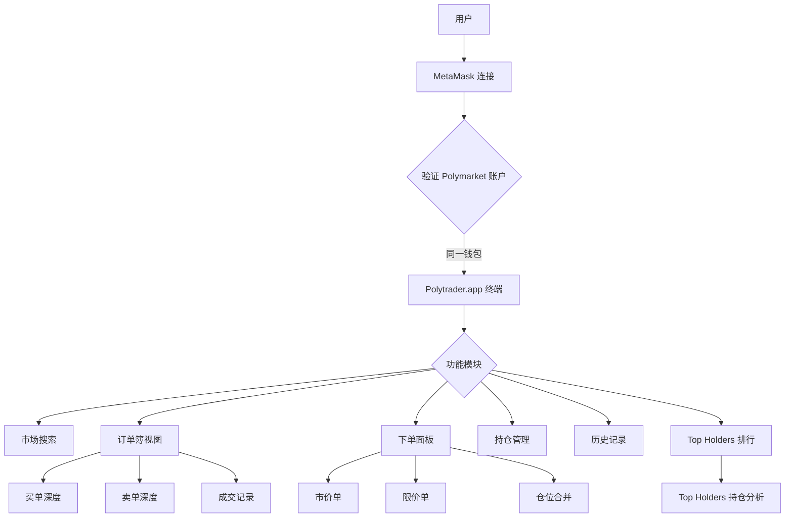
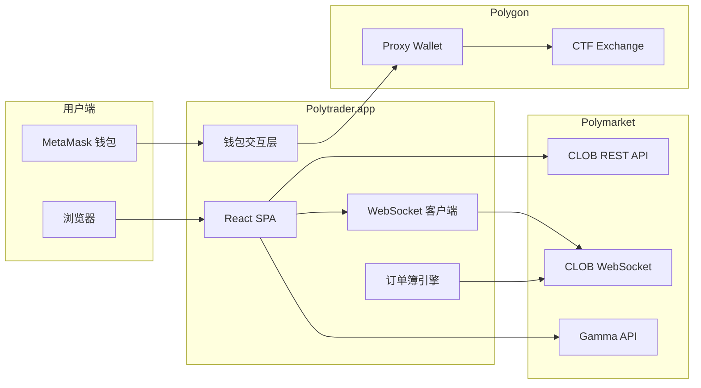

# PolyTraderPro & Polytrader.app — 深度分析报告

> 数据日期：2026-03-24  
> PolyTraderPro — Builder Program 排名：**#5**，近1月交易量：**$17.96M**  
> Polytrader.app — Builder Program 排名：**#15**，近1月交易量：**$3.35M**

---

## 1. 产品概述

### Polytrader.app（已实测）
根据实际页面内容，Polytrader.app 是一个**自托管订单簿交易终端**，核心特点：
- 完全自托管：连接 MetaMask，私钥不离开用户设备
- 专业订单簿界面：双向挂单、深度显示
- 公开 Beta 阶段
- 需桌面端浏览器（不支持移动端）

### PolyTraderPro
- 与 Polytrader.app 可能是同一团队的不同产品线（名称相近）
- 排名更高（#5 vs #15），交易量更大
- 具体区别待进一步确认

---

## 2. Polytrader.app 详细功能分析（基于实测页面）



### 2.1 订单簿配置选项（实测）
从页面内容可看到丰富的配置项：

| 配置项 | 选项 |
|--------|------|
| Size Format | Default / Whole / Decimal |
| Price Format | Price / American / Decimal Only / Percentage |
| Orderbook Coloring | Full / Medium / Light |
| Sell Order Tolerance | 0.00 / 0.01 / 0.02 / 0.05 |
| Order Size | 10 / 20 / 25 / 50 / 75 / 100 / 125 / 150 / 175 |

这些配置说明 Polytrader.app 面向**专业做市商和活跃交易者**，提供精细化的订单管理。

### 2.2 Top Holders 功能
- 显示市场中持仓最多的地址
- 对于判断市场多空力量有重要参考价值
- 是官方 Polymarket 没有的功能

---

## 3. 技术架构



### 3.1 自托管交易流程
```mermaid
sequenceDiagram
    participant U as 用户
    participant MM as MetaMask
    participant PT as Polytrader.app
    participant P as Polymarket CLOB
    participant C as Polygon
    
    U->>PT: 连接 MetaMask
    PT->>MM: 请求签名（Enable Trading）
    MM-->>PT: 签名授权
    PT->>P: 注册 Proxy Wallet
    U->>PT: 选择市场 + 设置订单参数
    PT->>P: GET /orderbook (获取当前挂单)
    P-->>PT: 订单簿数据
    PT->>U: 显示深度图
    U->>PT: 提交限价单 YES @ $0.65
    PT->>MM: 请求订单签名
    MM-->>PT: EIP-712 签名
    PT->>P: POST /order (签名订单)
    P->>C: 撮合/链上结算
    C-->>P: 成交确认
    P-->>PT: 成交回执
    PT->>U: 更新持仓显示

---

## 4. 核心功能与技术壁垒

### 4.1 专业订单簿的差异化
- 支持美式赔率、小数赔率、百分比等多种价格格式，面向不同背景用户
- Sell Order Tolerance（卖单容差）设置，帮助做市商管理滑点风险
- Top Holders 分析功能，提供市场情绪参考

### 4.2 完全自托管的信任优势
- 用户签名在浏览器本地完成，Polytrader 服务器**不接触私钥**
- 相比 Polygun/PolyCop 等托管式产品，用户资金更安全
- 适合大资金量的专业交易者

### 4.3 技术壁垒评估

| 壁垒类型 | 评分(1-10) | 说明 |
|---------|-----------|------|
| 自托管安全 | 9 | 完全自托管，大资金用户信任 |
| 专业功能深度 | 7 | 订单簿配置丰富，专业用户黏性 |
| 技术壁垒 | 5 | 相对可复制，但 UX 积累有壁垒 |
| 移动端缺失 | -2 | 不支持移动端是明显劣势 |
| 品牌认知 | 6 | 在专业交易者中有认知 |

---

## 5. 商业模式

```mermaid
pie title Polytrader 收入来源推测
    "Builder Fee 分成" : 80
    "Premium 功能订阅" : 15
    "其他" : 5
```

### 5.1 收入测算
- PolyTraderPro：$17.96M × 0.5% ≈ **$90k/月**
- Polytrader.app：$3.35M × 0.5% ≈ **$17k/月**
- 两者合计约 **$107k/月**（若为同一团队）

---

## 6. 待确认问题

- [ ] PolyTraderPro 和 Polytrader.app 是否为同一团队？两者有何区别？
- [ ] PolyTraderPro 的具体网址是什么？（polytrader.pro 只有一个跳转页）
- [ ] 是否计划支持移动端？
- [ ] Top Holders 数据是链上实时抓取还是缓存？
- [ ] 是否有 API 服务提供给机构用户？
- [ ] 团队背景、规模？

---

## 7. 总结

Polytrader 系列产品是**自托管专业交易终端**的代表，核心优势在于完全自托管的安全性和丰富的订单管理功能。两个产品合计月交易量约 $21.3M，在 Builder 生态中占约 **4% 份额**。移动端支持缺失是当前主要短板。
