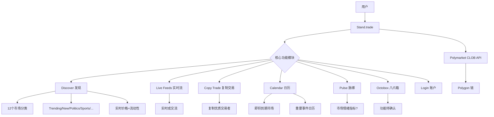
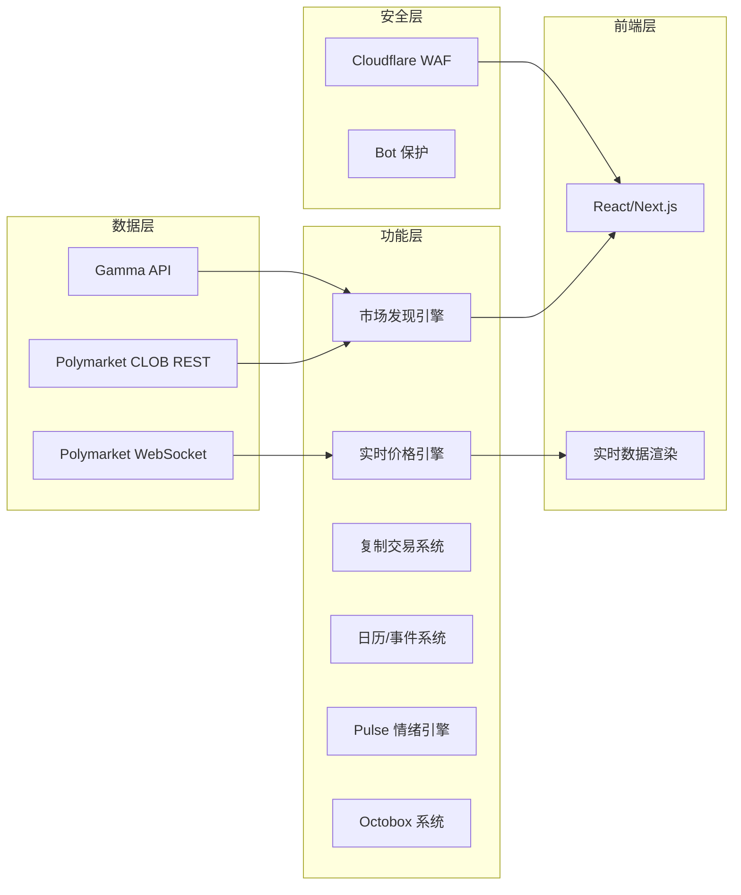
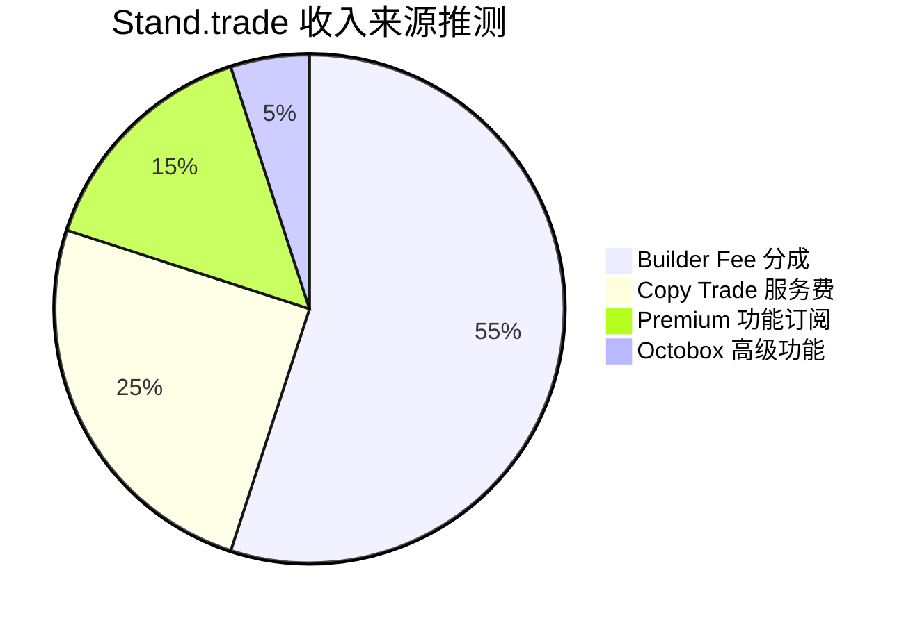

# Stand.trade — 深度分析报告

> 数据日期：2026-03-24  
> Polymarket Builder Program 排名：**#6**  
> 近1月交易量：**$16.46M**

---

## 1. 市场情况

### 1.1 市场定位
Stand（Beta）是一个功能**极为丰富的综合性 Polymarket 交易前端**，产品深度超出预期。口号：「Discover | Stand」，主打发现（Discover）优质预测市场机会。从页面内容来看，Stand 是所有 Builder 中**功能模块最多**的产品之一。

### 1.2 市场规模与地位
- Builder Program 排名 **第六**，月交易量 $16.46M
- 标注为 **BETA 版本**，仍在快速迭代
- 使用 Cloudflare 高安全保护（需真实浏览器环境）
- 已有「March Madness is live!」等时事市场运营活动

### 1.3 竞争格局
- 功能广度上与 Kreo 相近，但 Stand 更侧重 Web 端完整体验
- 与 Polymtrade 同属专业 Web 终端，但功能更多（Copy Trade、Calendar、Pulse、Octobox）
- **Octobox** 功能名称独特，是其他 Builder 没有的模块

---

## 2. 业务架构

### 2.1 市场分类体系（实测）

| 分类 | 覆盖范围 |
|------|----------|
| Trending | 热门市场 |
| All / New | 全部/新市场 |
| Politics | 政治 |
| Sports | 体育（March Madness等）|
| Crypto | 加密货币 |
| Finance | 金融（原油、股票等）|
| Mentions | 被提及的市场 |
| Economy | 经济 |
| Culture | 文化 |
| Weather | 天气 |
| Companies | 公司 |
| Tech | 科技 |
| Climate | 气候 |

**13个分类**，是 Builder 生态中分类最全面的平台之一。

### 2.2 市场展示信息密度（实测）
每个市场卡片显示：
- **Vol**（总交易量）+ **24h**（24小时量）+ **Liq**（流动性）+ **End**（到期日）
- 多结果市场展示各结果的概率
- 一键「Yes/No」下单按钮

---

## 3. 技术架构

### 3.1 技术栈推断
- **前端**：React/Next.js（从页面结构推断）
- **安全**：Cloudflare 企业级保护（说明流量规模大且有保护需求）
- **实时数据**：WebSocket 订阅 Polymarket 实时价格
- **独特模块**：Octobox（功能待确认，可能是多市场组合工具）

---

## 4. 核心功能与技术壁垒

### 4.1 「Octobox」独特功能
- 在所有 Builder 中**唯一**有 Octobox 功能
- 名称暗示「八爪鱼盒子」，可能是：
  - 多市场组合管理（同时管理 8 个市场仓位）
  - 组合策略构建工具
  - 批量下单工具
- **壁垒**：独特功能难以被快速复制

### 4.2 「Pulse」功能
- 可能是市场情绪/脉搏监控工具
- 类似于「市场热度」指标
- 帮助用户发现即将爆发的市场

### 4.3 Copy Trade 集成
- 在专业终端中**同时集成**复制交易功能
- 与 Polymtrade（无复制交易）形成差异化
- 与 PolyCop（纯复制交易，无专业终端）互补

### 4.4 时事运营能力
- 「March Madness is live! Trade here」说明有运营团队
- 能够快速响应热点事件，创建专题入口
- 运营能力是获客的重要手段

### 4.5 技术壁垒评估

| 壁垒类型 | 评分(1-10) | 说明 |
|---------|-----------|------|
| 功能广度 | 9 | 6大模块，13分类，最全面之一 |
| Octobox 独特功能 | 8 | 唯一，难以快速复制 |
| 运营能力 | 8 | 时事热点快速响应 |
| 技术深度 | 7 | 多模块集成工程量大 |
| Cloudflare 保护 | 6 | 说明重视安全和稳定性 |
| BETA 风险 | -1 | 仍处 Beta，功能可能不稳定 |

---

## 5. 商业模式

### 5.1 收入测算
- Builder Fee：$16.46M × 0.5% ≈ **$82.3k/月**
- Copy Trade 服务费：可能额外收取跟单费
- 仍处 Beta，商业化可能尚未完全展开

---

## 6. 待确认问题

- [x] 核心功能：已确认 Discover/Live Feeds/Copy Trade/Calendar/Pulse/Octobox
- [x] 市场分类：13 个分类，覆盖最全面
- [x] 有时事运营活动（March Madness）
- [ ] **Octobox 具体功能是什么？**
- [ ] **Pulse 的数据来源和计算方法？**
- [ ] Copy Trade 的具体机制（托管还是非托管？）
- [ ] Login 支持哪些方式（钱包/邮件/社媒？）
- [ ] BETA 什么时候正式上线？
- [ ] 团队背景？
- [ ] 为何需要 Cloudflare 高级保护？

---

## 7. 总结

Stand.trade 是整个 Builder 生态中**功能最全面、产品设计最有野心**的平台之一：
1. **6大核心模块**：Discover + Live Feeds + Copy Trade + Calendar + Pulse + Octobox
2. **13个市场分类**：覆盖所有主流预测市场类型
3. **Octobox 独特功能**：在所有 Builder 中独一无二
4. **运营能力强**：能快速响应热点（March Madness专题）
5. **仍处 Beta**：月交易量 $16.46M（#6）已相当可观，正式版上线后增长空间大

**Stand.trade 是被严重低估的 Builder，值得重点关注。**
