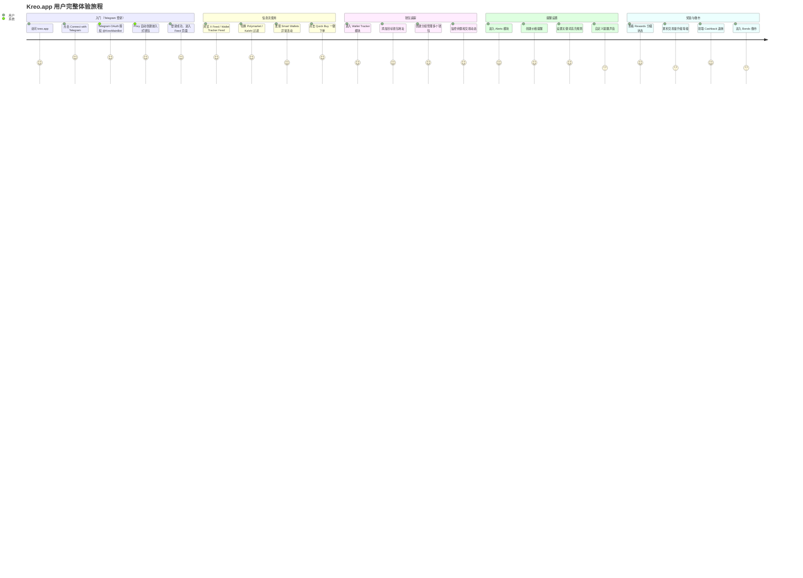
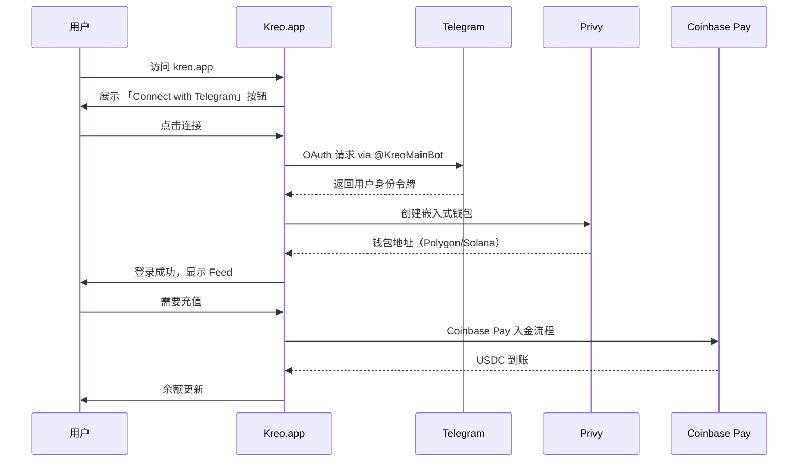
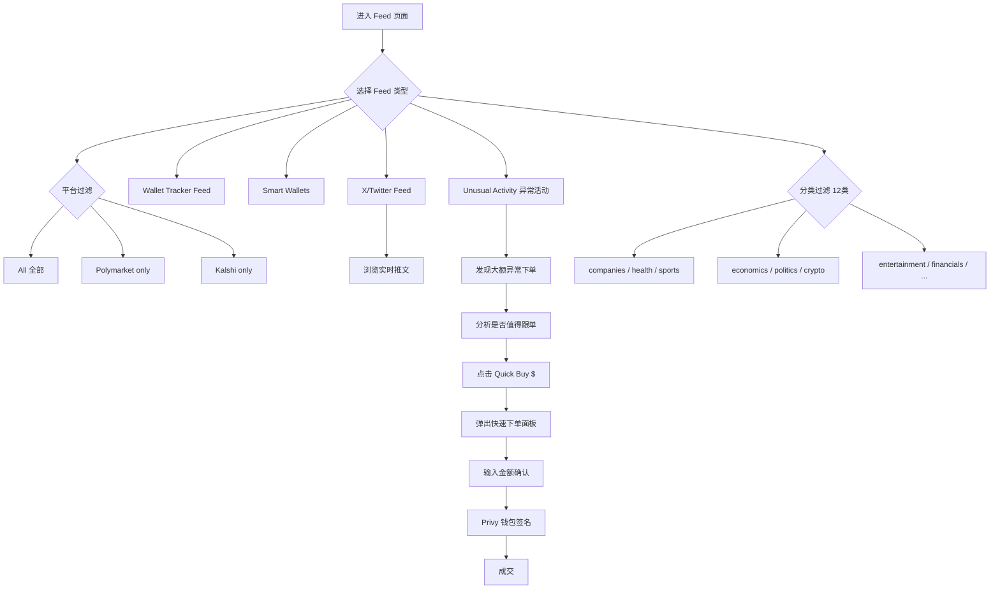
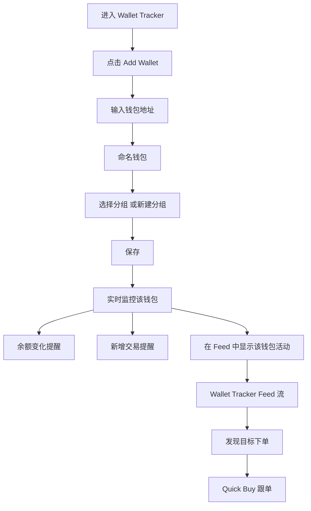
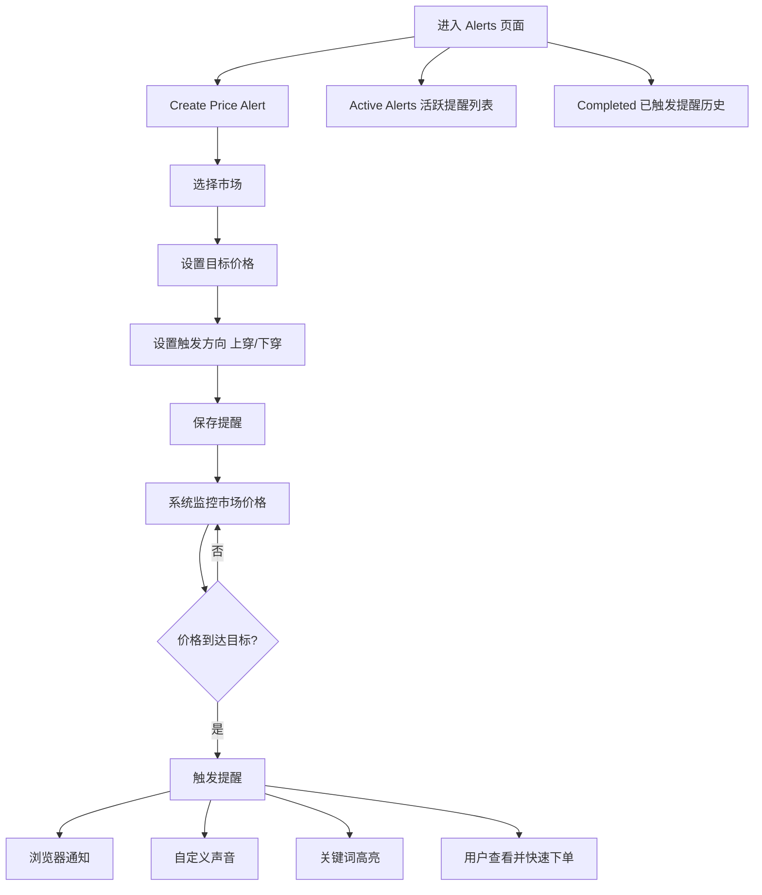
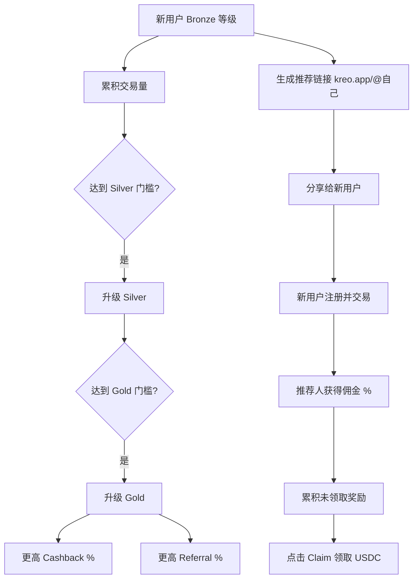
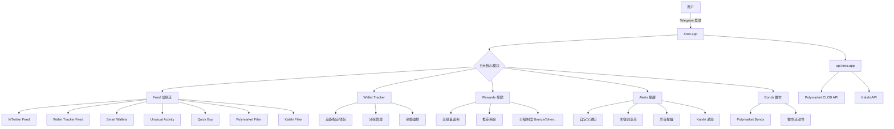
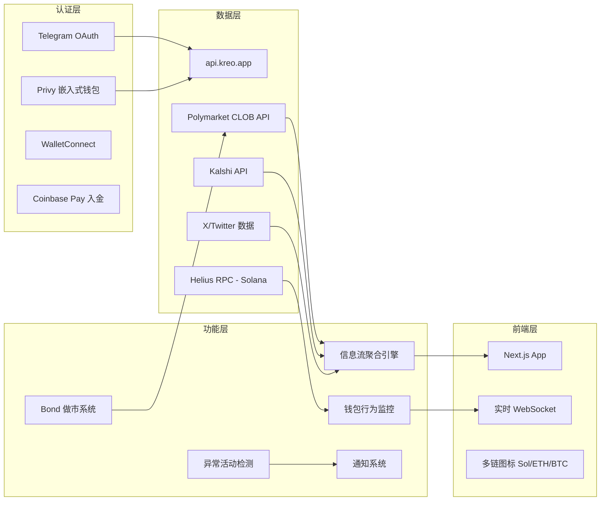
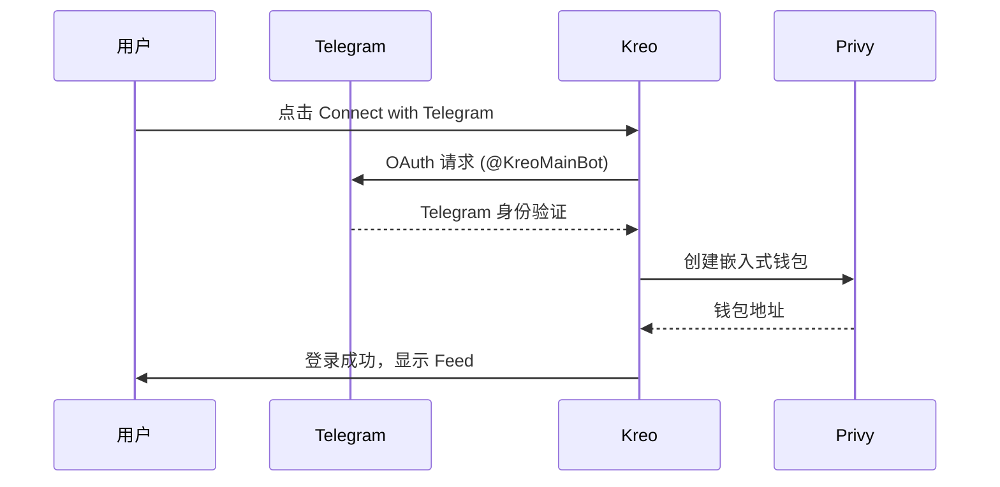
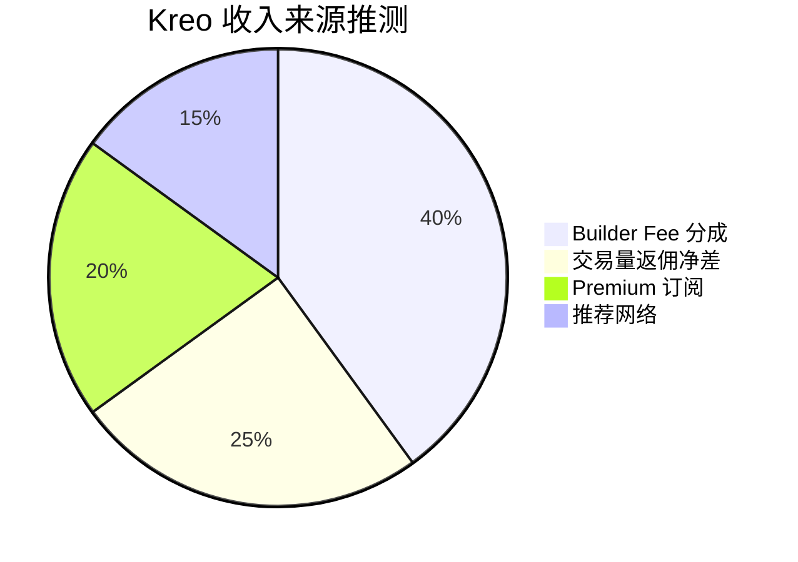

# Kreo — 深度分析报告

> 数据日期：2026-03-24  
> 真实域名：**kreo.app**（非 kreo.trade）  
> Polymarket Builder Program 排名：**#7**  
> 近1月交易量：**$12.72M**

---

## 1. 市场情况

### 1.1 市场定位
Kreo 定位为 **多平台预测市场实时信息流 + 钱包追踪 + 做市工具**。它是整个 Builder 生态中**唯一同时支持 Polymarket 和 Kalshi 两大平台**的综合工具。登录方式：Telegram（@KreoMainBot），非传统 Web3 钱包。

### 1.2 市场规模与地位
- Builder Program 排名 **第七**，月交易量 $12.72M
- 真实域名：`kreo.app`（之前调研误以为是 kreo.trade）
- **技术栈**：Next.js + Privy（非托管钱包）+ Telegram OAuth
- **多链支持**：Solana、Ethereum、Bitcoin（从图标推断）
- 同时聚合 Polymarket 和 Kalshi 数据

### 1.3 竞争格局
- **跨平台聚合**：唯一同时支持 Polymarket + Kalshi 的 Builder
- 与 Polymarket Eye 竞争数据分析赛道，但 Kreo 更侧重实时信息流
- Telegram 登录降低了 Web3 门槛，面向更广泛用户

---

## 2. 用户体验路径

### 2.1 完整用户旅程

### 2.2 Telegram 登录 → 首次使用流程

### 2.3 Feed 信息流使用流程

### 2.4 Wallet Tracker 使用流程

### 2.5 Alerts 提醒系统使用流程

### 2.6 Rewards 分级奖励流程（实测）

**实测 Rewards 页面数据（未登录状态）**：
- 当前等级：Bronze
- 显示字段：% Cashback / % Referral Rate / Your Referral Link
- 展示：Cashback Commission / Referral Commissions / Total Unclaimed / Total Lifetime Earnings
- 具体分级门槛（Silver/Gold 交易量阈值）及对应费率：**需登录后查看，当前无法获取**

---

## 3. 业务架构

### 2.1 Feed 类别（实测 API 参数）
`/api/feed?categories=companies,health,climate_and_weather,world,transportation,sports,economics,entertainment,financials,politics,science_and_technology,crypto`

覆盖 **12 个信息类别**，是全市场覆盖最全的信息流。

---

## 3. 技术架构

### 3.1 关键 API 端点（实测）

| API 端点 | 功能 |
|---------|------|
| `/api/kalshi/prices` | Kalshi 实时价格 |
| `/api/kalshi/notifications` | Kalshi 通知 |
| `/api/feed/groups` | 信息流分组 |
| `/api/wallet-tracker/tracked` | 追踪的钱包列表 |
| `/api/notification/custom-notifications` | 自定义通知 |
| `/api/notification/custom-sounds` | 自定义声音 |
| `/api/notification/keyword-highlighting` | 关键词高亮 |
| `/api/polymarket/bonds` | Polymarket 做市债券 |
| `/api/rewards` | 奖励数据 |
| `/api/rewards/referrals` | 推荐数据 |

### 3.2 Telegram 登录流程

---

## 4. 核心功能与技术壁垒

### 4.1 跨平台聚合壁垒
- 同时接入 Polymarket + Kalshi，是**唯一双平台 Builder**
- 跨平台套利信号：同一事件在两平台价差可能产生套利机会
- **壁垒**：需要同时维护两套 API 集成，工程复杂度更高

### 4.2 Telegram 登录的战略价值
- 无需 MetaMask，普通用户零门槛
- Telegram 用户基数庞大（9亿+），获客成本低
- Privy 钱包在后台自动创建，用户无感

### 4.3 信息流 + 异常检测
- 「Unusual Activity」检测：链上异常大单、聪明钱异动
- 「Quick Buy」：在 Feed 中直接一键买入，信息到执行零摩擦
- 自定义关键词高亮 + 声音提醒：专业交易者的必备工具

### 4.4 Bonds 做市功能
- 与 PolyMaker.bet 类似，提供 Polymarket 做市工具
- `/api/polymarket/bonds` 端点说明有完整的 Bond 管理

### 4.5 分级奖励体系
- Bronze / Silver / ... 分级制度
- 基于交易量的返佣（Cashback）
- 推荐佣金（Referral Commission）
- 完整的激励飞轮

### 4.6 技术壁垒评估

| 壁垒类型 | 评分(1-10) | 说明 |
|---------|-----------|------|
| 跨平台聚合 | 9 | 唯一 Poly+Kalshi 双平台 |
| Telegram 渠道 | 8 | 低门槛登录，大用户池 |
| 实时信息流 | 8 | 12类别 + 异常检测 |
| 做市工具 | 7 | Bonds 功能完整 |
| 通知系统 | 8 | 关键词+声音+自定义，专业级 |
| 数据积累 | 7 | 双平台数据积累壁垒 |

---

## 5. 商业模式

### 5.1 收入测算
- Builder Fee：$12.72M × 0.5% ≈ **$63.6k/月**
- 分级返佣：平台向用户返佣，但保留一部分差额
- 可能有 Pro 订阅（更多通知、更多追踪钱包数量）

---

## 6. 待确认问题

- [x] 真实域名：已确认为 kreo.app
- [x] 核心功能：Feed/Wallet Tracker/Rewards/Alerts/Bonds
- [x] 登录方式：Telegram OAuth + Privy 钱包
- [x] 同时支持 Polymarket + Kalshi
- [ ] Bonds 的具体 APR 和做市策略？
- [ ] 分级制度（Bronze/Silver/Gold）的门槛和具体返佣率？
- [ ] 多链支持（Solana/ETH/BTC）的具体使用场景？
- [ ] 自定义声音提醒是浏览器通知还是 Telegram 推送？
- [ ] 团队背景？Helius RPC 说明与 Solana 有深度连接
- [ ] X Feed 数据来源（官方 API 还是第三方聚合）？

---

## 7. 总结

Kreo 是整个 Polymarket Builder 生态中**功能最综合、技术深度最强**的平台之一：
1. **唯一跨平台**：同时支持 Polymarket + Kalshi
2. **Telegram 登录**：最低门槛的 Web3 入口
3. **完整工具链**：信息流 + 钱包追踪 + 做市 + 提醒 + 奖励
4. **专业级通知**：关键词高亮、自定义声音，针对专业交易者
5. 月交易量 $12.72M（#7），考虑其功能深度，仍有较大增长空间
