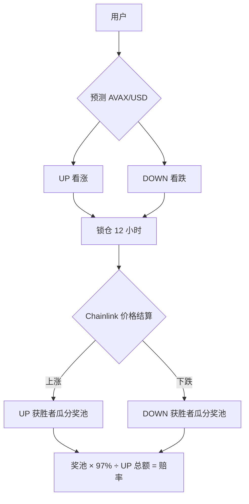
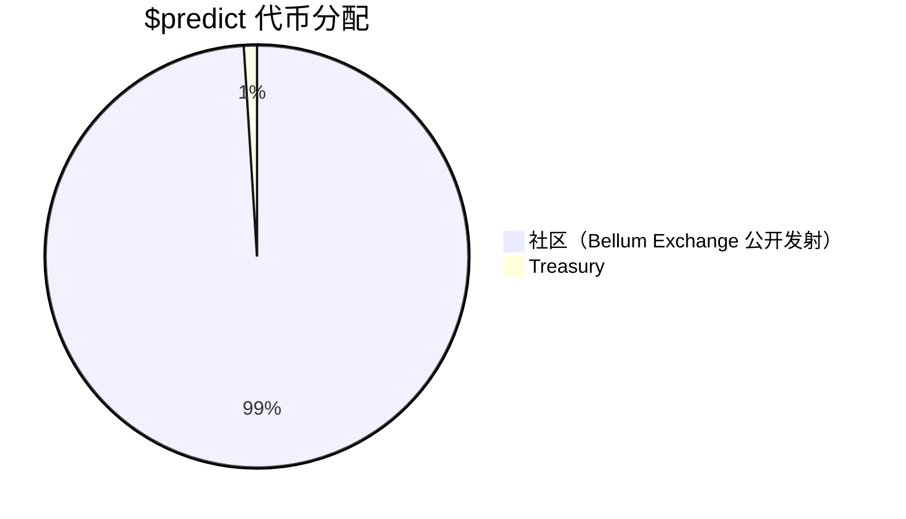
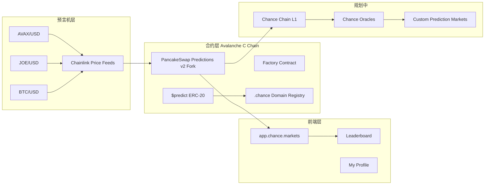
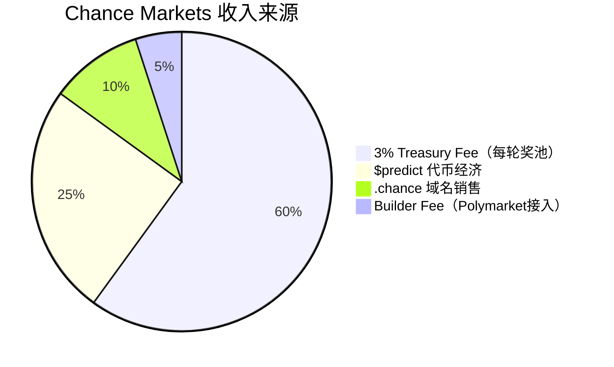

# Chance Markets — 深度分析报告（重大更新）

> 数据日期：2026-03-24  
> Polymarket Builder Program 排名：**#8**  
> 近1月交易量：**$9.99M**  
> ⚠️ **重要更正**：Chance Markets 与 Polymarket **完全无关**，是独立的 Avalanche 生态预测市场

---

## 1. 重大更正说明

初次调研时基于官网首页（chance.markets 无法访问）错误推断 Chance 是 Polymarket 前端。通过访问 `docs.chance.markets` 和 `app.chance.markets`，确认：

**Chance Markets 是基于 Avalanche C Chain 的独立价格预测平台，合约是 PancakeSwap Predictions v2 的 Fork，与 Polymarket 架构完全不同。**

它出现在 Polymarket Builder Program 排行榜，可能是因为：
1. 团队同时运营了一个 Polymarket 前端（Builder Code 接入）
2. 或者排行榜数据混淆

> 需要进一步确认 Chance 在 Polymarket 中的具体接入方式。

---

## 2. 产品真实情况

### 2.1 核心产品
- **类型**：UP/DOWN 价格预测游戏（Binary Prediction）
- **链**：Avalanche C Chain
- **预测标的**：AVAXUSD、JOEUSD、BTCUSD、QIUSD、COQUSD
- **价格来源**：Chainlink Price Feeds
- **合约**：PancakeSwap Predictions v2 Fork（已审计，PeckShield）
- **轮次**：每轮 12 小时，有 12 小时入场窗口
- **费率**：Treasury Fee 3%

### 2.2 玩法机制

**赔率计算**：
- UP 赔率 = 总奖池 ÷ UP 总仓位
- DOWN 赔率 = 总奖池 ÷ DOWN 总仓位
- 例：DOWN 池 15 AVAX，总池 150 AVAX → DOWN 赔率 10x

### 2.3 生态系统

| 组件 | 状态 | 说明 |
|------|------|------|
| **Daily Markets** | ✅ Alpha | AVAX/JOE/BTC/QI/COQ UP/DOWN |
| **$predict 代币** | ✅ 已发行 | Memecoin，总量 42,000,069，100% 流通 |
| **.chance Domains** | ✅ 上线 | 链上 NFT 域名，2000 $predict/个 |
| **Chance Chain L1** | 🚧 建设中 | 基于 Avalanche Stack |
| **Chance Oracles** | 🚧 规划中 | 支持小流动性代币的预言机 |
| **Custom Prediction Markets** | 🚧 规划中 | 用户自建预测市场 |
| **Leaderboard** | ✅ 上线 | 使用 .chance 域名作为用户名 |

---

## 3. $predict 代币详情

| 属性 | 数值 |
|------|------|
| **合约地址** | `0xe46b44179db3af934da552b35ff8869e98dc6af5` |
| **总供应量** | 42,000,069 |
| **流通量** | 100%（全流通）|
| **发射方式** | Bellum Exchange Stealth Launch |
| **绑定时间** | 30 分钟内完成绑定至 LFJ（Trader Joe）|
| **交易所** | LFJ.gg / DEX Screener / CoinGecko |

---

## 4. 技术架构

### 4.1 合约架构
- **基础**：PancakeSwap Predictions v2（已有 PeckShield 审计报告）
- **链**：Avalanche C Chain（低 gas，快确认）
- **去中心化程度**：无需许可，不依赖单一运营方
- **贡献者模式**：社区驱动，多个独立贡献者（JankyStudios 开发，cccompanions 品牌，FortiFi 平台合作）

---

## 5. 核心功能与壁垒

### 5.1 与 Polymarket 的关键区别

| 维度 | Chance Markets | Polymarket |
|------|---------------|------------|
| 链 | Avalanche C Chain | Polygon |
| 结算货币 | AVAX | USDC |
| 预测类型 | UP/DOWN 价格 | 任意事件 |
| 合约基础 | PancakeSwap v2 Fork | 自研 CLOB + CTF |
| 赔率机制 | 动态赔率（奖池比例）| 限价订单簿 |
| 预言机 | Chainlink | UMA |

### 5.2 壁垒评估

| 壁垒类型 | 评分(1-10) | 说明 |
|---------|-----------|------|
| $predict 社区 | 7 | Memecoin 社区黏性 |
| .chance 域名生态 | 6 | NFT 域名增加用户归属感 |
| Avalanche 生态位 | 7 | Avalanche 最活跃预测市场 |
| 技术壁垒 | 4 | PancakeSwap Fork，可复制 |
| Chance Chain 愿景 | 7 | 若成功，护城河极深 |

---

## 6. 商业模式

### 6.1 收入测算
- **Treasury Fee**：每轮奖池的 3% 归 Treasury
- 若月交易量 $9.99M 是来自 Polymarket 接入，则 Builder Fee ≈ $50k/月
- $predict 代币升值对早期持有者有利，Treasury 持有 1%
- .chance 域名：2000 $predict/个，按 $predict 价格计算收入

---

## 7. 待确认问题

- [ ] **Chance Markets 在 Polymarket Builder Program 的具体接入方式**？是否同时有 Polymarket 前端？
- [ ] $predict 当前市值和价格？（CoinGecko 已上市）
- [ ] Chance Chain 当前进展？（文档说「已启动」）
- [ ] 月交易量 $9.99M 的构成：Avalanche 预测 vs Polymarket 接入？
- [ ] JankyStudios 和 cccompanions 的具体角色？
- [ ] FortiFi 平台合作的具体内容？
- [ ] Custom Prediction Markets 的上线时间表？

---

## 8. 总结

Chance Markets 是一个**完全独立的预测市场生态**，基于 Avalanche C Chain，与 Polymarket 属于同赛道竞争者而非前端工具：

1. **独特机制**：UP/DOWN 动态赔率，比 Polymarket 的 CLOB 更简单易懂
2. **完整代币经济**：$predict + .chance 域名 + Leaderboard 构成完整激励体系
3. **Avalanche 原生**：在 Avalanche 生态中占据独特位置
4. **野心勃勃**：Chance Chain L1 + 自定义预言机 + 自定义预测市场
5. **社区驱动**：无单一运营方，多贡献者模式

**与 Polymarket 的关系需要进一步确认**——它出现在 Builder Program 排行榜可能意味着团队同时运营了一个 Polymarket 接入前端。
