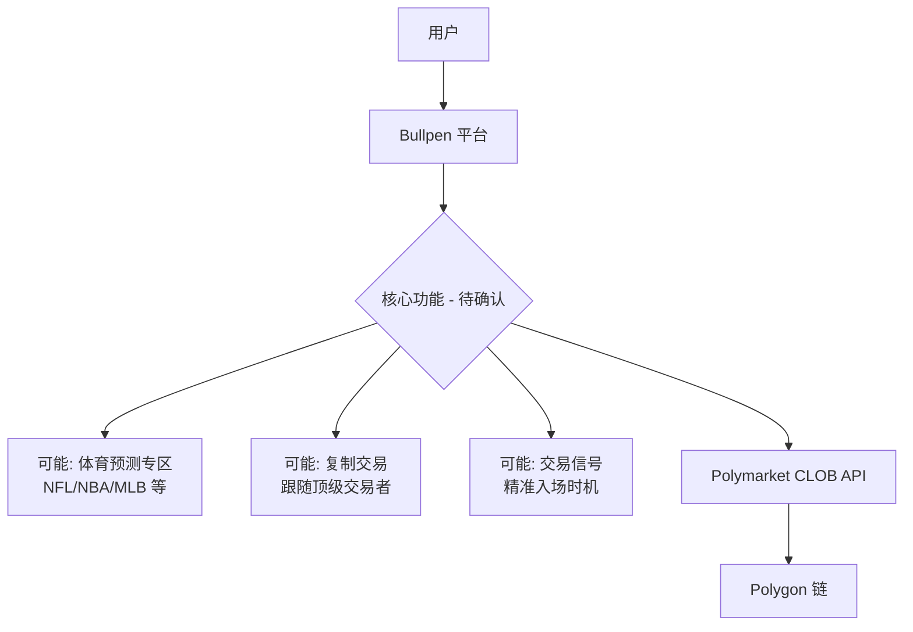
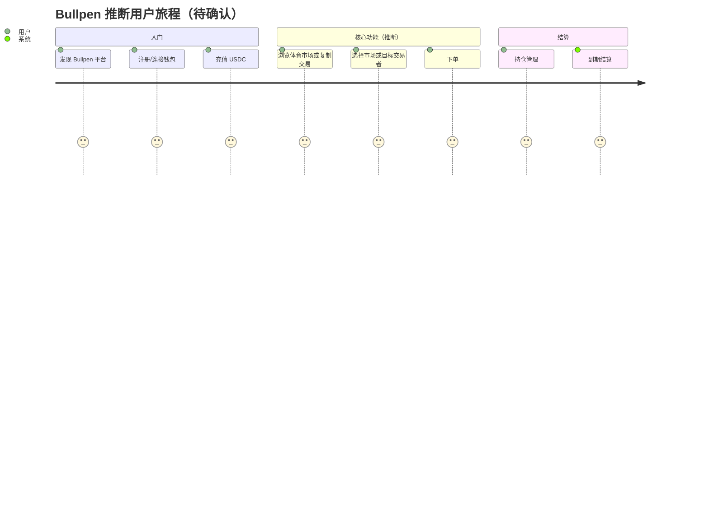
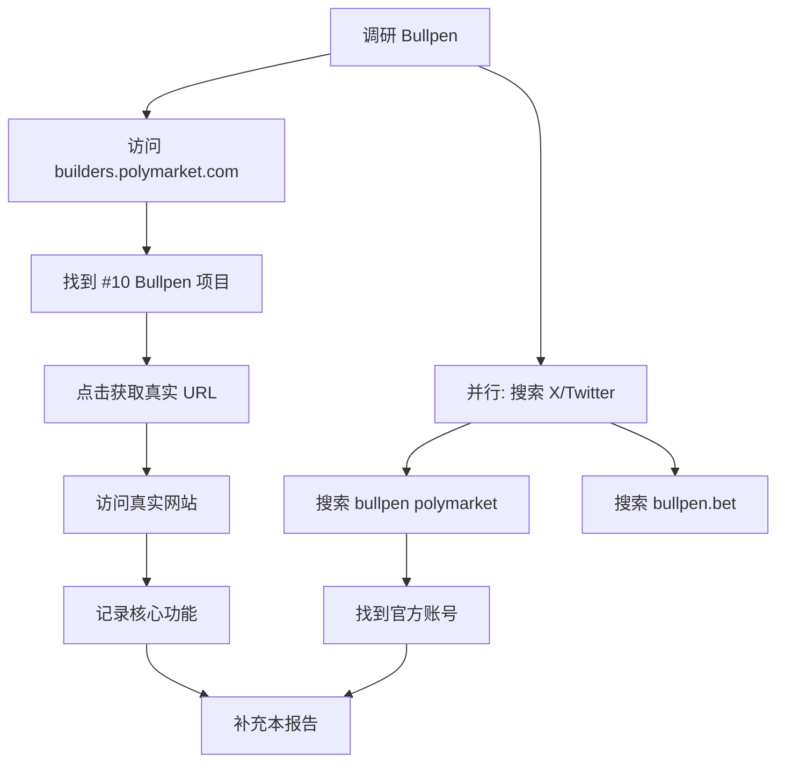
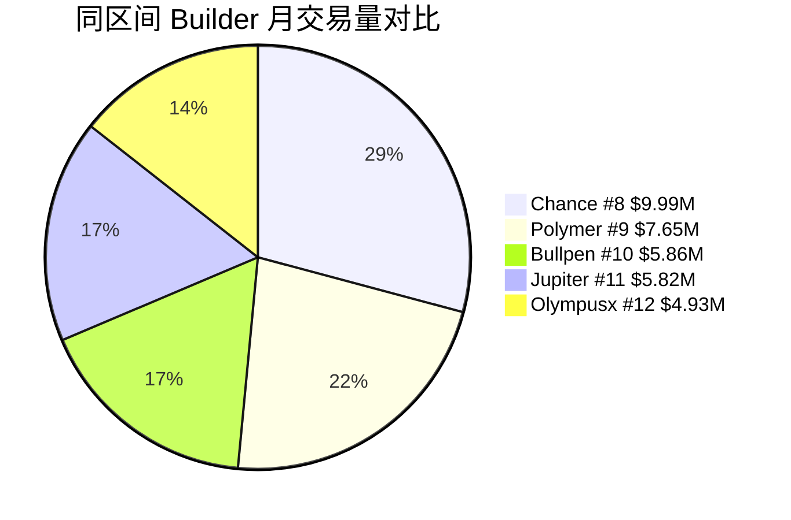

# Bullpen — 深度分析报告

> 数据日期：2026-03-24  
> Polymarket Builder Program 排名：**#10**  
> 近1月交易量：**$5.86M**  
> 真实 URL：**待确认**（以下所有域名尝试均失败）

---

## 1. 已确认信息

- Builder Program 排名 **第十**，月交易量 **$5.86M**
- 尝试域名（均失败）：
  - `bullpen.markets`、`bullpen.bet`、`bullpen.app`
  - `bullpen.io`、`bullpen.gg`、`bullpen.xyz`
  - `bullpen.wtf`、`bullpen.club`、`bullpen.so`、`bullpen.fun`
  - `getbullpen.io`
- 真实 URL **需手动在 builders.polymarket.com 点击项目链接确认**

### 1.1 名称含义
「Bullpen」在棒球中指 **牛棚**（投手候场区），引申含义：
- 金融语境：**多头看涨**（Bull）的交易场所
- 棒球语境：等待时机、精准出手、候场候机
- 产品暗示：可能与体育预测市场或「等待最佳入场时机」相关

---

## 2. 推断定位

基于交易量（$5.86M，#10）和名称，可能的定位：

| 假设 | 依据 | 可能性 |
|------|------|--------|
| 体育预测市场专属前端 | 「Bullpen」棒球术语 | 高 |
| 复制交易平台 | 同量级 Olympusx/PolyCop | 中 |
| 交易信号工具 | 「等待时机出手」语义 | 中 |
| 聚合交易终端 | 体量与 Polymtrade 相近 | 低 |

### 2.1 对标竞品分析
月交易量 $5.86M（#10），介于 Chance（$9.99M, #8）和 Jupiter（$5.82M, #11）之间，体量可观但功能未知。

### 2.2 推断用户旅程（待验证）

---

## 3. 待确认问题（核心）

- [ ] **真实网址是什么？** 在 builders.polymarket.com 排行榜中点击 Bullpen 项目链接
- [ ] 核心产品功能是什么？
- [ ] 是否专注体育类预测市场（NFL/NBA/MLB/NHL）？
- [ ] 是复制交易、信号工具还是聚合终端？
- [ ] 托管还是非托管？
- [ ] 是否有 Twitter/X 账号？搜索 `@bullpen` 或 `bullpen polymarket`
- [ ] 团队背景？
- [ ] 费率结构？
- [ ] 是否有移动端 App？

---

## 4. 调研行动计划

**备选调研途径**：
1. 在 X/Twitter 搜索 `bullpen polymarket`
2. 在 Polymarket Discord 的 `#builders` 频道搜索 Bullpen
3. 在 Polymarket builders.polymarket.com 排行榜点击 #10 位置的项目链接

---

## 5. 市场地位分析

- $5.86M/月（#10）说明 Bullpen **有真实用户和真实交易量**
- 体量与 Jupiter（Solana 最大 DEX）相当，说明产品有一定竞争力
- 处于前十边缘，若功能有差异化，有进入前五的潜力

---

## 6. 总结

Bullpen 以 **$5.86M/月**（#10）位居前十，交易量可观，但真实产品功能**目前无法通过网络直接访问**确认。

**优先行动**：手动访问 builders.polymarket.com，点击 #10 Bullpen 项目链接，获取真实 URL 后深度补充本报告。

**TODO**：
- [ ] 获取真实 URL
- [ ] 确认产品定位
- [ ] 补充 UX 路径
- [ ] 补充技术架构
- [ ] 补充商业模式
