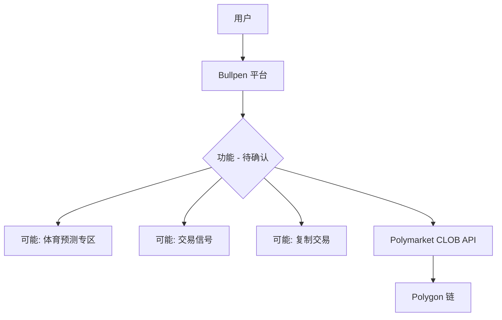

# Bullpen — 深度分析报告

> 数据日期：2026-03-24  
> Polymarket Builder Program 排名：**#10**  
> 近1月交易量：**$5.86M**

---

## 1. 已确认信息

- Builder Program 排名 **第十**，月交易量 **$5.86M**
- 尝试域名：`bullpen.markets`、`bullpen.bet`、`bullpen.app`、`bullpen.io`、`bullpen.gg`、`bullpen.xyz` 均无法解析或不相关
- 真实 URL **待确认**（需手动在 Polymarket builders 排行榜点击项目链接）

### 名称含义
「Bullpen」在棒球中指牛棚（投手候场区），引申含义是「等待时机、精准出手」。在金融语境中也可能指「多头看涨」。这暗示产品可能与体育预测或交易时机把握有关。

---

## 2. 推断定位

基于交易量（$5.86M，#10）和名称，推断可能是：
1. **体育预测市场专属前端**：专注 Polymarket 的体育类市场
2. **交易信号工具**：帮助用户把握最佳入场时机
3. **复制交易平台**：与 PolyCop/Polygun 同赛道

---

## 3. 待确认问题（核心）

- [ ] **真实网址是什么？** 在 builders.polymarket.com 排行榜中找到项目链接
- [ ] 核心产品功能？
- [ ] 是否专注体育类预测市场？
- [ ] 目标用户群体？
- [ ] 托管还是非托管？
- [ ] 团队背景？
- [ ] 是否有 Twitter/X 账号？

---

## 4. 调研计划

**优先行动**：访问 `https://builders.polymarket.com`，在排行榜中找到 Bullpen（#10），点击项目链接获取真实 URL。

---

## 5. 总结（初步）

Bullpen 以 **$5.86M/月**（#10）位居前十，体量可观。真实域名和具体功能**待手动确认**。鉴于其交易量规模，值得重点调研。
