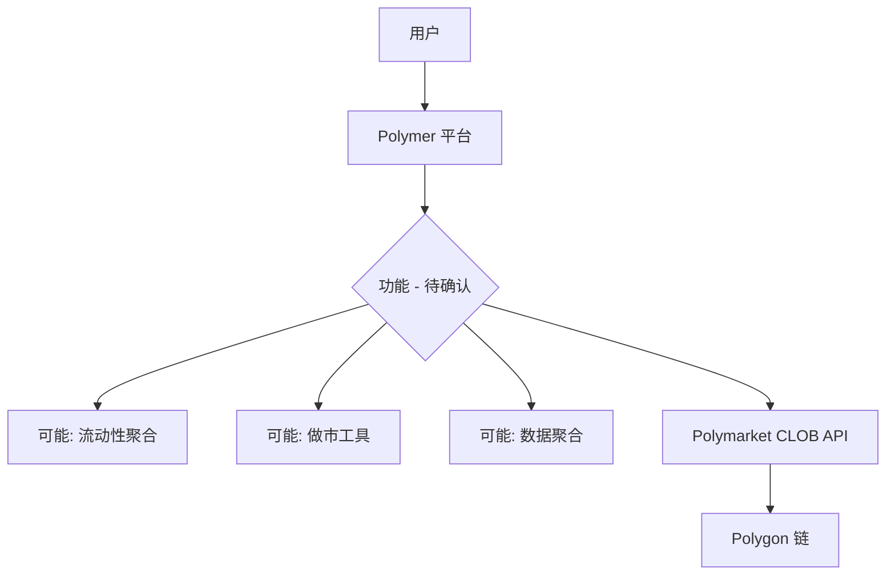

# Polymer — 深度分析报告

> 数据日期：2026-03-24  
> Polymarket Builder Program 排名：**#9**  
> 近1月交易量：**$7.65M**

---

## 1. 已确认信息

- Builder Program 排名 **第九**，月交易量 **$7.65M**
- 尝试域名：
  - `polymer.fi` — 域名待售（nameshift.com），**非此项目**
  - `polymer.trade` — 存在但内容为空
  - `polymer.app`、`polymerfi.xyz`、`polymerapp.xyz` — 均无法解析
- 真实 URL **待确认**

### 注意事项
- 需区分：「Polymer」(Polymarket Builder #9) vs「Polymer Protocol」(跨链互操作协议，polymer.network)
- 后者是 IBC 协议的 EVM 扩展，与 Polymarket 无关

---

## 2. 推断定位

基于名称「Polymer」（聚合物），可能的定位：
1. **流动性聚合器**：聚合 Polymarket 多个市场的流动性
2. **做市工具**：类似 PolyMaker.bet 的做市平台
3. **数据聚合**：整合多源数据

---

## 3. 待确认问题（核心）

- [ ] **真实网址是什么？** 在 builders.polymarket.com 找到项目链接
- [ ] 与 Polymer Protocol（跨链）有关联吗？
- [ ] 核心产品功能？
- [ ] 目标用户：交易者、做市商还是数据用户？
- [ ] 团队背景？
- [ ] 是否有 Twitter/X 账号？

---

## 4. 调研计划

**优先行动**：访问 `https://builders.polymarket.com`，在排行榜中找到 Polymer（#9），点击获取真实 URL。

---

## 5. 总结（初步）

Polymer 以 **$7.65M/月**（#9）位居前十，体量显著。真实域名和具体功能**待手动确认**。
