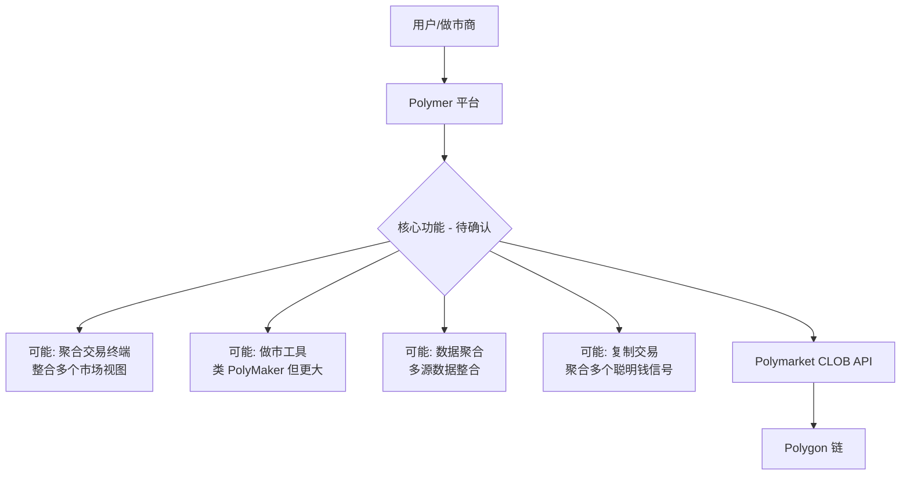
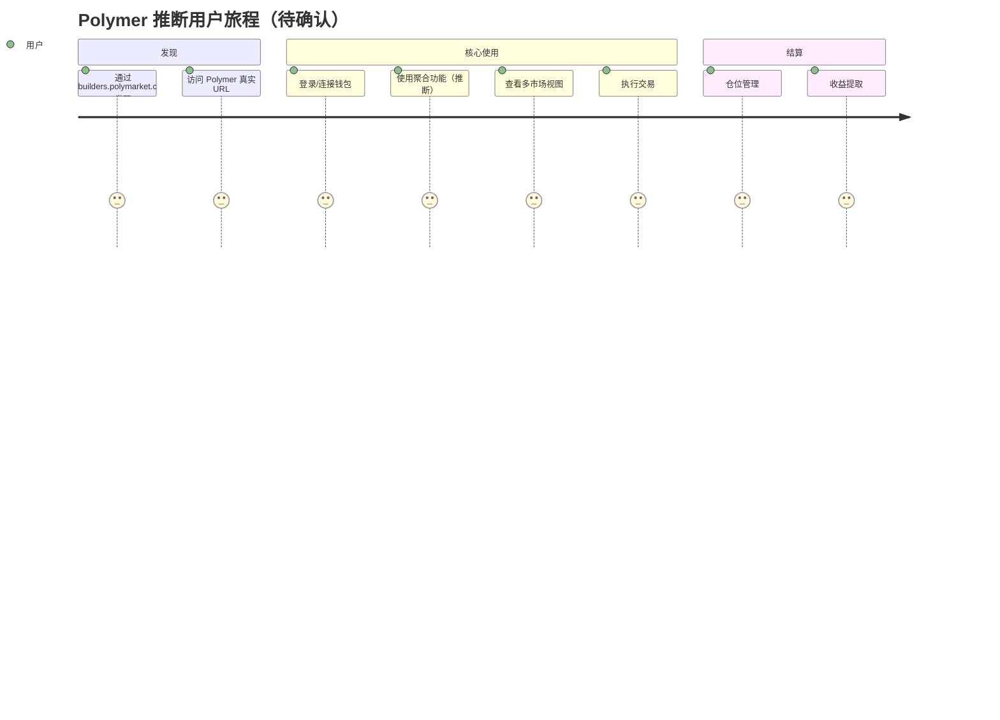
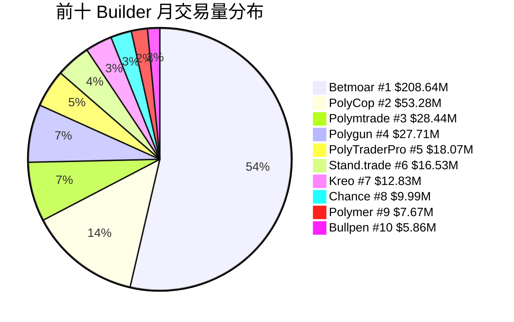
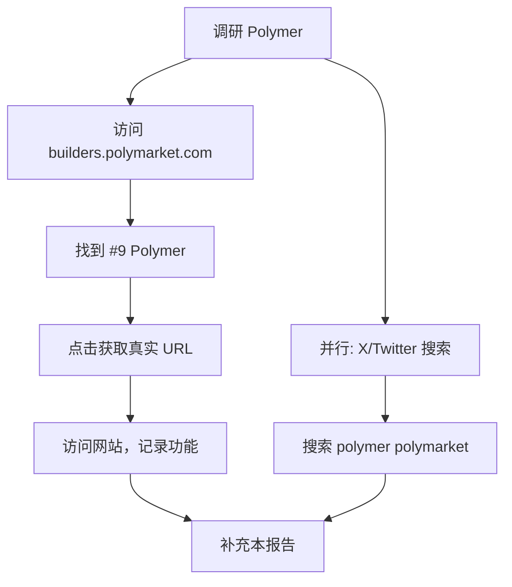

# Polymer — 深度分析报告

> 数据日期：2026-03-24  
> Polymarket Builder Program 排名：**#9**  
> 近1月交易量：**$7.67M**（官方排行榜实测）  
> 真实 URL：**待确认**（所有常见域名均失败）

---

## 1. 已确认信息

- Builder Program 排名 **第九**，月交易量 **$7.67M**
- 尝试域名（均失败）：
  - `polymer.fi` — GoDaddy 待售页，非此项目
  - `polymer.trade` — 重定向到 GoDaddy 待售页，非此项目
  - `polymer.app`、`polymerfi.xyz`、`polymerapp.xyz` — 无法解析
  - `getpolymer.app`、`polymerapp.io` — 无法解析
- 真实 URL **需手动在 builders.polymarket.com 点击项目链接确认**

### 1.1 重要区分
⚠️ **「Polymer」(Polymarket Builder #9)** ≠ **「Polymer Protocol」(polymer.network)**  
后者是 IBC 协议的 EVM 跨链互操作扩展，与 Polymarket 完全无关。

---

## 2. 名称推断

「Polymer」（聚合物）在产品语境中可能代表：

| 语义 | 推断功能 | 可能性 |
|------|----------|--------|
| 聚合（aggregate）多个市场 | 流动性/数据聚合器 | 高 |
| 合成（synthesize）仓位 | 复合仓位/套利工具 | 中 |
| 做市（market making） | 类似 PolyMaker.bet | 中 |
| 聚合多平台 | 跨平台聚合（Poly+Kalshi）| 低 |

---

## 3. 推断定位

排名 #9，月交易量 $7.67M，仅次于 Chance（$9.99M）。体量如此大，说明产品有稳定的用户基础。可能的定位：

### 3.1 推断用户旅程（待验证）

---

## 4. 市场地位

- $7.67M/月（#9）是前十中较低的，但仍远超 #11（Jupiter $5.84M）
- 与 Chance（#8）差距约 $2.3M，若功能有差异化有追赶空间

---

## 5. 待确认问题（核心）

- [ ] **真实网址是什么？** 在 builders.polymarket.com 点击 #9 Polymer 链接
- [ ] 与 Polymer Protocol（polymer.network）有无关联？
- [ ] 核心产品功能：聚合器？做市工具？复制交易？
- [ ] 目标用户：散户、做市商还是机构？
- [ ] 托管或非托管？
- [ ] 团队背景？
- [ ] Twitter/X 账号？
- [ ] 费率结构？

---

## 6. 调研行动计划

**备选途径**：
1. X/Twitter 搜索 `polymer polymarket`
2. Polymarket Discord `#builders` 频道搜索 Polymer
3. builders.polymarket.com 排行榜 #9 点击链接

---

## 7. 总结

Polymer 以 **$7.67M/月**（#9）位居前十，是仅次于前八强的有力竞争者。由于所有常见域名均无法访问，真实产品功能**完全待确认**。

**优先行动**：手动访问 builders.polymarket.com，点击 #9 Polymer，获取真实 URL。

**TODO**：
- [ ] 获取真实 URL
- [ ] 确认产品定位
- [ ] 补充 UX 路径和 Mermaid 流程图
- [ ] 补充技术架构
- [ ] 补充商业模式和竞品对比
