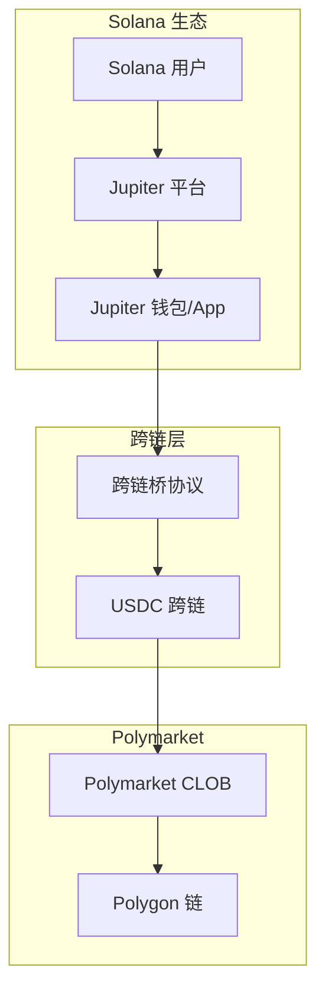
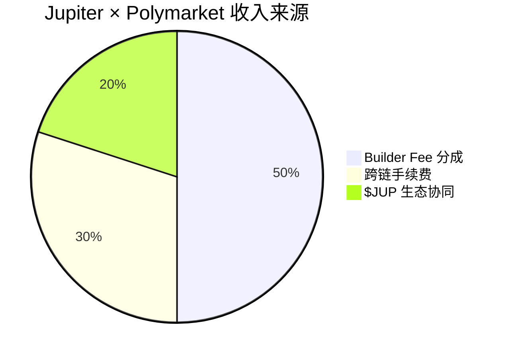

# Jupiter — 深度分析报告

> 数据日期：2026-03-24  
> Polymarket Builder Program 排名：**#11**  
> 近1月交易量：**$5.82M**

---

## 1. 市场情况

### 1.1 市场定位
Jupiter 是 **Solana 生态最大的 DEX 聚合器**，其在 Polymarket Builder Program 中的出现代表了一个重要信号：**传统 DeFi 基础设施开始集成预测市场**。

### 1.2 Jupiter 背景
- Solana 生态最大的流动性聚合协议，累计交易量超数百亿美元
- 核心产品：DEX 路由聚合（类似 Solana 上的 1inch）
- 代币：$JUP，市值数十亿美元
- 用户基数：Solana 生态数百万用户

### 1.3 为何接入 Polymarket？
- 为其庞大的 Solana 用户群提供预测市场功能
- 预测市场是 DeFi 的新增长点，Jupiter 通过集成扩展产品边界
- Polymarket 在 Polygon 上，Jupiter 连接 Solana←→Polygon 有跨链技术挑战

---

## 2. 业务架构



### 2.1 Jupiter × Polymarket 集成模式推断

```mermaid
sequenceDiagram
    participant U as Solana 用户
    participant J as Jupiter App
    participant B as 跨链桥 (Wormhole/Allbridge)
    participant P as Polymarket API
    participant PG as Polygon
    
    U->>J: 在 Jupiter 界面浏览预测市场
    J->>P: 获取市场数据
    P-->>J: 市场列表 + 价格
    U->>J: 选择市场，输入金额
    J->>B: USDC Solana → Polygon
    B-->>PG: Polygon USDC 到账
    J->>P: 提交订单 (代理执行)
    P->>PG: 链上成交
    PG-->>J: 成交回执
    J->>U: 通知成交，更新持仓

---

## 3. 技术架构

```mermaid
graph LR
    subgraph Jupiter 技术栈
        J1[Jupiter Frontend React]
        J2[Jupiter SDK]
        J3[Solana Web3.js]
    end
    
    subgraph 跨链层
        X1[Wormhole / Allbridge]
        X2[CCTP - Circle 跨链]
        X3[USDC Native Bridge]
    end
    
    subgraph Polymarket 层
        P1[CLOB REST API]
        P2[Gamma API]
        P3[Polygon ethers.js]
    end
    
    J1 --> J2
    J2 --> J3
    J2 --> X1
    X1 --> X2
    X2 --> P3
    J1 --> P1
    J1 --> P2
```

---

## 4. 核心功能与技术壁垒

### 4.1 跨链集成壁垒
- Jupiter 需要处理 Solana→Polygon 的跨链资产转移
- 使用 Circle CCTP（跨链转账协议）可实现原生 USDC 跨链，无滑点
- **壁垒**：跨链基础设施已有成熟方案，但集成工作量大

### 4.2 用户规模优势
- Jupiter 拥有 Solana 生态数百万活跃用户
- 将这批用户引入预测市场是其最大优势
- **壁垒**：用户基数和品牌信任不可复制

### 4.3 技术壁垒评估

| 壁垒类型 | 评分(1-10) | 说明 |
|---------|-----------|------|
| 用户基数 | 10 | Solana 生态最大用户池 |
| 品牌信任 | 9 | $JUP 持有者众多，高信任度 |
| 跨链技术 | 7 | CCTP 等成熟方案 |
| 预测市场专业度 | 4 | 非核心业务，功能深度可能有限 |
| 流量优势 | 9 | 自带流量无需获客 |

---

## 5. 商业模式



### 5.1 收入测算
- 月交易量 $5.82M × 0.5% ≈ **$29k/月** Builder Fee
- 加上跨链手续费收入
- 对 Jupiter 而言，预测市场是**产品扩展而非主要收入来源**

### 5.2 战略价值（超越直接收入）
- 增加 Jupiter 平台的功能丰富度
- 为 $JUP 代币增加使用场景
- 探索 DeFi × 预测市场的融合方向

---

## 6. 待确认问题

- [ ] Jupiter 使用哪种跨链方案连接 Solana 和 Polygon？
- [ ] Jupiter 的 Polymarket 集成是独立页面还是嵌入现有 DEX 界面？
- [ ] 用户在 Jupiter 上交易 Polymarket 是否需要额外的 KYC？
- [ ] Jupiter 的 Polymarket 集成是否为独家？还是也接入了 Kalshi 等？
- [ ] 月交易量 $5.82M 中 Solana 用户占比多少？

---

## 7. 总结

Jupiter 接入 Polymarket 是整个 Builder 生态中**战略意义最大的案例之一**：
1. 代表了**传统 DeFi 基础设施向预测市场扩展**的趋势
2. 为 Polymarket 带来了 Solana 生态的庞大用户流量
3. 月交易量 $5.82M（#11）相对其用户基数而言渗透率还很低，增长空间大
4. **预示着未来更多大型 DeFi 协议可能接入预测市场**
