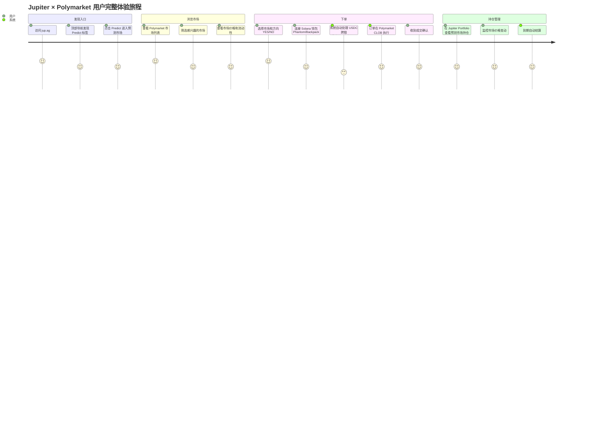
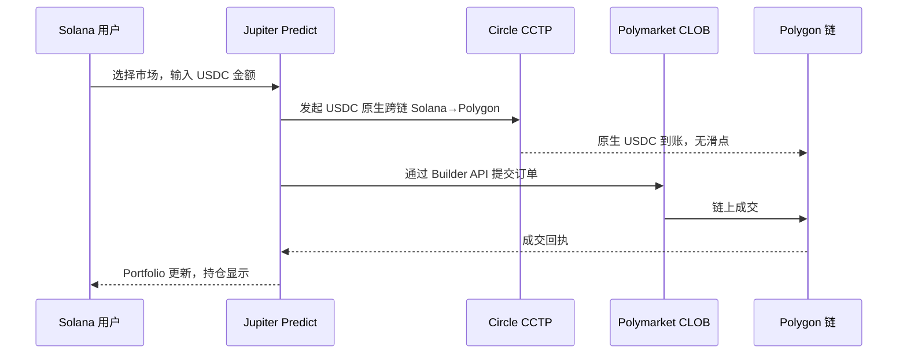
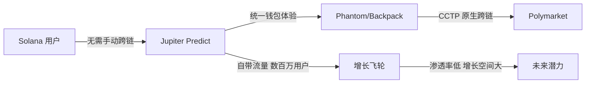
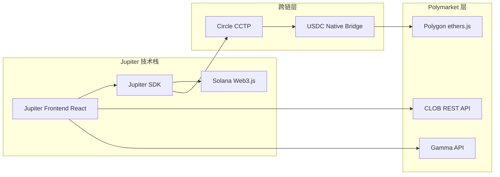
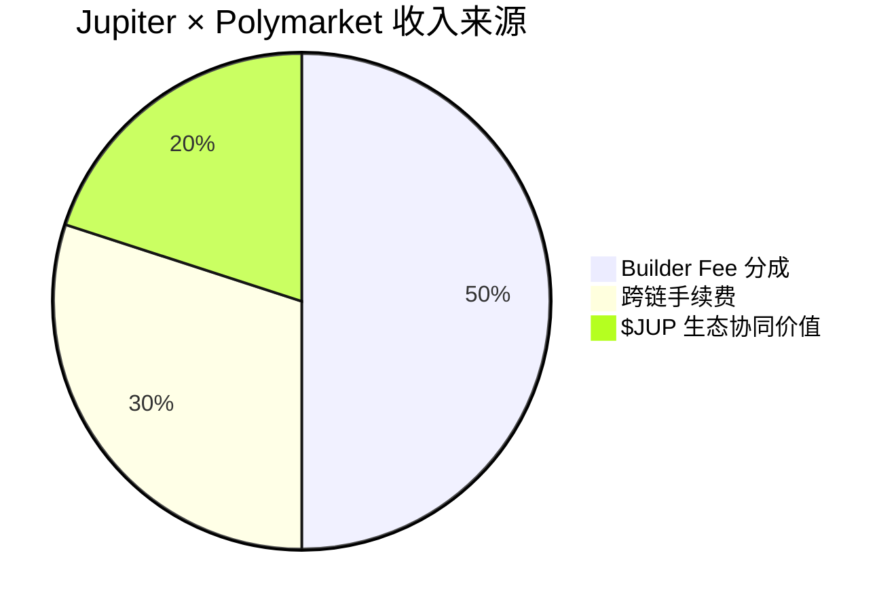

# Jupiter — 深度分析报告

> 数据日期：2026-03-24  
> Polymarket Builder Program 排名：**#11**  
> 近1月交易量：**$5.82M**  
> 官网：**jup.ag**（Predict 入口：jup.ag 顶部导航 → Predict）

---

## 1. 市场情况

### 1.1 市场定位
Jupiter 是 **Solana 生态最大的 DEX 聚合器**，其在 Polymarket Builder Program 中的出现代表了一个重要信号：**传统 DeFi 基础设施开始集成预测市场**。

### 1.2 Jupiter 背景
- Solana 生态最大的流动性聚合协议，累计交易量超数百亿美元
- 核心产品：DEX 路由聚合（类似 Solana 上的 1inch）
- 代币：$JUP，市值数十亿美元
- 用户基数：Solana 生态数百万用户

### 1.3 为何接入 Polymarket？
- 为其庞大的 Solana 用户群提供预测市场功能
- 预测市场是 DeFi 的新增长点，Jupiter 通过集成扩展产品边界
- Polymarket 在 Polygon 上，Jupiter 连接 Solana←→Polygon 有跨链技术挑战

### 1.4 Jupiter 导航结构（实测确认）

jup.ag 顶部导航模块：
- **Swap** — DEX 聚合兑换
- **Terminal** — 交易终端
- **Perps** — 永续合约
- **Lend** — 借贷
- **Predict** ← 预测市场入口（Polymarket 接入）
- **Portfolio** — 投资组合管理

---

## 2. 用户体验路径（实测）

### 2.1 完整用户旅程

### 2.2 Solana → Polygon 跨链下单流程

### 2.3 集成优势分析

---

## 3. 技术架构

---

## 4. 核心功能与技术壁垒

### 4.1 跨链集成方案
- 使用 **Circle CCTP**（跨链转账协议）实现原生 USDC 跨链，无桥接滑点
- Solana → Polygon 跨链对用户完全透明
- **壁垒**：跨链基础设施集成工作量大，但方案已成熟

### 4.2 用户规模优势
- Jupiter 拥有 Solana 生态数百万活跃用户
- 预测市场作为 Swap/Perps 之外的功能扩展，获客成本极低
- **壁垒**：用户基数和品牌信任不可复制

### 4.3 技术壁垒评估

| 壁垒类型 | 评分(1-10) | 说明 |
|---------|-----------|------|
| 用户基数 | 10 | Solana 生态最大用户池 |
| 品牌信任 | 9 | $JUP 持有者众多，高信任度 |
| 跨链技术 | 7 | CCTP 成熟方案，集成工作量大 |
| 预测市场专业度 | 4 | 非核心业务，功能深度有限 |
| 自带流量 | 9 | 无需额外获客 |

---

## 5. 商业模式

### 5.1 收入测算
- 月交易量 $5.82M × 0.5% ≈ **$29.1k/月** Builder Fee
- 跨链手续费（CCTP 费用分成）
- 对 Jupiter 而言，预测市场是**产品扩展而非主要收入来源**

### 5.2 战略价值（超越直接收入）
- 增加 Jupiter 平台功能丰富度，提升用户黏性
- 为 $JUP 代币增加使用场景
- 探索 DeFi × 预测市场融合方向，占据生态先机

---

## 6. 待确认问题

- [ ] Jupiter 具体使用 CCTP 还是 Wormhole 做跨链？
- [ ] Predict 功能是独立页面还是嵌入现有界面？
- [ ] 用户在 Jupiter 上交易 Polymarket 是否需要额外 KYC？
- [ ] 是否也接入了 Kalshi 等其他预测市场？
- [ ] $5.82M 月交易量中 Solana 新用户占比多少？
- [ ] 是否有 Jupiter × Polymarket 的专属激励活动？

---

## 7. 总结

Jupiter 接入 Polymarket 是整个 Builder 生态中**战略意义最大的案例之一**：
1. 实测确认：jup.ag 顶部导航存在 **Predict 入口**，集成已上线
2. 代表了**传统 DeFi 基础设施向预测市场扩展**的趋势
3. 为 Polymarket 带来 Solana 生态的庞大用户流量，获客成本极低
4. 月交易量 $5.82M（#11）相对其用户基数渗透率仍低，增长空间巨大
5. **预示着未来更多大型 DeFi 协议可能接入预测市场**
