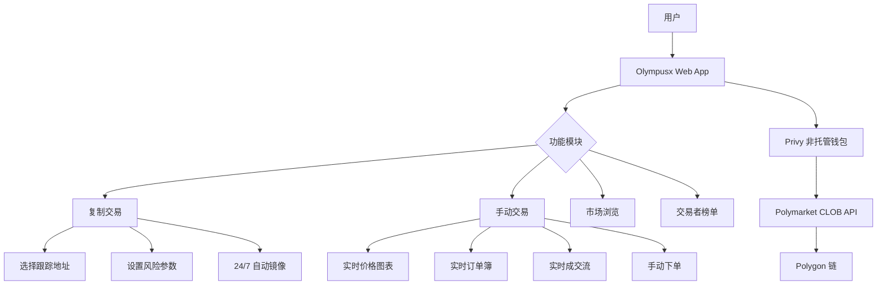
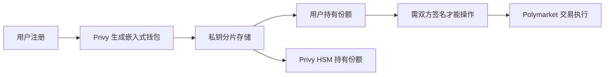
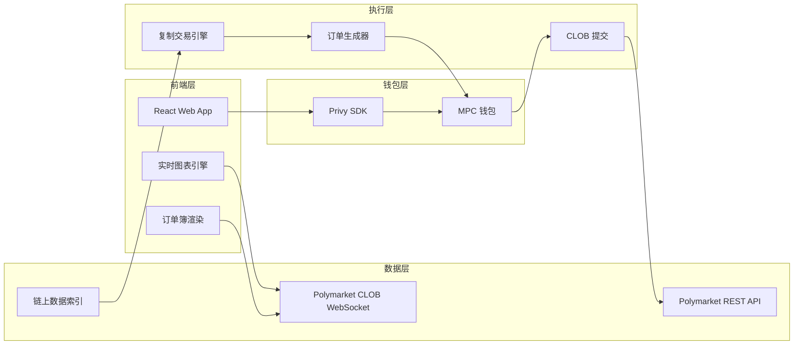
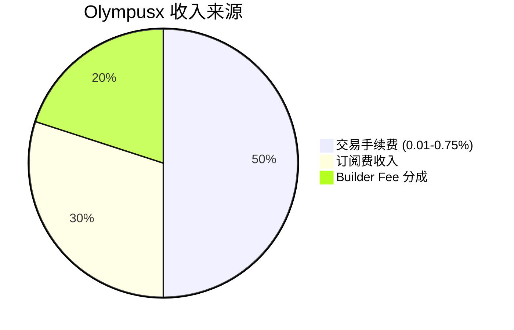

# Olympusx.app — 深度分析报告

> 数据日期：2026-03-24  
> Polymarket Builder Program 排名：**#12**  
> 近1月交易量：**$4.93M**

---

## 1. 市场情况

### 1.1 市场定位
Olympus 定位为 **非托管复制交易 + 手动交易终端**，口号是「Automated Polymarket Copy Trading」。与 PolyCop 和 Polygun 同属复制交易赛道，但强调**非托管（Non-Custodial）**和极低费率作为差异化。

### 1.2 市场规模与地位
- Builder Program 排名 **第十二**，月交易量 $4.93M
- 费率：免费版 **0.01%-0.75%**，订阅版 **0.003%-0.23%**（业内最低之一）
- 使用 **Privy** 提供非托管钱包方案

### 1.3 竞争格局与差异化

| 对比维度 | Olympusx | PolyCop | Polygun |
|---------|---------|---------|--------|
| 托管方式 | 非托管(Privy) | 托管 | 托管 |
| 费率 | 0.003%-0.75% | 未公开 | 1% |
| 平台 | Web | Web | Telegram |
| 手动交易 | ✅ 支持 | ❌ | ❌ |
| 图表 | ✅ 实时图表 | ❌ | ❌ |
| 订单簿 | ✅ 实时 | ❌ | ❌ |

---

## 2. 业务架构

### 2.1 Privy 非托管钱包方案

- **Privy** 是以太坊生态知名的嵌入式钱包基础设施
- 使用 MPC（多方计算）/分片密钥，用户无需管理助记词
- 相比传统托管（平台持有全部私钥）更安全
- 相比 MetaMask 类完全自托管更友好（无需插件）

---

## 3. 技术架构

---

## 4. 核心功能与技术壁垒

### 4.1 低费率战略
- 免费版：0.01%-0.75%（按交易量分层）
- 订阅版：0.003%-0.23%（极低，机构级别）
- **战略意图**：用低价格抢夺 PolyCop（费率未知）和 Polygun（1%）的用户

### 4.2 完整交易终端
- 复制交易 + 手动交易 + 图表 + 订单簿 = 一站式体验
- 比 PolyCop 功能更全，比 Polymtrade 多了复制交易

### 4.3 Privy 非托管优势
- 无需 MetaMask 插件，新用户友好
- 比完全托管更安全，比完全自托管更简单
- 是「托管体验 + 自托管安全」的最佳平衡

### 4.4 聪明钱追踪数据
从首页实测数据可见：
- 地址 `0x7c3d...5c6b`：PnL **+$1.1M**，胜率 **61.6%**
- 地址 `0x6ffb...a834`：PnL **+$497.6K**，胜率 **94.2%**
这些真实数据增强了用户对平台的信任。

### 4.5 技术壁垒评估

| 壁垒类型 | 评分(1-10) | 说明 |
|---------|-----------|------|
| 非托管安全性 | 9 | Privy MPC 是行业领先方案 |
| 费率优势 | 8 | 订阅版 0.003% 极具竞争力 |
| 功能完整性 | 8 | 复制+手动+图表+订单簿全覆盖 |
| 用户体验 | 8 | 无需 MetaMask，新用户友好 |
| 数据积累 | 6 | 相比 PolyCop 数据积累较少 |

---

## 5. 商业模式

### 5.1 收入测算
- 月交易量 $4.93M × 平均 0.3% ≈ **$14.8k/月** 手续费
- 加上订阅收入 + Builder Fee
- 当前体量偏小，但费率模型设计合理，有增长潜力

### 5.2 订阅模式
- 免费版：适合散户，0.01%-0.75%
- 订阅版：适合活跃交易者/机构，0.003%-0.23%
- 订阅费可能固定月费 + 超低交易费组合

---

## 6. 待确认问题

- [ ] 订阅版的具体月费价格？
- [ ] Privy 钱包支持导出助记词吗？
- [ ] 复制交易的最小/最大跟单比例？
- [ ] 智能交易者评分算法细节？
- [ ] 团队背景、融资情况？
- [ ] 是否有移动端 App？

---

## 7. 总结

Olympusx 是 Polymarket Builder 生态中**产品设计最全面**的复制交易平台：
1. **非托管安全**：Privy MPC 方案，兼顾安全与体验
2. **最低费率**：订阅版 0.003%，吸引大资金用户
3. **一站式**：复制 + 手动 + 图表 + 订单簿全覆盖
4. 当前排名 #12，月交易量 $4.93M，仍有较大增长空间
