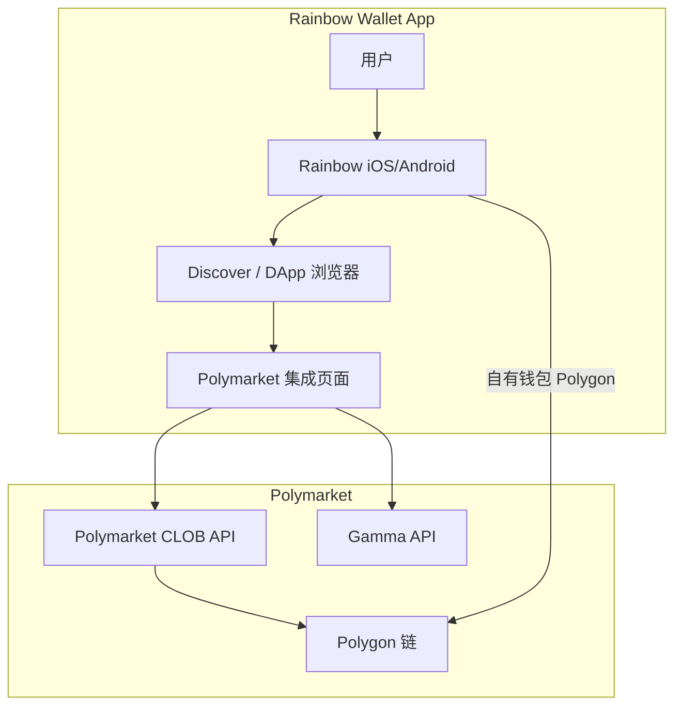
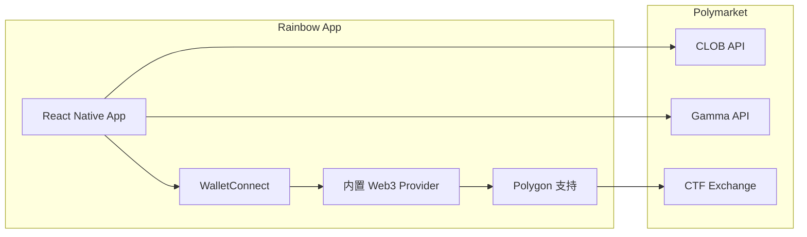
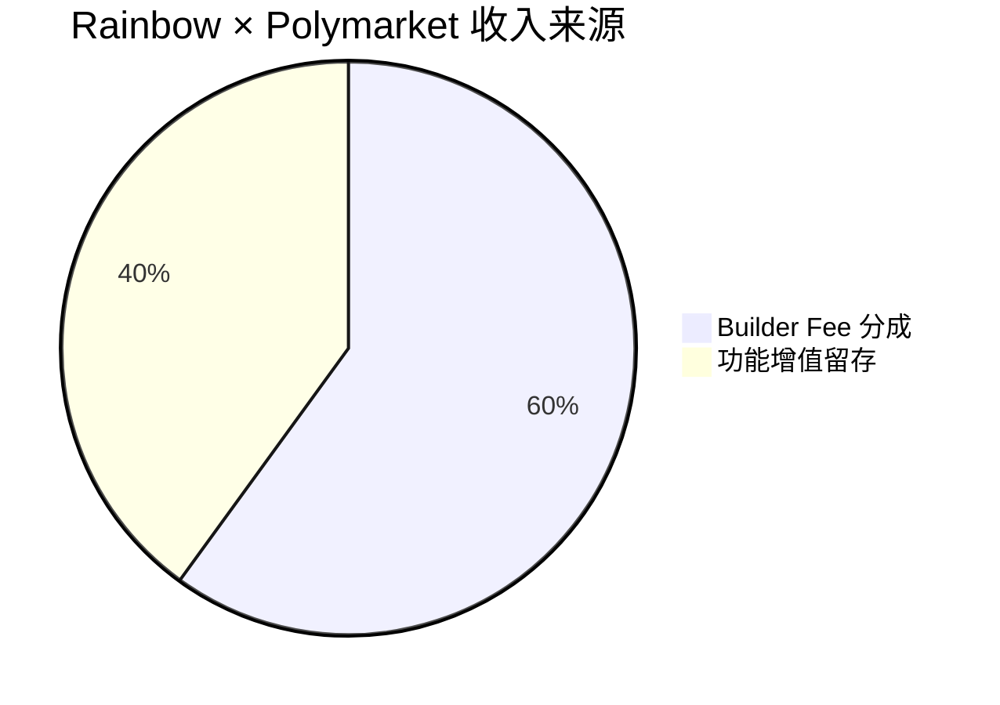

# Rainbow Wallet — 深度分析报告

> 数据日期：2026-03-24  
> Polymarket Builder Program 排名：**#25**  
> 近1月交易量：**$1.46M**

---

## 1. 市场情况

### 1.1 市场定位
Rainbow 是**知名的以太坊/多链钱包应用**（iOS/Android），以美观的 UI 和良好的用户体验著称。其在 Polymarket Builder Program 中出现，代表了**钱包应用集成预测市场**的趋势。

### 1.2 Rainbow 背景
- 知名以太坊钱包，以精美设计著称
- 支持 ETH、Polygon、Base、Optimism 等多链
- 主要用户群：以太坊原生用户、NFT 爱好者、DeFi 用户
- 非托管钱包：用户自控私钥

### 1.3 集成 Polymarket 的意义
- 为 Rainbow 用户提供直接在钱包内参与预测市场的能力
- 丰富钱包的功能生态，增加用户留存
- 与 Jupiter（钱包/DEX 聚合器集成）类似的战略逻辑

---

## 2. 业务架构

### 2.1 集成模式推断
Rainbow 可能通过以下方式集成 Polymarket：
1. **DApp 浏览器内嵌**：在 Rainbow 的内置浏览器中直接访问 Polymarket
2. **原生集成**：在 Rainbow App 中开发专属的预测市场界面
3. **深链集成**：Rainbow 提供 Polymarket 的快捷入口

---

## 3. 技术架构

---

## 4. 核心功能与技术壁垒

### 4.1 钱包集成的天然优势
- 用户已经在 Rainbow 中管理资产，无需额外转账
- 签名体验无缝，无需切换应用
- Polygon 支持意味着直接可用

### 4.2 移动端优势
- Rainbow 是移动端钱包，弥补了 Polytrader.app 等不支持移动端的缺口
- 移动端用户是加密市场增量用户的主要来源

### 4.3 技术壁垒评估

| 壁垒类型 | 评分(1-10) | 说明 |
|---------|-----------|------|
| 用户基数 | 8 | 知名钱包，百万级用户 |
| 移动端体验 | 9 | 原生移动端无缝体验 |
| 品牌信任 | 8 | 钱包安全性长期积累的信任 |
| 预测市场深度 | 4 | 非核心业务，功能可能较基础 |
| 渠道独特性 | 8 | 钱包渠道是独特的用户触达方式 |

---

## 5. 商业模式

### 5.1 收入测算
- 月交易量 $1.46M × 0.5% ≈ **$7.3k/月** Builder Fee
- 对 Rainbow 而言，预测市场是**功能扩展，主要价值是用户留存而非直接收入**

### 5.2 战略价值
- 增加 Rainbow 的 DApp 生态丰富度
- 差异化竞争：与 MetaMask 等竞品拉开距离
- 探索「一站式 DeFi 钱包」的产品方向

---

## 6. 待确认问题

- [ ] Rainbow 集成 Polymarket 的具体形式？（内嵌 WebView vs 原生组件）
- [ ] 在 Rainbow App 哪个版本/入口可以访问 Polymarket？
- [ ] 是否有针对预测市场的专属 UI？
- [ ] Rainbow 的 Polymarket 集成是否仅限 Polygon 链？
- [ ] 月交易量 $1.46M 的增长趋势如何？

---

## 7. 总结

Rainbow 接入 Polymarket 代表了**移动端钱包集成预测市场**的新趋势。虽然月交易量（$1.46M，#25）相对较小，但其战略意义在于：
1. 验证了钱包作为预测市场入口的可行性
2. 为 Polymarket 打开了移动端原生用户渠道
3. 与 Jupiter 一起预示着**未来更多 DeFi 基础设施将集成预测市场**
