# EVplus AI — 深度分析报告

> 数据日期：2026-03-24  
> Polymarket Builder Program 排名：**#13**  
> 近1月交易量：**$3.61M**  
> 官网：**evplus.ai** | App：**app.evplus.ai**  
> ⚠️ **重要更正**：Polymarket Bot 当前标注为「**Soon**」，尚未正式上线

---

## 1. 市场情况

### 1.1 市场定位
EVplus（evplus.ai）是 **AI 驱动的多平台综合交易终端**，主战场是 **Hyperliquid + DEX 套利 + 资金费率套利**，Polymarket Bot 是其规划中的扩展模块（当前标注 Soon）。

口号：「Trade smarter with AI powered intelligent insights, execution, and risk tools. Built by traders for discretionary and systematic traders.」

### 1.2 真实产品状态（实测确认）

**app.evplus.ai 实测页面内容**：

| 模块 | 状态 | 描述 |
|------|------|------|
| Automated Trading (ATV4) | ✅ **Live** | Hyperliquid 自动化交易，HIP-3 资产 + 手动终端 + 热力图 |
| EVFarm | ✅ **Live** | HyperLiquid/Lighter/Pacifica/Paradex 资金费率套利 |
| Funding Rates | ✅ **Live** | 6 家交易所资金费率追踪，多空建议 |
| Premium Signals | ✅ **New** | 套利信号，精确入场/出场/仓位建议，USDC 按次付费 |
| **Polymarket Bot** | 🚧 **Soon** | AI 驱动 Polymarket 自动化交易（**尚未上线**）|

### 1.3 月交易量来源推测
- $3.61M 来自 Polymarket，但 Polymarket Bot 标注「Soon」
- 可能是团队内测账号或早期 beta 用户在使用
- 或者通过其他接入方式（手动集成）产生了交易量

---

## 2. 用户体验路径

### 2.0 注册、入金、交易、提现全流程（详细）

#### 2.0.1 注册流程

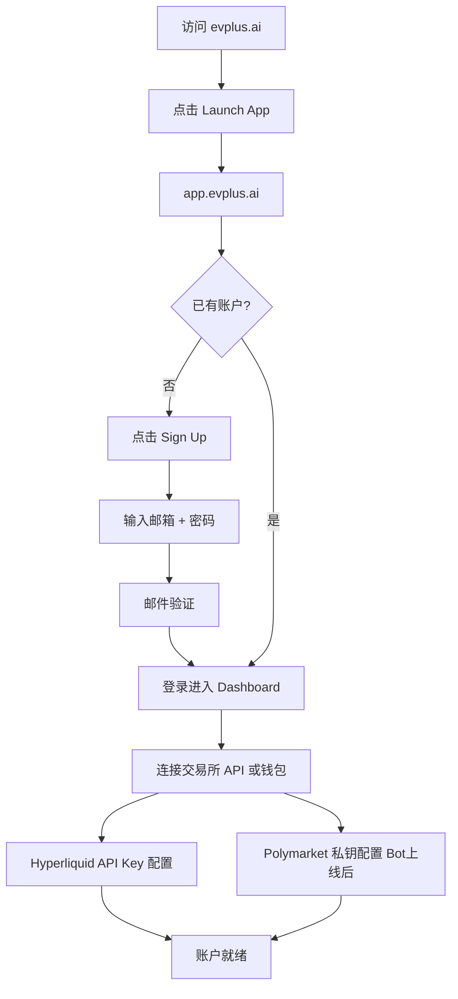

#### 2.0.2 入金流程（Hyperliquid 主战场）

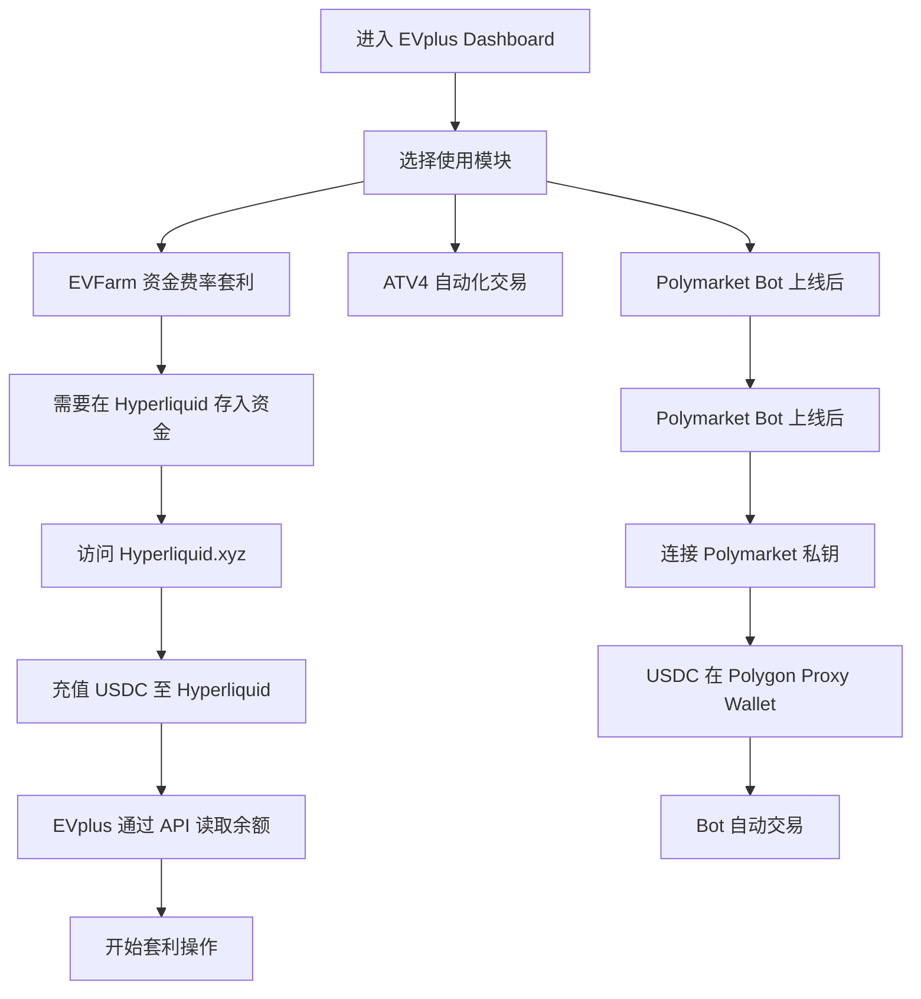

#### 2.0.3 EVFarm 资金费率套利流程（核心已上线功能）

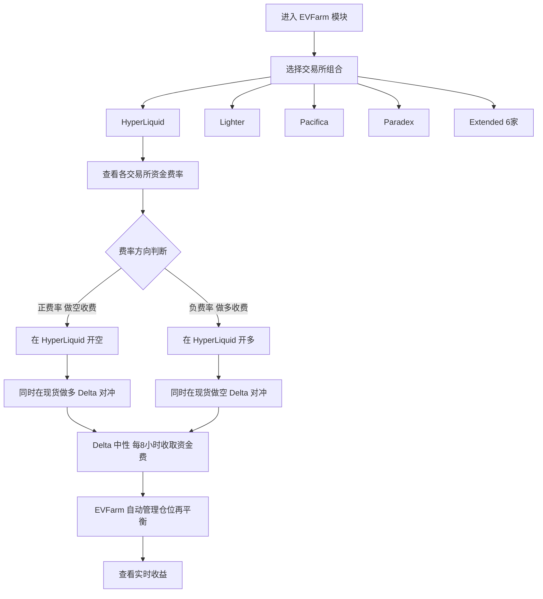

#### 2.0.4 Premium Signals 订阅与使用流程

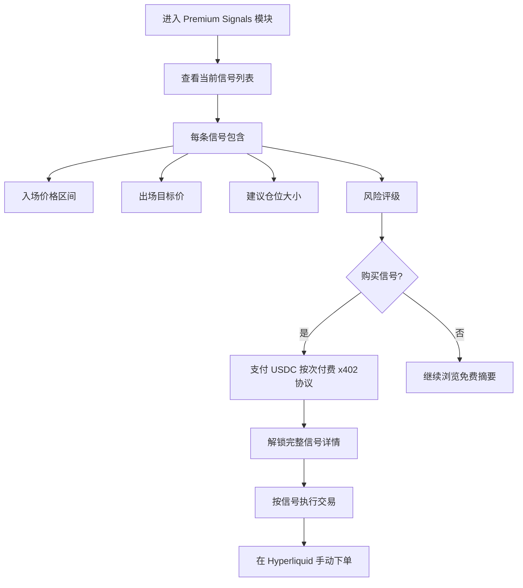

#### 2.0.5 Polymarket Bot 规划流程（Soon 待上线）

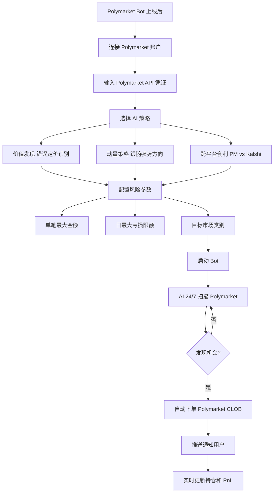

#### 2.0.6 提现流程

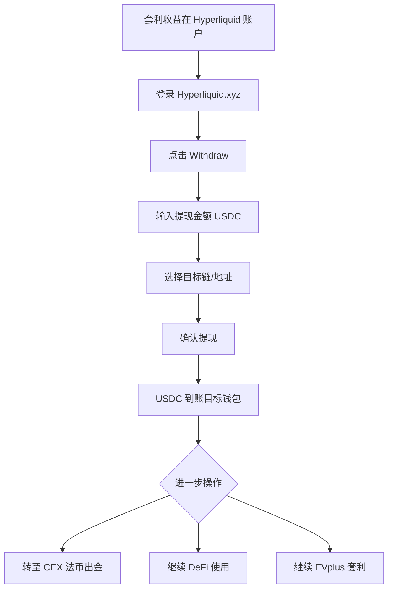

### 2.1 完整用户旅程

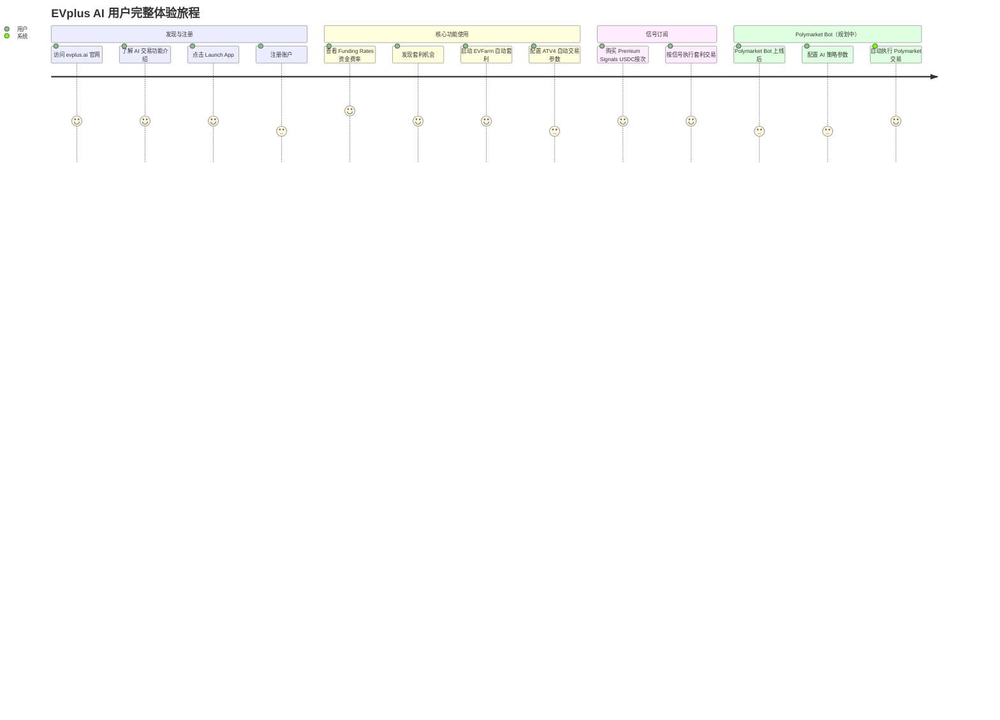

### 2.2 EVFarm 资金费率套利流程

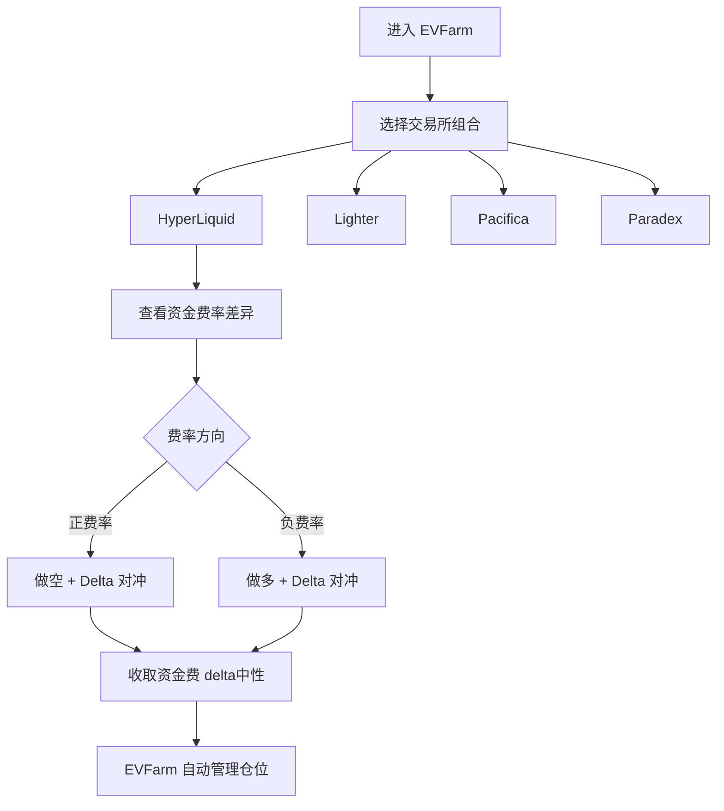

### 2.3 Polymarket Bot 规划流程（基于产品描述）

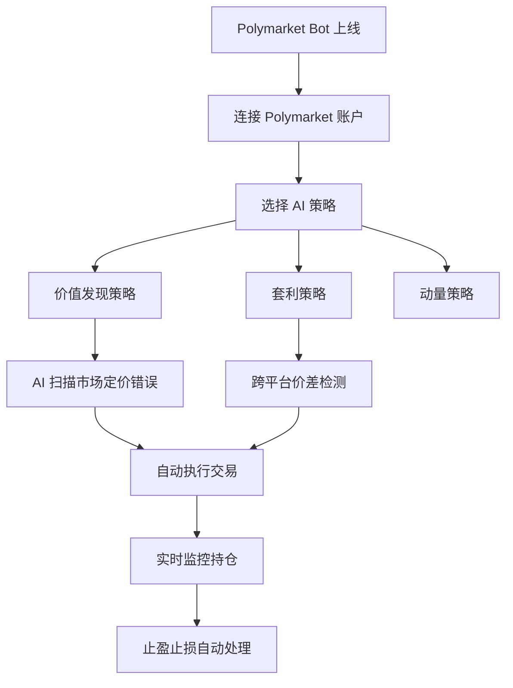

---

## 3. 业务架构

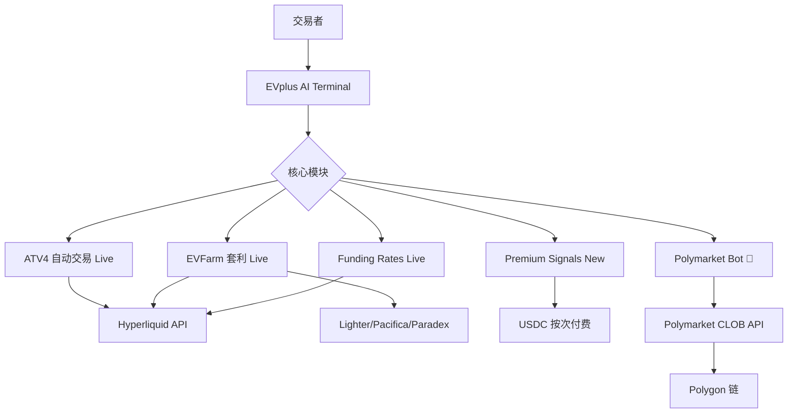

---

## 4. 技术架构

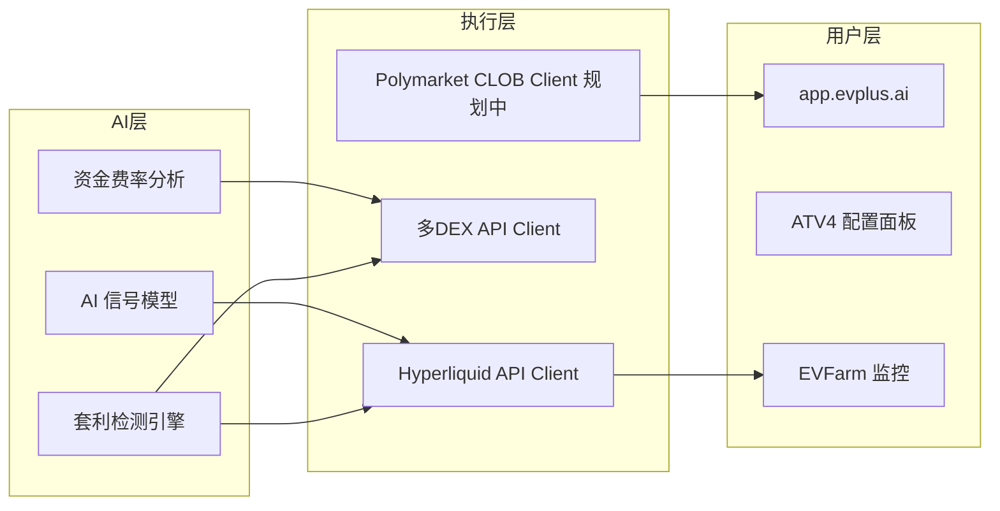

### 4.1 技术栈（实测推断）
- **前端**：React（app.evplus.ai）
- **AI 模型**：未公开，可能是 GPT-4 或自研量化模型
- **支持协议**：HyperLiquid、Lighter、Pacifica、Paradex、Extended（6家）
- **付费方式**：Signals 按 USDC 次付费（x402 协议支持）

---

## 5. 核心功能与技术壁垒

### 5.1 壁垒评估（更新后）

| 壁垒类型 | 评分(1-10) | 说明 |
|---------|-----------|------|
| 多DEX集成深度 | 8 | 6家交易所实时资金费率，工程量大 |
| ATV4 自动化 | 7 | Hyperliquid 自动交易已成熟 |
| Polymarket Bot | 3 | 当前仅 Soon，未上线 |
| Premium Signals | 7 | 按次付费模型，低摩擦 |
| AI 能力 | 6 | 实际 AI 深度待验证 |
| Polymarket 专业度 | 3 | Polymarket 是次要业务 |

---

## 6. 商业模式

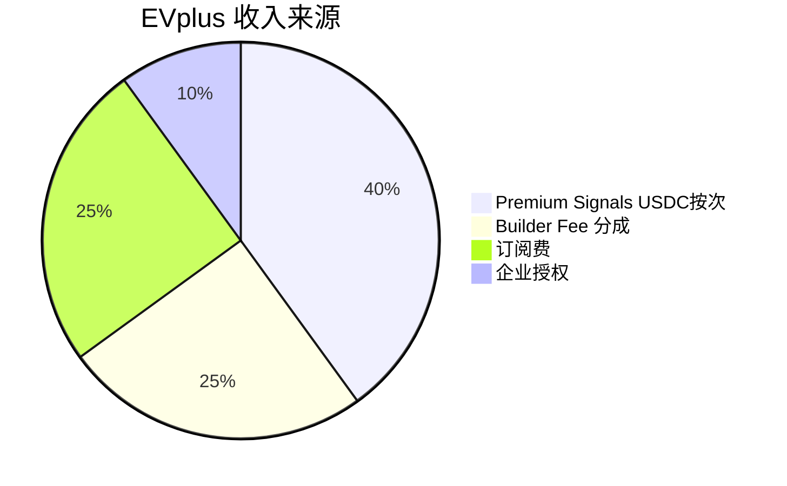

### 6.1 收入测算
- Builder Fee：$3.61M × 0.5% ≈ **$18k/月**
- Premium Signals：按次付费，高频套利用户可能消费显著
- 主要收入来自 Hyperliquid 用户，Polymarket 是次要来源

---

## 7. 待确认问题

- [ ] **Polymarket Bot 的上线时间表？**（当前 Soon）
- [ ] $3.61M/月 Polymarket 交易量的来源（Bot 未上线，谁在交易？）
- [ ] Premium Signals 的具体定价（每次多少 USDC？）
- [ ] x402 协议是什么？（支付相关）
- [ ] AI 模型是自研还是调用 OpenAI/Anthropic？
- [ ] 团队背景？

---

## 8. 总结

EVplus AI 的真实情况与初步调研有重大差异：**Polymarket Bot 尚未上线**，当前产品重心在 Hyperliquid 和 DEX 套利。在 Polymarket Builder 排行榜中出现 $3.61M 交易量，可能来自早期 beta 或手动集成。

作为 Polymarket Builder，EVplus 仍处于早期阶段；但作为 AI 交易终端，其 Hyperliquid 生态的成熟度已相当高。**Polymarket Bot 正式上线后值得重点关注**。

> 数据日期：2026-03-24  
> Polymarket Builder Program 排名：**#13**  
> 近1月交易量：**$3.61M**

---

## 1. 市场情况

### 1.1 市场定位
EVplus（evplus.ai）定位为 **AI 驱动的综合交易终端**，不局限于 Polymarket，同时支持 Hyperliquid 等 DeFi 协议。Polymarket Bot 是其众多功能模块之一。口号：「Trade smarter with AI powered intelligent insights, execution, and risk tools. Built by traders for discretionary and systematic traders.」

### 1.2 市场规模与地位
- Builder Program 排名 **第十三**，月交易量 $3.61M
- **多平台 AI 终端**：不是专门的 Polymarket 工具，而是将 Polymarket 作为其交易生态的一部分
- 面向：自主交易者（discretionary）+ 系统化交易者（systematic）

### 1.3 竞争格局
- 与 Polymtrade 的 AI Predictions 功能有重叠，但 EVplus 的 AI 深度更强
- 与 Simmer.Markets（AI Agent）方向相近但实现不同
- 独特之处：**跨平台**（Hyperliquid + Polymarket + DEX），不是单一 Polymarket 工具

---

## 2. 业务架构

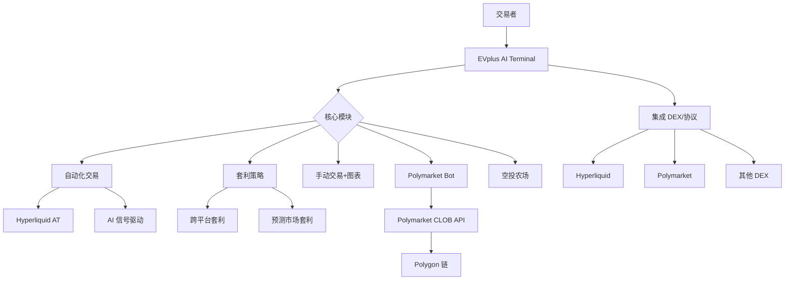

### 2.1 核心功能模块

| 模块 | 详情 | 目标用户 |
|------|------|----------|
| Automated Trading | Hyperliquid AT，AI 信号，24/7 执行 | 系统化交易者 |
| Arbitrage Strategy | 跨平台套利（含预测市场） | 量化交易者 |
| Manual Trading & Charts | 图表+手动下单 | 自主交易者 |
| **Polymarket Bot** | Polymarket 自动化交易 | 预测市场交易者 |
| Airdrop Farming | 多平台空投自动化 | 撸毛用户 |

---

## 3. 技术架构

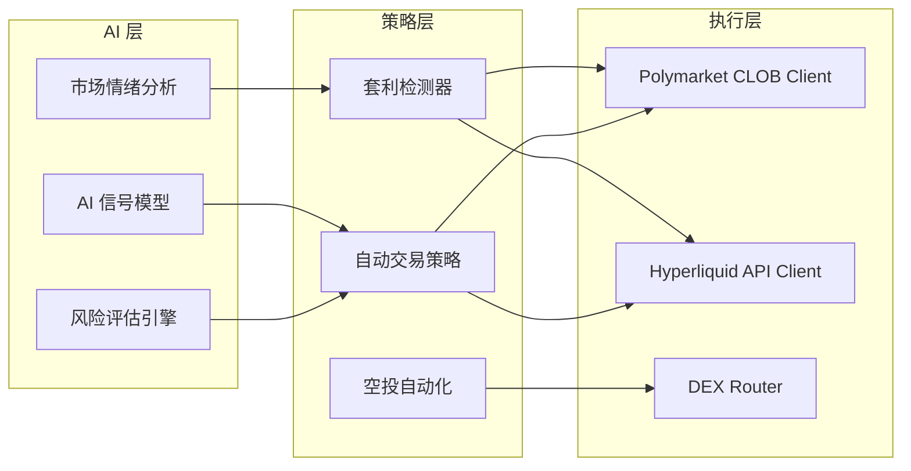

### 3.1 Polymarket Bot 技术推断
- 通过 Polymarket CLOB API 进行程序化交易
- AI 模型分析市场价格偏差，识别交易机会
- 套利策略：Polymarket vs Kalshi vs 其他预测市场价差
- 自动执行，支持自定义策略参数

---

## 4. 核心功能与技术壁垒

### 4.1 AI 驱动差异化
- **EVplus 是 Builder 生态中 AI 能力最强的平台之一**
- AI 信号驱动自动交易，不只是数据展示
- 套利检测是技术含量较高的功能

### 4.2 跨平台优势
- 同时支持 Hyperliquid + Polymarket，用户无需切换工具
- 跨平台套利：在 Polymarket 和 Kalshi 之间发现价差

### 4.3 技术壁垒评估

| 壁垒类型 | 评分(1-10) | 说明 |
|---------|-----------|------|
| AI 模型能力 | 8 | 真正的 AI 驱动，非 AI 噱头 |
| 跨平台集成 | 8 | 多协议整合工程量大 |
| 套利算法 | 7 | 需要实时监控多平台价差 |
| 目标用户专业度 | 8 | 面向专业/机构交易者 |
| 功能宽度 | 9 | 覆盖范围最广的终端之一 |

---

## 5. 商业模式

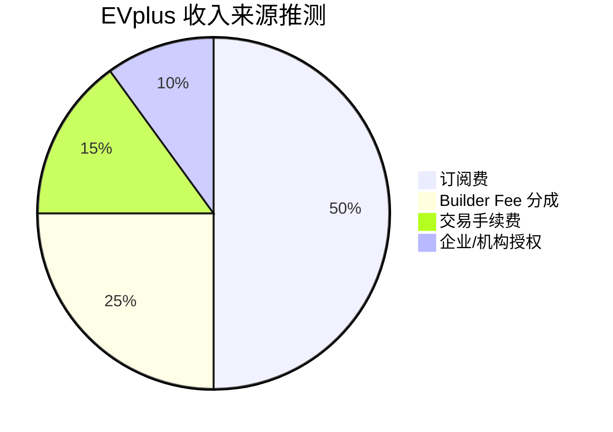

### 5.1 收入测算
- Builder Fee：$3.61M × 0.5% ≈ **$18k/月**
- 主要收入应来自订阅费（AI 功能、自动交易功能）
- 面向专业用户，订阅单价可能较高（$50-200/月）

---

## 6. 待确认问题

- [ ] Polymarket Bot 的具体功能和策略类型？
- [ ] AI 信号的准确率和历史回测数据？
- [ ] 套利策略是否包含 Polymarket vs Kalshi？
- [ ] 订阅定价？
- [ ] 团队背景（建议查看 evplus.ai/about）？
- [ ] 是否支持自定义 AI 策略？

---

## 7. 总结

EVplus 是 Builder 生态中**技术深度最强、覆盖面最广**的 AI 交易终端。其 Polymarket Bot 只是其多平台 AI 交易系统的一部分，这使其与其他专注 Polymarket 的 Builder 有本质区别。月交易量 $3.61M（#13）相对其功能深度偏低，可能是因为其核心用户群是专业量化交易者，而非散户。
