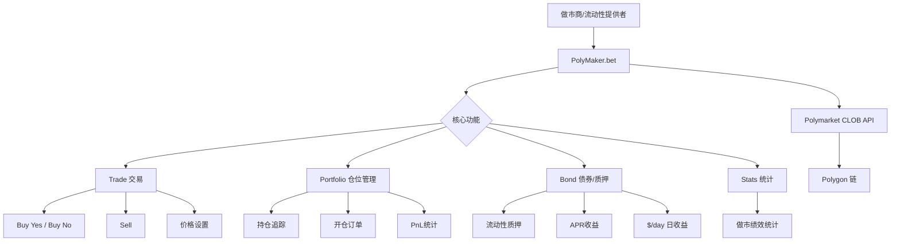
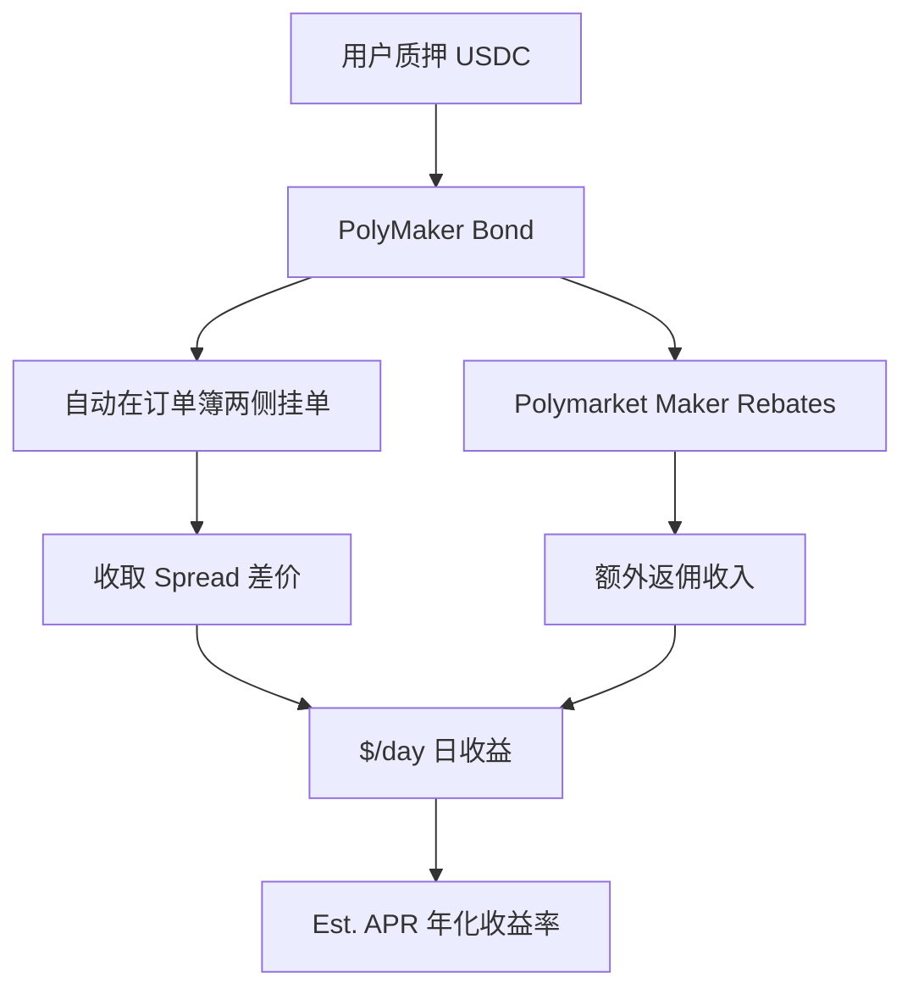
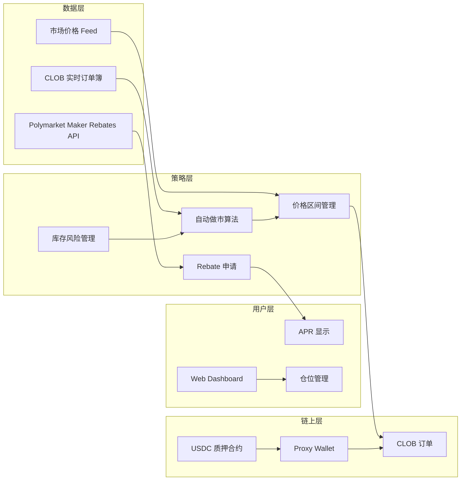
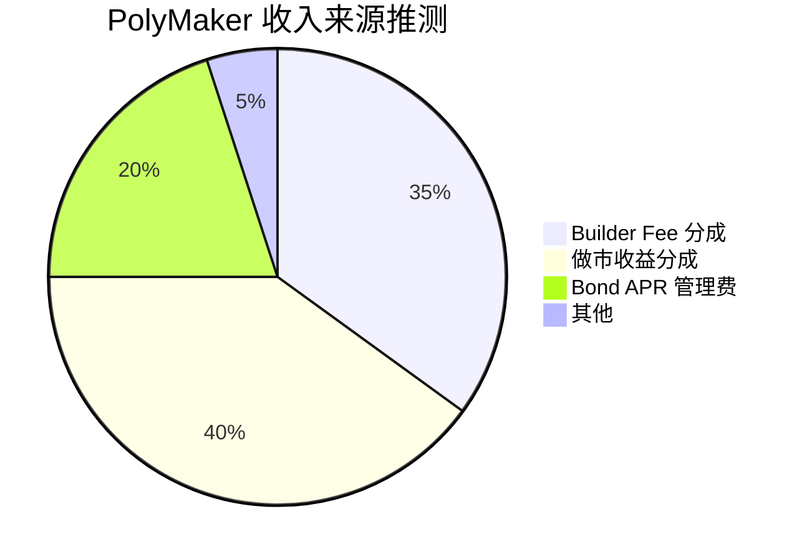

# PolyMaker.bet — 深度分析报告

> 数据日期：2026-03-24  
> Polymarket Builder Program 排名：**#14**  
> 近1月交易量：**$3.54M**

---

## 1. 市场情况

### 1.1 市场定位
PolyMaker 定位为 **Polymarket 做市商工具（Market Maker Tool）**，核心功能是帮助用户在预测市场中提供流动性（做市），并通过「Bond」机制获得收益。这是 Builder 生态中**唯一专注做市商**的产品。

### 1.2 市场规模与地位
- Builder Program 排名 **第十四**，月交易量 $3.54M
- 从页面内容可见：**Trade / Portfolio / Bond / Stats** 四个核心模块
- 有「Rewards / Positions」功能，暗示做市激励机制
- 排序选项：**$/day / Est. APR / Volume / 24h Vol / A-Z**，说明面向做市商的收益管理

### 1.3 竞争格局
- **无直接竞争者**：专注做市商工具是独特定位
- 与 Polymarket 官方的 Maker Rebates Program 和 Liquidity Rewards 配合使用
- 面向：专业做市商、量化团队、流动性提供者

---

## 2. 业务架构

### 2.1 「Bond」机制推断

**Bond 机制本质**：将做市自动化，用户质押资金后，PolyMaker 自动管理双边挂单、收取价差、申请 Maker Rebates。用户看到的是简单的 APR 数字。

---

## 3. 技术架构

---

## 4. 核心功能与技术壁垒

### 4.1 做市自动化壁垒
- **库存风险管理**：做市商需要平衡 YES/NO 仓位，防止单边暴露
- **价格发现算法**：在何价位挂单才能最大化收益而不亏损
- **Rebate 优化**：Polymarket 对做市量有分级 Rebate，需要精细管理

### 4.2 Polymarket Maker Rebates 集成
- Polymarket 对达到一定做市量的用户提供 Rebate（返佣）
- PolyMaker 帮用户自动达成 Rebate 门槛，用户分享收益
- 这是真实的额外收入来源，不依赖价差

### 4.3 做市商排序功能
- **$/day**：按日收益排序市场，找最赚钱的做市机会
- **Est. APR**：年化收益率排序，帮助做市商资本配置
- 这些工具对专业做市商极有价值

### 4.4 技术壁垒评估

| 壁垒类型 | 评分(1-10) | 说明 |
|---------|-----------|------|
| 做市算法 | 8 | 自动化做市需要复杂的库存管理 |
| Rebate 优化 | 7 | 深度理解 Polymarket Maker Program |
| 用户独特性 | 8 | 做市商是高价值、高门槛用户群 |
| 竞争壁垒 | 8 | 做市工具赛道几乎无竞争者 |
| 技术门槛 | 7 | 需要量化交易背景 |

---

## 5. 商业模式

### 5.1 收入测算
- Builder Fee：$3.54M × 0.5% ≈ **$17.7k/月**
- 做市收益分成：用户的做市收益中抽取一定比例（如 10-20%）
- Bond 管理费：对质押资金收取管理费（如 0.1-0.5%/年）

### 5.2 商业模式优势
- 与 Polymarket Maker Rebates 深度配合，共同激励做市
- 做市商是 Polymarket 流动性的核心，PolyMaker 提供了必要工具

---

## 6. 待确认问题

- [ ] Bond 的具体 APR 范围？当前实际收益？
- [ ] 做市算法的参数是否可以用户自定义？
- [ ] 是否支持多市场同时做市？
- [ ] 库存风险如何管理（防止 Delta 失衡）？
- [ ] PolyMaker 收取的管理费/分成比例？
- [ ] 与 Polymarket 官方 Maker Rebates 的对接细节？
- [ ] 团队背景？是否有量化交易背景？
- [ ] v1.7.9 版本号说明产品已相当成熟，具体发展历程？

---

## 7. 总结

PolyMaker.bet 是 Builder 生态中**最专业化**的工具：
1. **唯一做市商工具**：填补了 Builder 生态中做市商工具的空白
2. **Bond 机制**：将复杂的做市操作简化为「质押即赚 APR」
3. **Rebate 优化**：充分利用 Polymarket 官方 Maker Rebates
4. 月交易量 $3.54M（#14），考虑到其面向专业做市商，实际影响力远超交易量数字
5. v1.7.9 版本号说明产品已有较长发展历史，产品成熟
