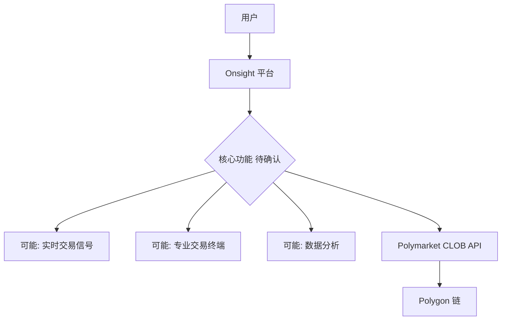
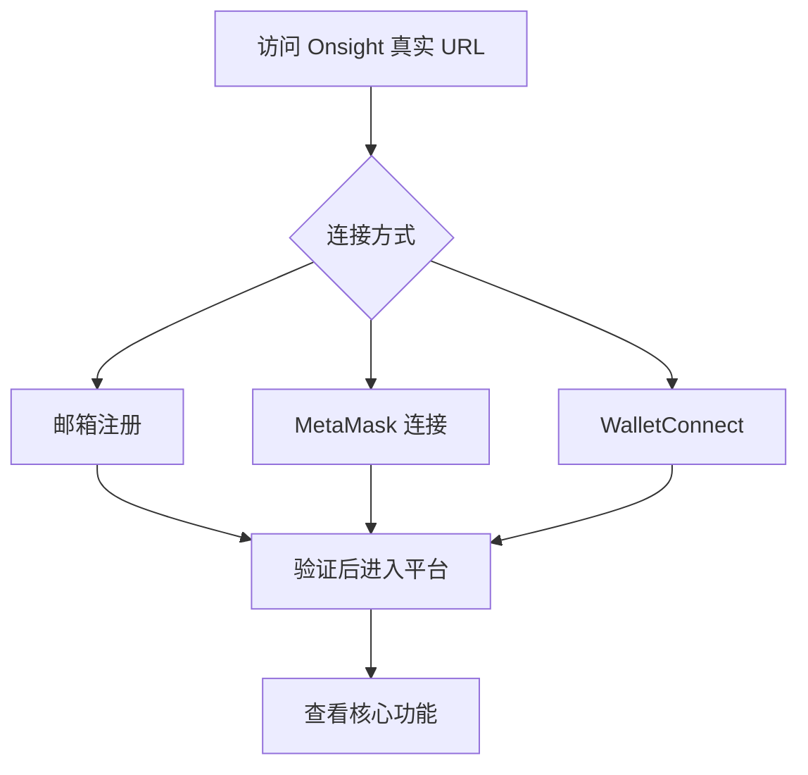
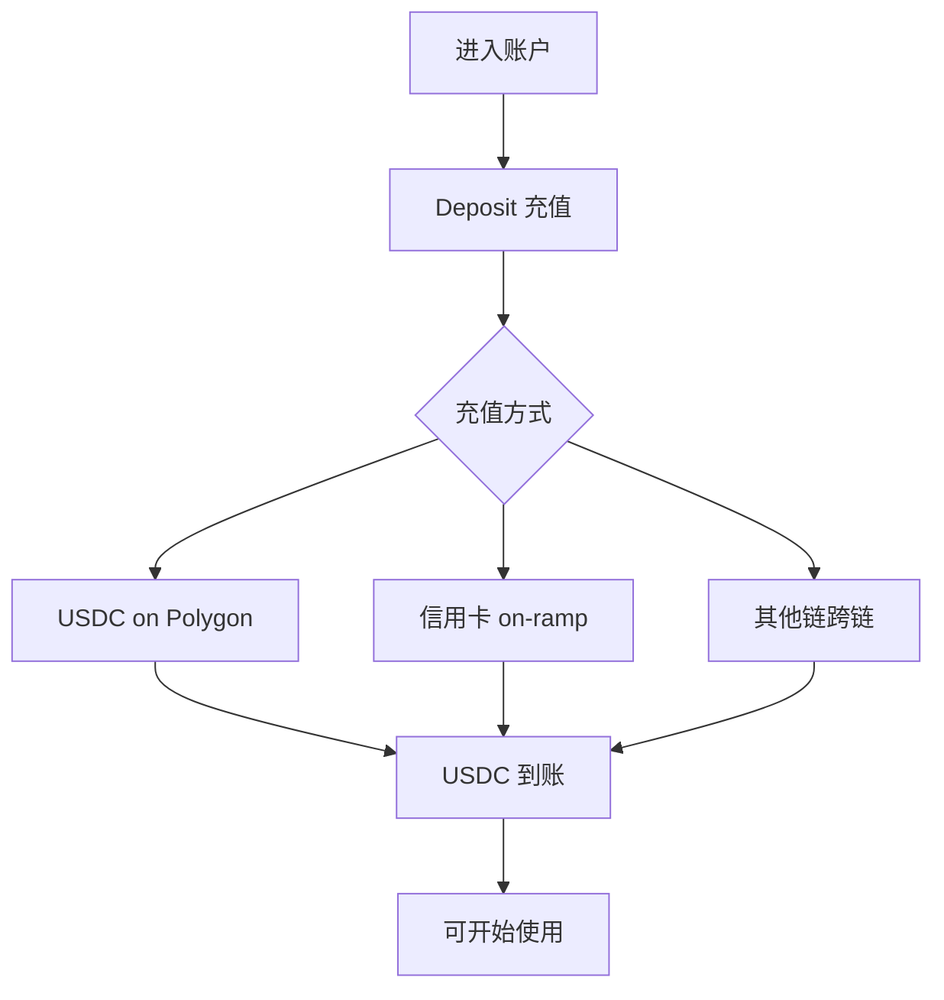
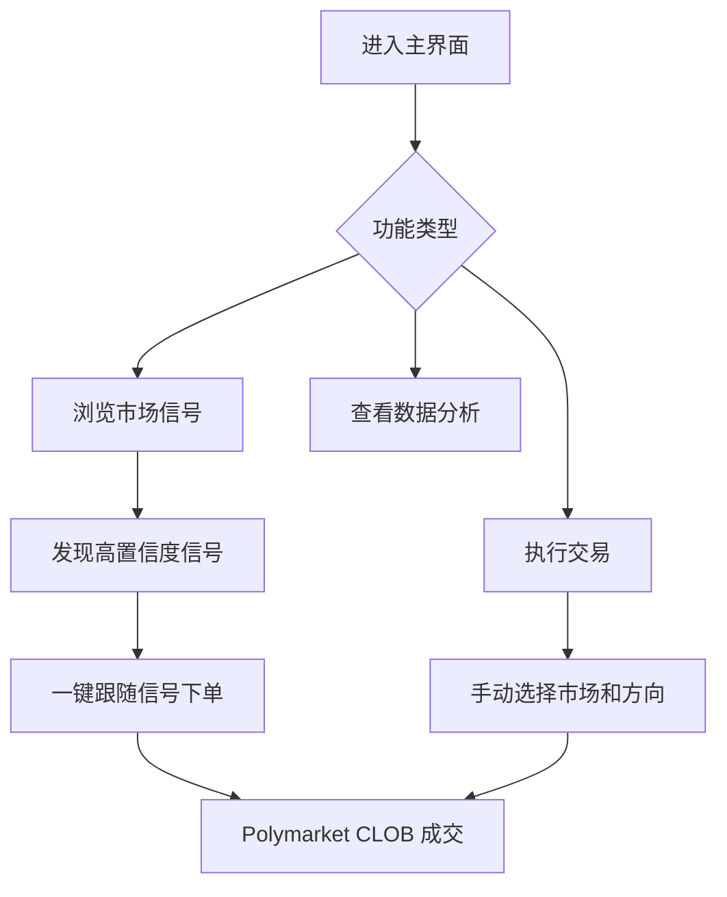
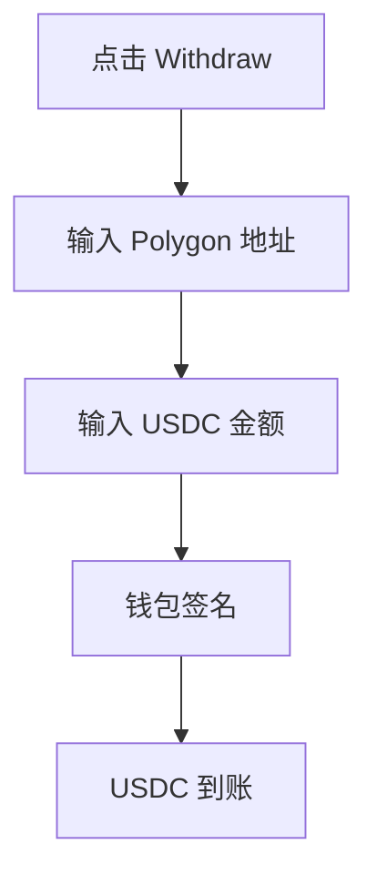
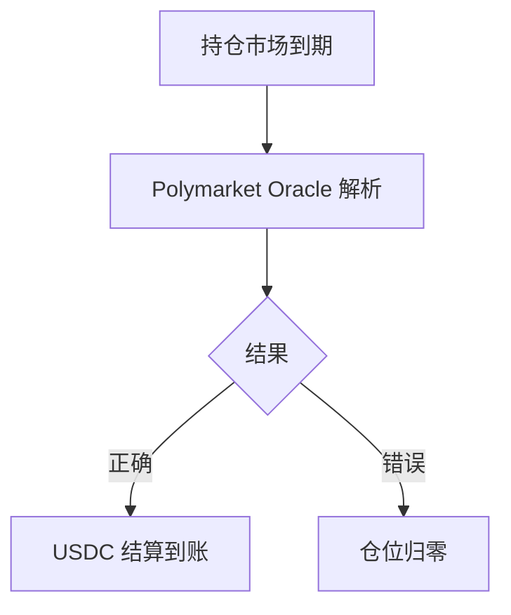
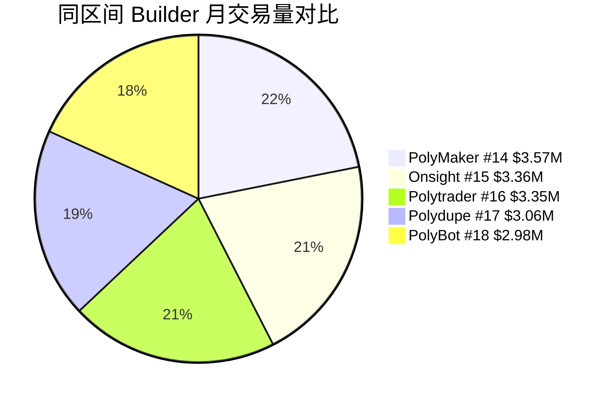

# Onsight — 深度分析报告

> 数据日期：2026-03-24  
> Polymarket Builder Program 排名：**#15**  
> 近1月交易量：**$3.36M**  
> 真实 URL：**待确认**

---

## 1. 已确认信息

- Builder Program 排名 **第十五**，月交易量 **$3.36M**
- 所有常见域名均无法访问（onsight.markets/.trade/.app/.io/.xyz）
- 处于 #14 PolyMaker.bet（$3.57M）和 #16 Polytrader.app（$3.35M）之间

### 1.1 名称含义
「Onsight」来自攀岩术语，指**第一次尝试就成功完成路线**（无任何事先信息）。
引申含义：
- **即时洞察**（On-sight：当场看到）：实时数据/信号工具
- **精准判断**：第一次就做出正确预测
- **无预先信息**：可能强调基于纯数据而非内部信息的交易

---

## 2. 推断定位

基于交易量（$3.36M，#15）和名称，可能的定位：

| 假设 | 依据 | 可能性 |
|------|------|--------|
| 实时交易信号工具 | 名称含「即时洞察」语义 | 高 |
| 专业交易终端 | 同量级 PolyTraderPro/Stand.trade | 高 |
| 数据分析平台 | 「洞察」语义 | 中 |
| 复制交易 | 同量级竞品 | 中 |

---

## 3. 推断架构

---

## 4. 用户体验路径（推断）

### 2.0 注册、入金、交易、提现全流程（推断）

#### 2.0.1 注册流程（推断）

#### 2.0.2 入金流程（推断）

#### 2.0.3 交易/信号使用流程（推断）

#### 2.0.4 提现流程（推断）

#### 2.0.5 结算流程（推断）

---

## 5. 市场地位

---

## 6. 待确认问题

- [ ] **真实网址**：在 builders.polymarket.com 点击 #15 Onsight 链接
- [ ] 核心产品功能：信号工具？终端？分析平台？
- [ ] 是否有 Twitter/X 账号？搜索 `onsight polymarket`
- [ ] 托管还是非托管？
- [ ] 团队背景？
- [ ] 费率结构？

---

## 7. 总结

Onsight 以 **$3.36M/月**（#15）位列前十五，交易量可观。名称暗示「即时洞察」，可能是信号或分析类工具。真实 URL 需手动从 builders.polymarket.com 获取。

**TODO**：
- [ ] 获取真实 URL
- [ ] 确认产品定位
- [ ] 补充完整 UX 分析
