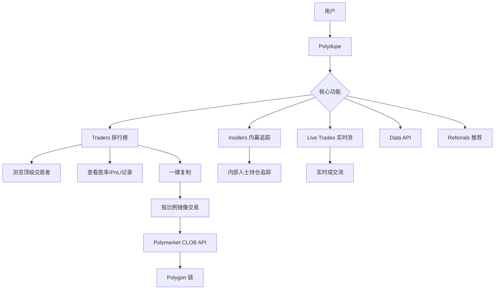
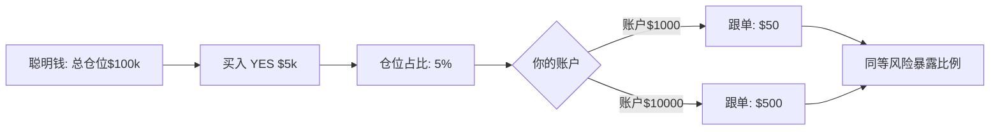
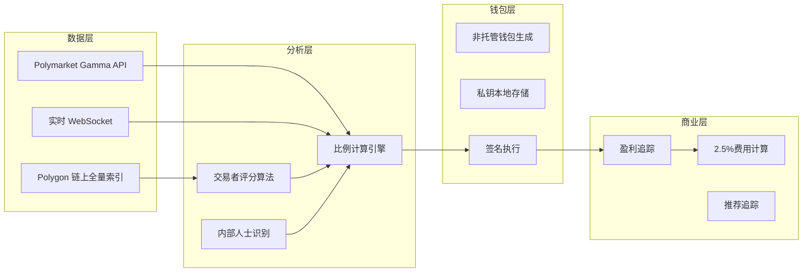
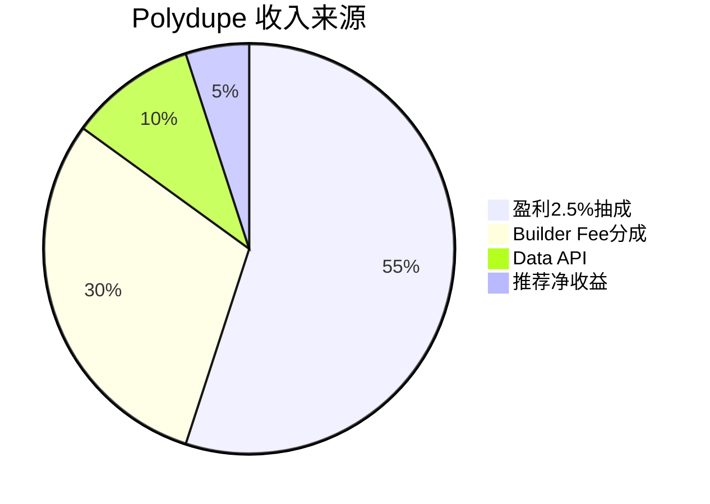

# Polydupe — 深度分析报告

> 数据日期：2026-03-24  
> Polymarket Builder Program 排名：**#17**  
> 近1月交易量：**$3.06M**

---

## 1. 市场情况

### 1.1 市场定位
Polydupe 定位为 **非托管复制交易平台**，口号「Copy the Best. Your keys, your predictions.」强调非托管和安全性。其核心创新是**按比例复制**（Conviction-based copying）：不是简单地镜像金额，而是按对方的仓位占比来决定自己的跟单比例。

### 1.2 市场规模与地位
- Builder Program 排名 **第十七**，月交易量 $3.06M
- **完全非托管**：用户自控私钥，可随时导出钱包
- **费率**：盈利的 2.5%（只赚钱才收费），推荐码享 2.25%
- **推荐系统**：30% 推荐返佣

### 1.3 竞争对比

| 对比维度 | Polydupe | PolyCop | Olympusx | Polygun |
|---------|---------|---------|---------|--------|
| 托管方式 | 非托管 | 托管 | 非托管(Privy) | 托管 |
| 费率模型 | 盈利2.5% | 未知 | 0.01-0.75% | 1% |
| 平台 | Web | Web | Web | Telegram |
| 独特功能 | 按比例复制 | 聪明钱算法 | 手动交易+复制 | 跨链桥 |

---

## 2. 业务架构

### 2.1 「Conviction-based Copying」核心机制

**核心洞察**：「$10,000 trade means nothing. For a whale, it's 1%. For you, it might be everything.」
传统复制交易按绝对金额，Polydupe 按**风险暴露比例**，让小户和大户承受同等相对风险。

### 2.2 Insiders 功能
- 追踪「内部人士」（Insiders）持仓
- 可能是追踪有信息优势的钱包（如：媒体人、行业从业者关联地址）
- 是独特的差异化功能

---

## 3. 技术架构

---

## 4. 核心功能与技术壁垒

### 4.1 「只赚钱才收费」的商业模式创新
- 盈利的 2.5% vs 固定交易手续费
- 与用户利益完全对齐：平台只在用户赚钱时才赚
- 对散户非常有吸引力（无盈利零成本）

### 4.2 Data API 开放
- 提供数据 API，说明数据积累是重要资产
- 可对外出售数据，B2B 收入来源

### 4.3 技术壁垒评估

| 壁垒类型 | 评分(1-10) | 说明 |
|---------|-----------|------|
| 非托管安全 | 8 | 完全自控私钥 |
| 比例复制算法 | 7 | 独特的 Conviction-based 机制 |
| 利益对齐模型 | 9 | 「只赚钱才收费」极强用户信任 |
| 数据 API | 6 | 额外B2B收入来源 |
| 推荐飞轮 | 7 | 30%推荐返佣驱动增长 |

---

## 5. 商业模式

### 5.1 收入测算
- Builder Fee：$3.06M × 0.5% ≈ **$15.3k/月**
- 盈利抽成：假设平均用户月盈利率5%，则 $3.06M × 5% × 2.5% ≈ **$3.8k/月**
- 盈利抽成金额取决于用户整体盈利状况

---

## 6. 待确认问题

- [ ] 「Insiders」如何识别内部人士？链上分析还是人工标注？
- [ ] 非托管钱包的具体实现（纯本地存储还是有加密备份）？
- [ ] Data API 的定价和可用数据集？
- [ ] 卡/银行入金功能如何实现？（on-ramp 合作方？）
- [ ] 团队背景？
- [ ] 2.5% 是如何计算「盈利」的？按每笔还是总账户？

---

## 7. 总结

Polydupe 是复制交易赛道中**商业模式设计最优雅**的产品：
1. **「只赚钱才收费」**：利益完全对齐，用户信任极高
2. **Conviction-based 复制**：相对风险暴露，比绝对金额复制更合理
3. **非托管安全**：用户资金完全自控
4. **Insiders 功能**：独特差异化，追踪信息优势者
5. 月交易量 $3.06M（#17），有较大增长空间
