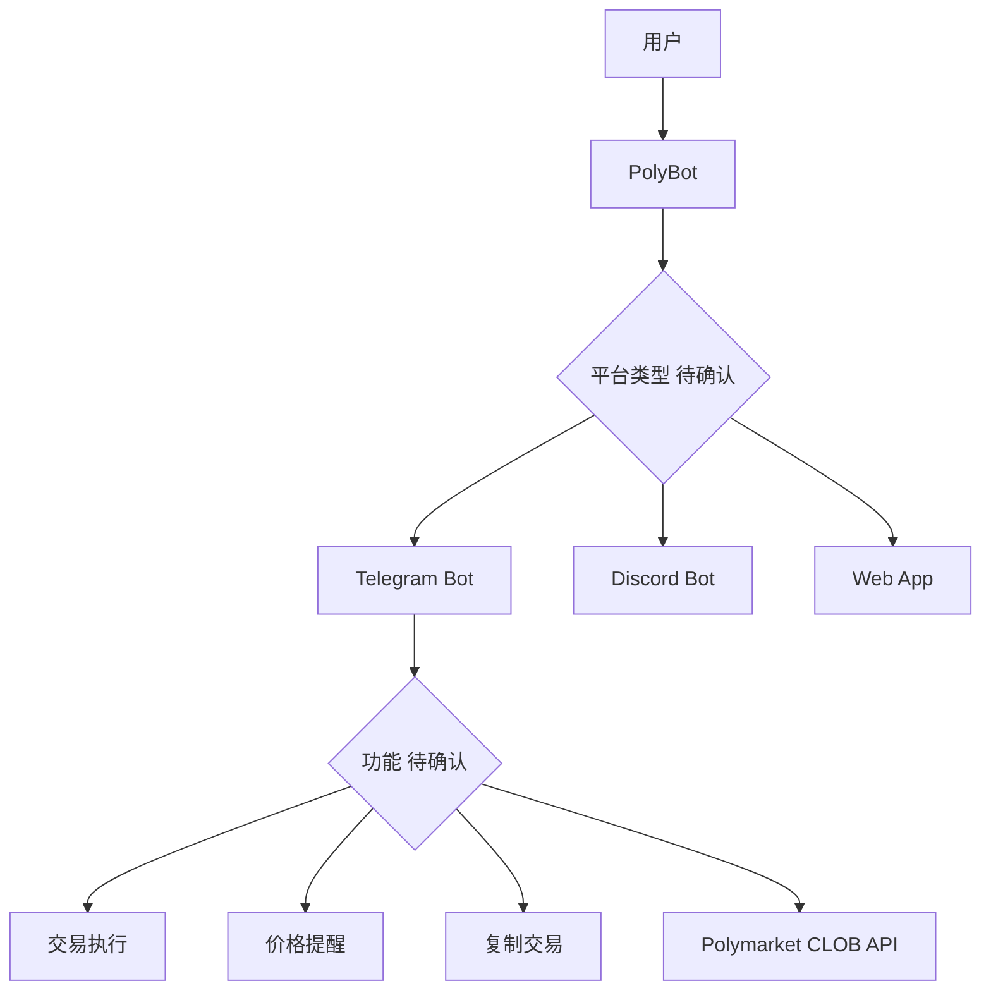
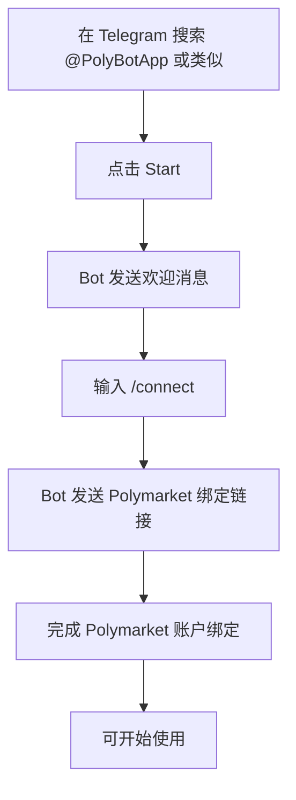
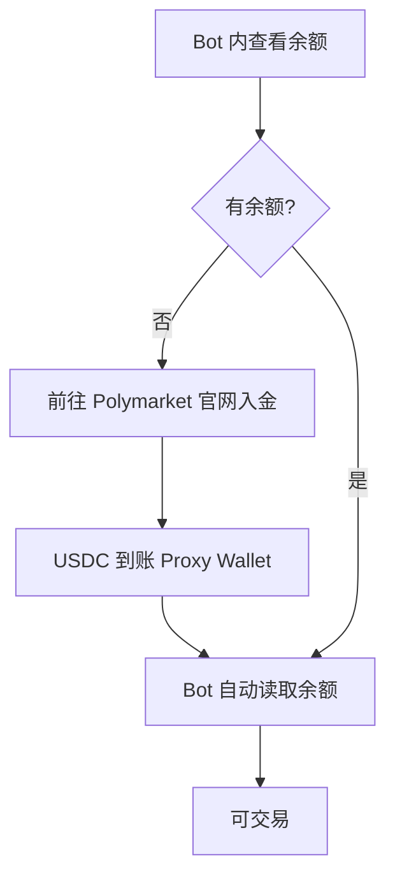
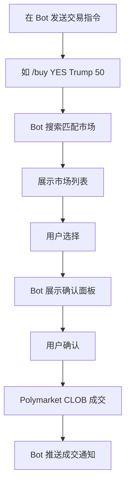
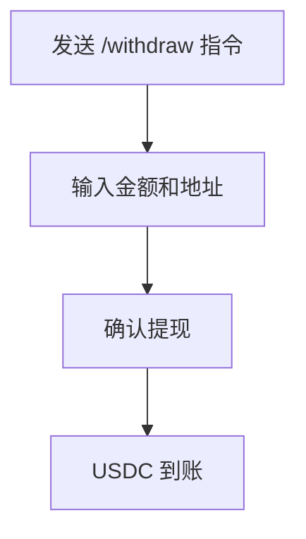
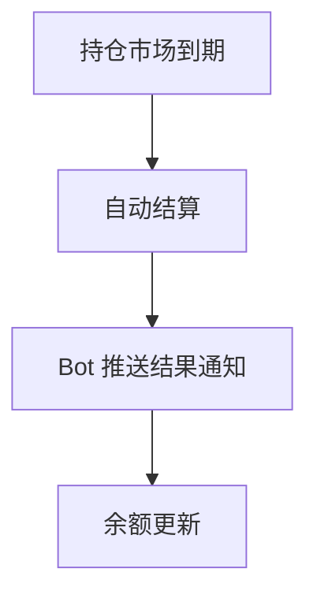

# PolyBot — 深度分析报告

> 数据日期：2026-03-24  
> Polymarket Builder Program 排名：**#18**  
> 近1月交易量：**$2.98M**  
> 真实 URL：**待确认**

---

## 1. 已确认信息

- Builder Program 排名 **第十八**，月交易量 **$2.98M**
- 名称「PolyBot」强烈暗示是 **Bot 类产品**（Telegram Bot 或 Discord Bot）
- 处于 #17 Polydupe（$3.06M）和 #19 Simmer（$2.68M）之间

### 1.1 与现有 Bot 产品对比

| 对比 | PolyBot | Polygun | Betmoar Bot |
|------|---------|---------|-------------|
| 平台 | 待确认 | Telegram | Discord |
| 月交易量 | $2.98M | $27.71M | $208M |
| 定位 | 待确认 | 复制交易+跨链 | 社区嵌入 |

---

## 2. 推断定位

---

## 3. 用户体验路径（推断）

### 2.0 注册、入金、交易、提现全流程（推断）

#### 2.0.1 注册流程（Telegram Bot 推断）

#### 2.0.2 入金流程（推断）

#### 2.0.3 交易流程（推断）

#### 2.0.4 提现流程（推断）

#### 2.0.5 结算流程（推断）

---

## 4. 待确认问题

- [ ] **真实网址或 Telegram Bot 名称**
- [ ] 是 Telegram、Discord 还是 Web 产品？
- [ ] 核心功能：交易执行？复制交易？价格提醒？
- [ ] 费率结构？
- [ ] 团队背景？
- [ ] 与 Polygun 的差异化？

---

## 5. 总结

PolyBot 以 **$2.98M/月**（#18）位列中部区间，名称强烈暗示 Bot 类产品。具体平台和功能需手动在 builders.polymarket.com 获取真实链接后确认。

**TODO**：
- [ ] 在 