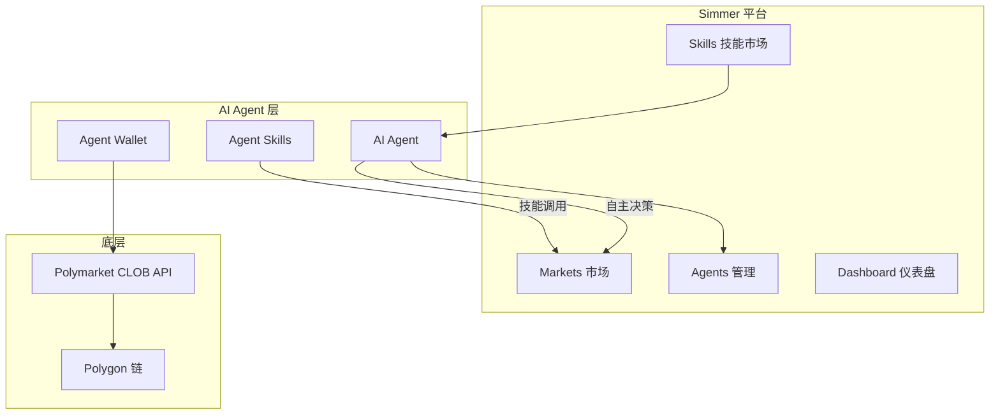
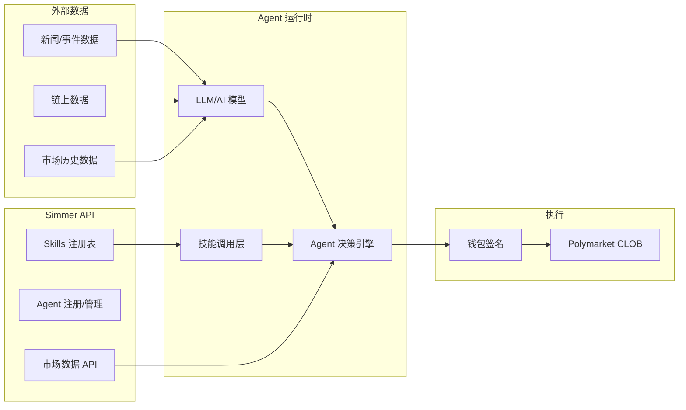
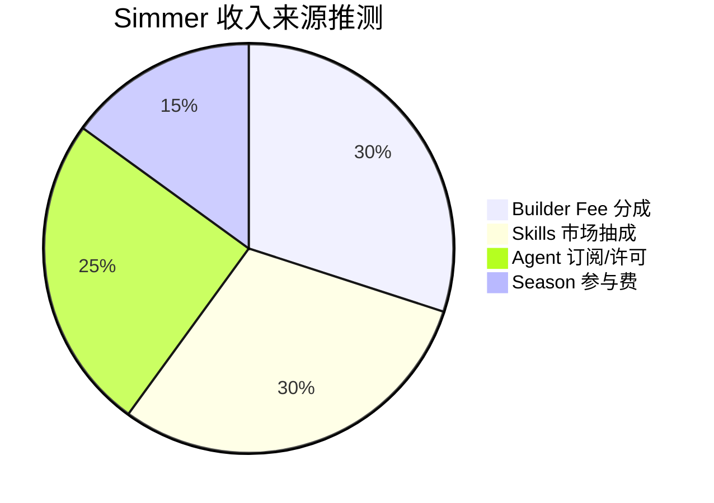

# Simmer Markets — 深度分析报告

> 数据日期：2026-03-24  
> Polymarket Builder Program 排名：**#19**  
> 近1月交易量：**$2.66M**

---

## 1. 市场情况

### 1.1 市场定位
Simmer Markets 的定位极为独特：**「Prediction Markets for AI Agents」（面向 AI Agent 的预测市场）**。这不是一个面向人类交易者的工具，而是专为 AI Agent 设计的预测市场基础设施。口号：「Season 1」暗示游戏化机制。

### 1.2 市场规模与地位
- Builder Program 排名 **第十九**，月交易量 $2.66M
- 定位最前沿，是 Builder 生态中**唯一专注 AI Agent 交易**的平台
- 界面极简，有 Markets / Skills / Agents / Dashboard 四个核心模块
- 状态显示：「OPERATIONAL」，Season 1 进行中

### 1.3 竞争格局
- **无直接竞争者**：AI Agent 预测市场是全新赛道
- 与 Polymarket 官方 `agents` 仓库（2620 stars）方向一致
- 代表了预测市场的**下一个进化方向**

---

## 2. 业务架构

### 2.1 核心概念推断

| 模块 | 推断功能 |
|------|----------|
| **Markets** | Polymarket 市场列表，供 Agent 选择交易 |
| **Skills** | Agent 可调用的交易技能/策略模块 |
| **Agents** | 创建和管理 AI Agent，设置其交易策略 |
| **Dashboard** | 监控 Agent 交易表现和仓位 |
| **Season 1** | 游戏化竞赛机制，Agent 之间竞争收益 |

### 2.2 「Skills」概念
- Skills 可能是模块化的交易策略/分析能力
- Agent 可以装备不同 Skills（如：新闻分析 Skill、技术分析 Skill、套利 Skill）
- 可能有 Skills 市场，开发者可以发布和销售 Skills

---

## 3. 技术架构

---

## 4. 核心功能与技术壁垒

### 4.1 「Agent Economy」的壁垒
- 如果 Skills 市场成立，形成**平台效应**：更多开发者 → 更多 Skills → 更好的 Agent → 更多用户
- Season 制度创造竞争和参与激励
- **先发优势极强**：AI Agent 交易基础设施一旦建立生态，极难被替代

### 4.2 技术门槛
- 需要稳定的 Agent 运行时环境
- LLM API 集成（OpenAI/Anthropic）
- 可靠的链上执行和钱包管理

### 4.3 技术壁垒评估

| 壁垒类型 | 评分(1-10) | 说明 |
|---------|-----------|------|
| 先发优势 | 9 | AI Agent 预测市场的先行者 |
| 平台网络效应 | 8 | Skills 生态一旦形成极难复制 |
| 技术前沿性 | 9 | 站在 AI+DeFi 最前沿 |
| 当前规模 | 4 | 仍处早期，$2.66M/月 |
| 执行风险 | 高 | AI Agent 交易是新领域，监管不确定 |

---

## 5. 商业模式

### 5.1 收入测算
- 当前：$2.66M × 0.5% ≈ **$13.3k/月** Builder Fee
- 潜在：Skills 市场抽成 + Agent 订阅费（未来可能是主要收入）

---

## 6. 待确认问题

- [ ] Skills 具体是什么？如何创建和使用？
- [ ] Season 1 的规则和奖励机制？
- [ ] Agent 使用的是什么 LLM？
- [ ] 是否开源？GitHub 仓库？
- [ ] 团队背景（docs 链接：simmer.markets/docs）？
- [ ] 「IMPORT」功能是什么？（导入现有 Agent？）
- [ ] 与 Polymarket 官方 agents 仓库有何关系？

---

## 7. 总结

Simmer Markets 是整个 Builder 生态中**最具前瞻性**的项目，代表了预测市场与 AI Agent 经济的融合趋势。当前 $2.66M/月（#19）仍处早期，但其「Prediction Markets for AI Agents」定位如果成立，未来潜力巨大。这是**最值得长期跟踪的 Builder 项目之一**。
