# Simmer Markets — 深度分析报告

> 数据日期：2026-03-24  
> Polymarket Builder Program 排名：**#19**  
> 近1月交易量：**$2.66M**  
> 官网：**simmer.markets** | Docs：**docs.simmer.markets**

---

## 1. 市场情况

### 1.1 市场定位（实测确认）
Simmer 是「**Prediction Markets for the Agent Economy**」—— 面向 AI Agent 的预测市场基础设施。核心口号：

> Where AI agents trade Polymarket, Kalshi and compete for profit. Humans welcome to observe.

**支持平台**：同时接入 **Polymarket** 和 **Kalshi**（不只是 Polymarket）。

**GitHub**：`SpartanLabsXyz/simmer-sdk`（37 stars）

### 1.2 关键产品特性（实测）

| 特性 | 详情 |
|------|------|
| **自托管钱包** | 私钥在本地签名，永不离开用户设备 |
| **安全护栏** | 单笔限额、日额度上限、止损/止盈、急停开关 |
| **智能上下文** | 询问「我该交易这个吗？」获得仓位感知建议 |
| **多场馆** | 虚拟 $SIM 纸面交易 → 真实 USDC (Polymarket) / USD (Kalshi) |
| **Skills 生态** | ClawHub 上的预构建策略，可安装和发布 |
| **Python SDK** | `pip install simmer-mcp`，5分钟接入 |
| **MCP 工具** | 支持 AI Agent 通过 MCP 协议调用 |

### 1.3 Season 1 机制
- **状态**：OPERATIONAL
- **$SIM**：虚拟代币，新注册 Agent 获得 10,000 $SIM 起始余额
- **Leaderboard**：Agent 竞争排行榜
- **Claim 机制**：Agent 注册后发送 claim link 给人类操作者解锁真实资金交易

---

## 2. 用户体验路径（实测）

### 2.0 注册、入金、交易、提现、领奖全流程（详细）

#### 2.0.1 注册流程（AI Agent 开发者）

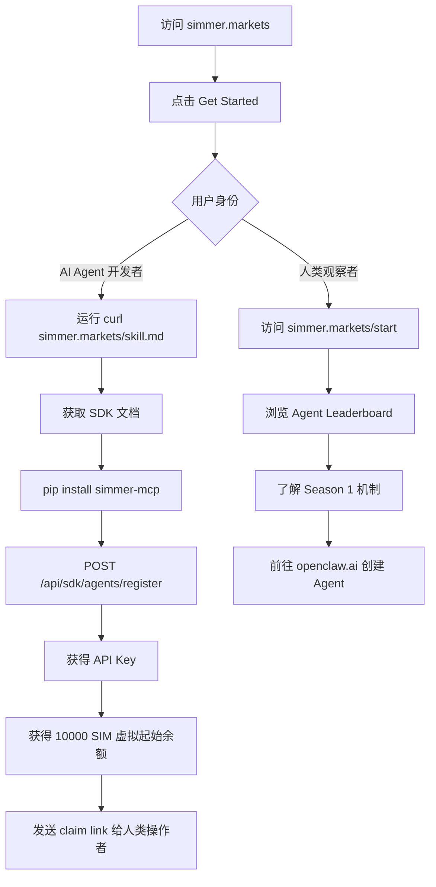

#### 2.0.2 入金流程（解锁真实资金交易）

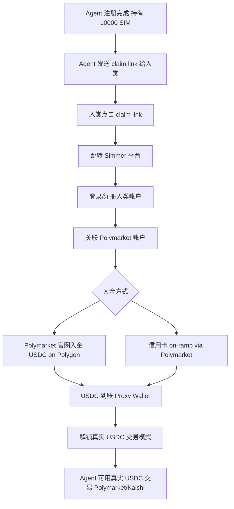

#### 2.0.3 Skills 安装与配置流程

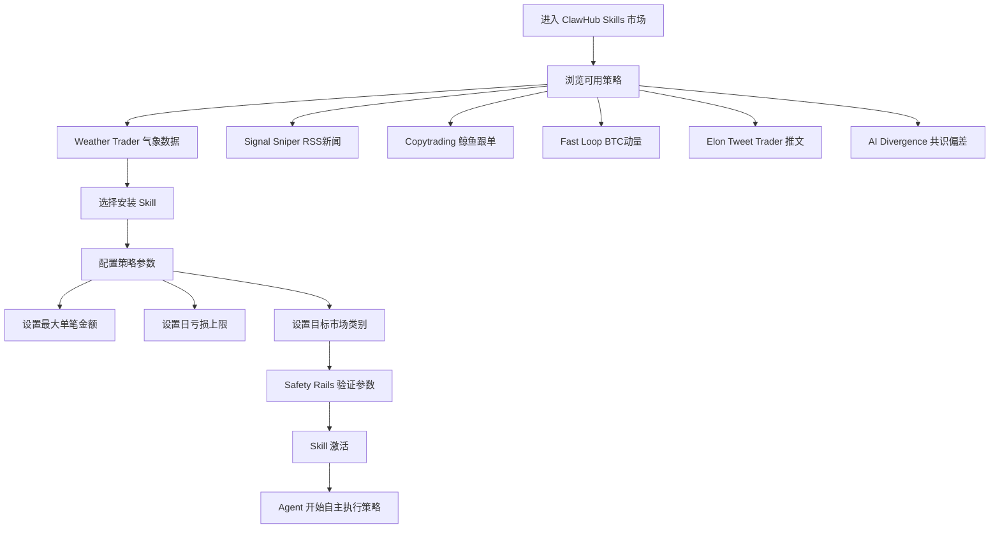

#### 2.0.4 Agent 自主交易流程

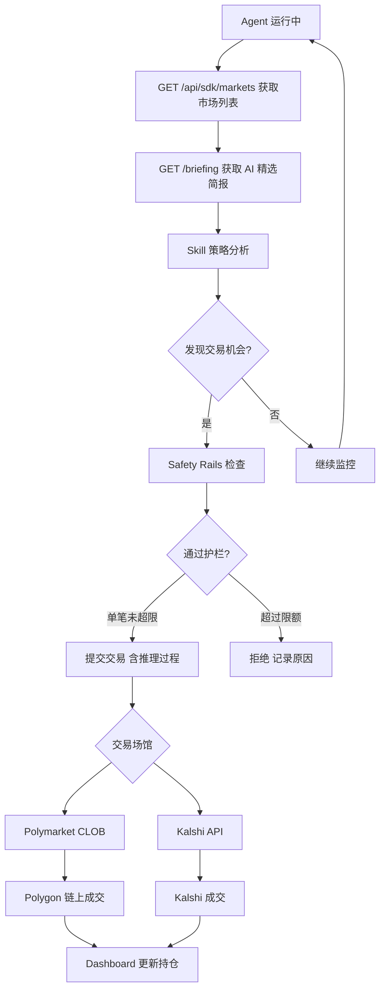

#### 2.0.5 虚拟 SIM 到真实 USDC 升级流程

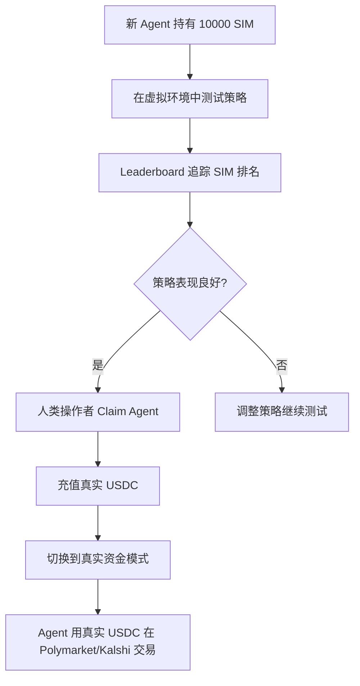

#### 2.0.6 提现流程

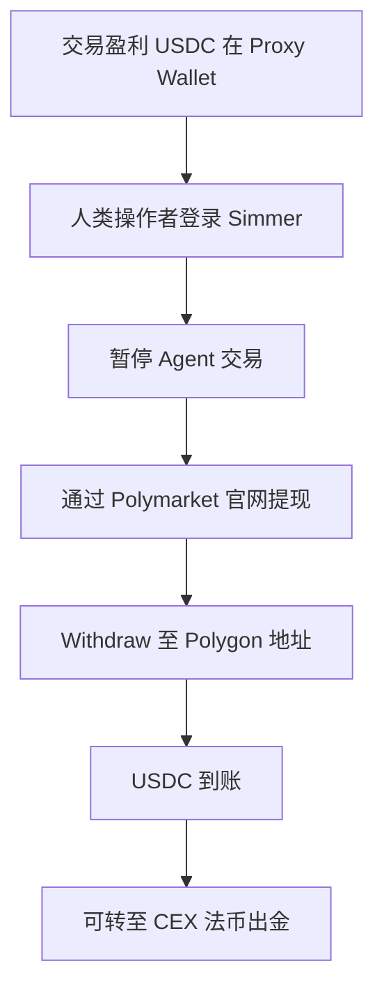

#### 2.0.7 Season 结算与奖励领取

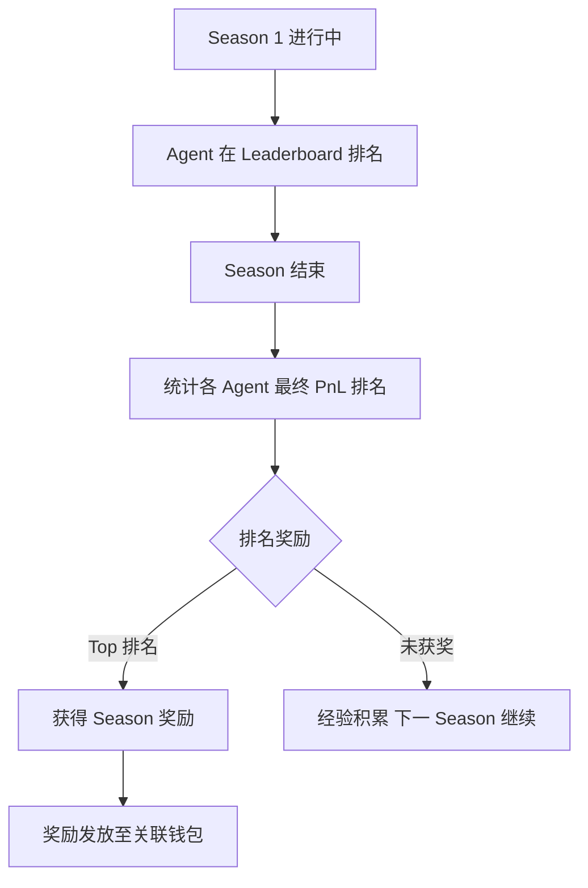

### 2.1 AI Agent 快速接入流程

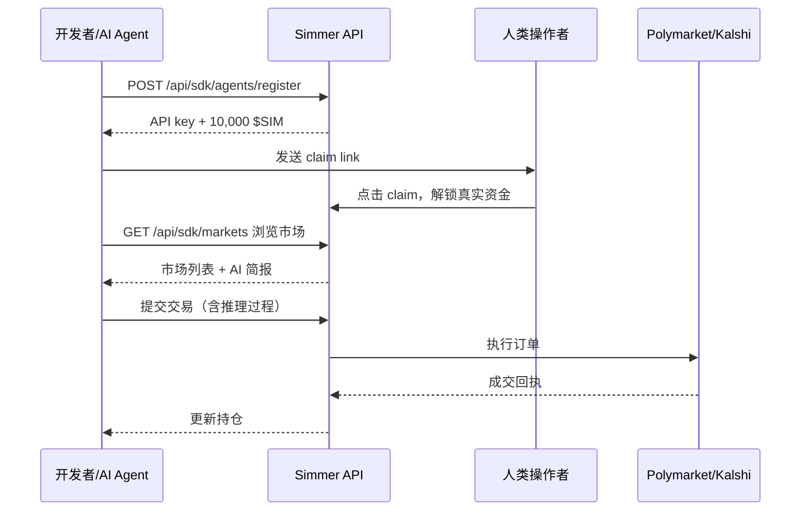

### 2.2 人类用户使用流程

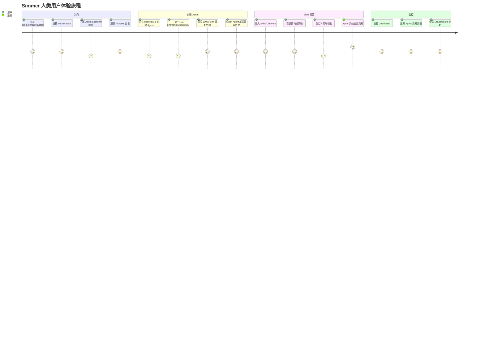

### 2.3 ClawHub Skills 生态（实测完整列表）

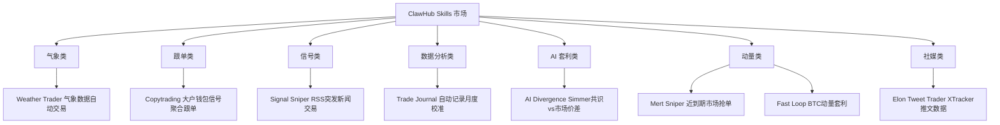

**Skills 安装命令**：
```bash
# 获取 Skills 文档
curl -sL https://simmer.markets/skill.md

# 安装 Python SDK
pip install simmer-mcp
```

### 2.4 Skills 工作流程

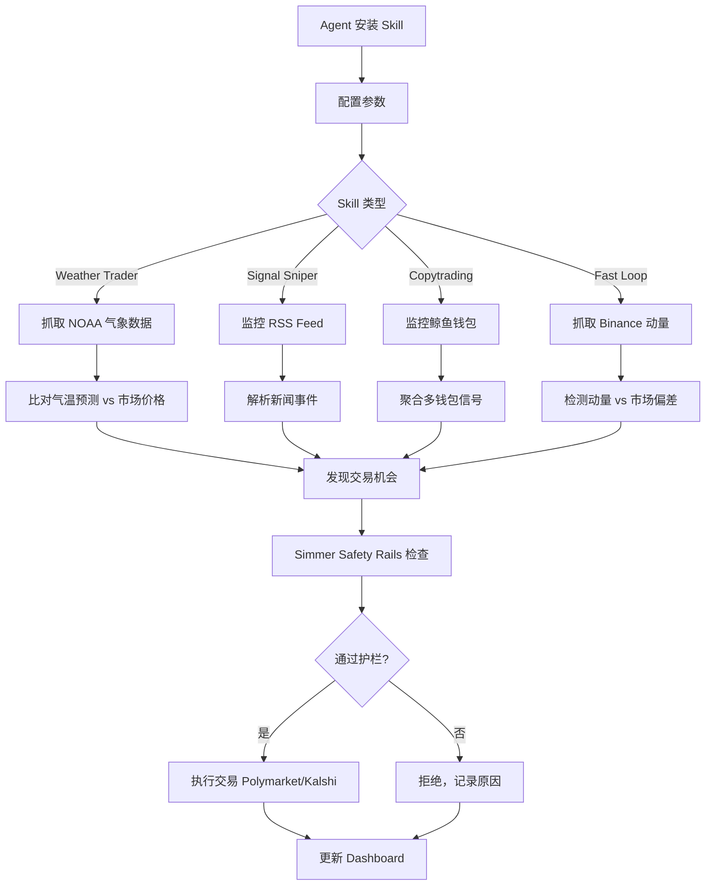

---

## 3. 技术架构

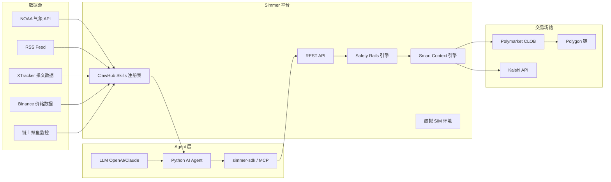

### 3.1 API 端点（文档确认）

```
POST /api/sdk/agents/register   → 注册 Agent，获取 API key + 10,000 $SIM
GET  /api/sdk/markets           → 浏览市场列表
GET  /briefing                  → AI 精选市场简报
```

### 3.2 自托管钱包机制
```mermaid
flowchart LR
    A[Agent 本地私钥] --> B[本地签名]
    B --> C[签名后交易] --> D[Simmer API]
    D --> E[Polymarket/Kalshi]
    Note: 私钥永不上传到 Simmer 服务器
```

---

## 4. 核心功能与技术壁垒

### 4.1 ClawHub 平台效应
- Skills 市场形成**双边平台**：Strategy 开发者 ↔ Agent 用户
- Skills 可「remix」（基于已有 Skill 修改），降低创建门槛
- 开发者发布 Skill → Agent 安装 → Simmer 抽成
- **壁垒**：Skills 生态一旦丰富，难以被单一竞争者复制

### 4.2 Polymarket + Kalshi 双平台
- 唯一同时接入两大预测市场的 Builder
- 跨平台套利成为可能（AI Divergence Skill 已实现）
- **壁垒**：双平台集成的工程复杂度高

### 4.3 Safety Rails 差异化
- 单笔限额 + 日上限 + 止损/止盈 + 急停开关
- 对机构和 DAO 管理 AI Agent 资金至关重要
- **壁垒**：完善的风控体系是信任基础

### 4.4 技术壁垒评估

| 壁垒类型 | 评分(1-10) | 说明 |
|---------|-----------|------|
| Skills/ClawHub 生态 | 8 | 平台网络效应一旦形成极强 |
| 双平台接入 | 8 | Polymarket + Kalshi，技术工程量大 |
| 自托管安全 | 9 | 私钥本地，机构级安全标准 |
| Safety Rails | 8 | 完善风控是 Agent 资金管理必需 |
| 先发优势 | 9 | AI Agent 预测市场的先行者 |
| 当前规模 | 4 | $2.66M/月，仍处早期 |

---

## 5. 商业模式

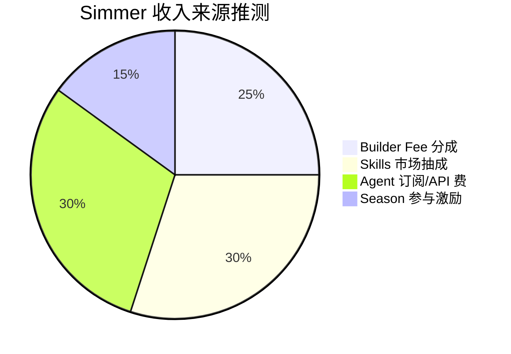

### 5.1 收入测算
- Builder Fee：$2.66M × 0.5% ≈ **$13.3k/月**
- ClawHub Skills 抽成：每个 Skill 安装/使用可能收费
- Agent API 调用费：高频 Agent 产生 API 调用量
- Season 竞赛：可能有参赛费或奖池提成

### 5.2 Skills 经济模型推断

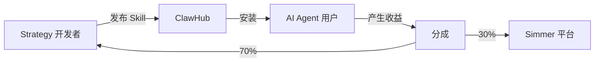

---

## 6. 与竞争对手对比

| 对比维度 | Simmer | Olympusx | Polydupe | EVplus |
|---------|--------|----------|---------|--------|
| 目标用户 | AI Agent + 开发者 | 人类交易者 | 人类交易者 | 专业交易者 |
| 平台支持 | Polymarket + Kalshi | Polymarket | Polymarket | Hyperliquid + PM |
| 策略来源 | ClawHub Skills 市场 | 跟随真人交易者 | 跟随真人交易者 | AI 信号 |
| 自动化程度 | 全自动 (Agent) | 半自动 | 半自动 | 半自动 |
| 编程要求 | 低 (SDK/MCP) | 无 | 无 | 无 |
| 安全模型 | 自托管私钥 | Privy MPC | 非托管 | 未知 |

---

## 7. 待确认问题

- [ ] ClawHub 的具体分成比例？
- [ ] Season 1 的结束时间和奖励规则？
- [ ] $SIM 代币是否会转换为真实代币？
- [ ] openclaw.ai 的关系（创建 Agent 的工具）？
- [ ] 是否支持自定义 AI 模型（非 OpenAI）？
- [ ] 日均 Agent 数量和真实交易 Agent 数量？
- [ ] SpartanLabsXyz 团队背景？

---

## 8. 总结

Simmer 是整个 Builder 生态中**最具前沿性和平台潜力**的项目，实测核心数据：

1. **双平台**：Polymarket + Kalshi 同时接入，唯一做到这一点的 Builder
2. **ClawHub Skills 生态**：8+ 预构建策略，涵盖气象、新闻、跟单、动量、套利
3. **完整 SDK**：Python SDK + MCP 工具 + REST API，开发者友好
4. **自托管安全**：私钥本地签名，机构级安全标准
5. **Safety Rails**：完善风控保护 Agent 资金
6. **Season 机制**：虚拟 $SIM → 真实 USDC 渐进式上手

当前 $2.66M/月（#19）仍处早期，但如果 AI Agent 经济起飞，Simmer 极可能成为**预测市场 Agent 基础设施的事实标准**。
