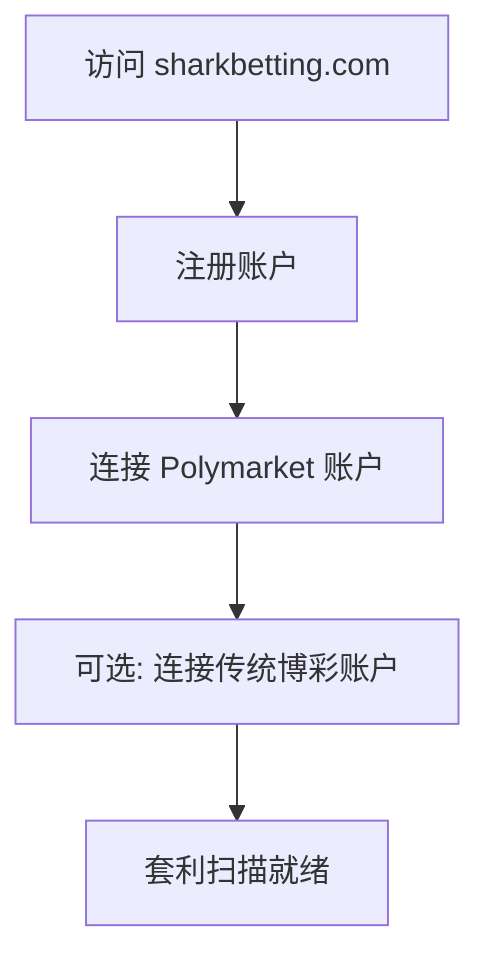
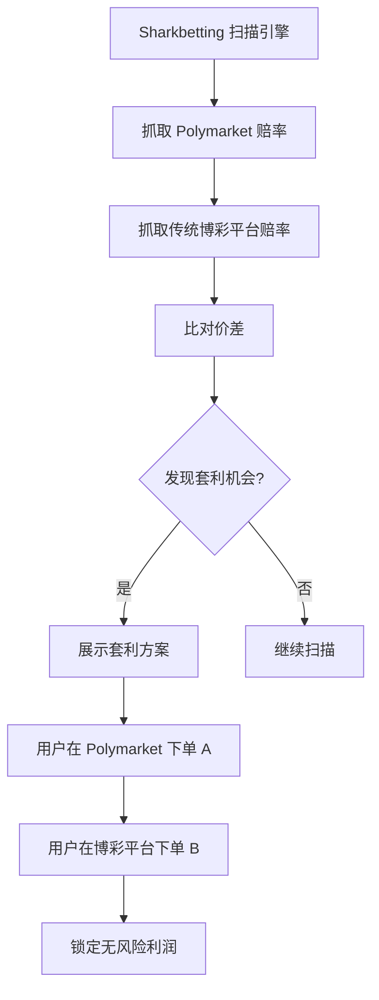
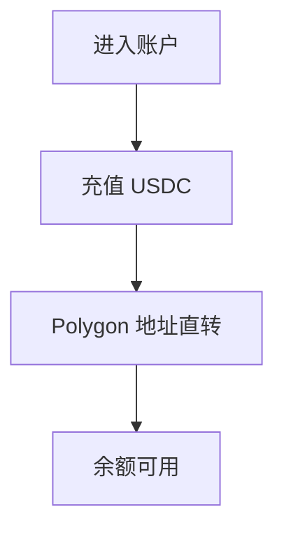
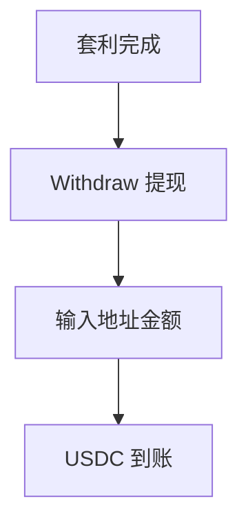
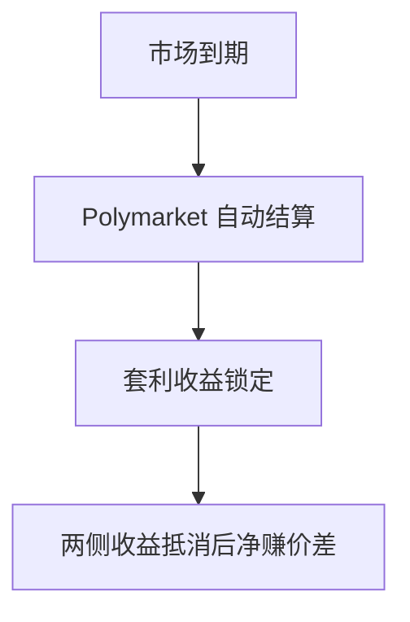

# Sharkbetting.com — 深度分析报告

> 数据日期：2026-03-24  
> Polymarket Builder Program 排名：**#20**  
> 近1月交易量：**$2.44M**

---

## 1. 市场情况

### 1.1 市场定位
Sharkbetting 是**传统体育博彩套利/匹配投注工具**，其出现在 Polymarket Builder 榜单代表了传统博彩工具与预测市场的融合趋势。

名称含义：Shark（鲨鱼）在博彩语境中指**专业套利者/匹配投注者**，善于发现各平台间的赔率差异套利。

### 1.2 核心用途（推断）
- 在 Polymarket 和传统博彩平台之间发现**赔率差异**
- **匹配投注**：在不同平台对赌，锁定无风险利润
- **套利工具**：自动比对多平台赔率

---

## 2. 用户体验路径（推断）

### 2.0 注册、入金、交易、提现全流程（推断）

#### 2.0.1 注册流程

#### 2.0.2 套利发现流程（核心功能）

#### 2.0.3 入金流程

#### 2.0.4 提现流程

#### 2.0.5 结算流程

---

## 3. 待确认问题

- [ ] 官网是否有产品详情？（连接曾失败）
- [ ] 具体支持哪些传统博彩平台对比？
- [ ] 是否有自动执行套利功能？
- [ ] 费率结构？
- [ ] 团队背景？

---

## 4. 总结

Sharkbetting 代表**传统博彩套利工具向预测市场延伸**的趋势。月交易量 $2.44M（#20）说明有真实用户在使用 Polymarket 进行套利交易。
