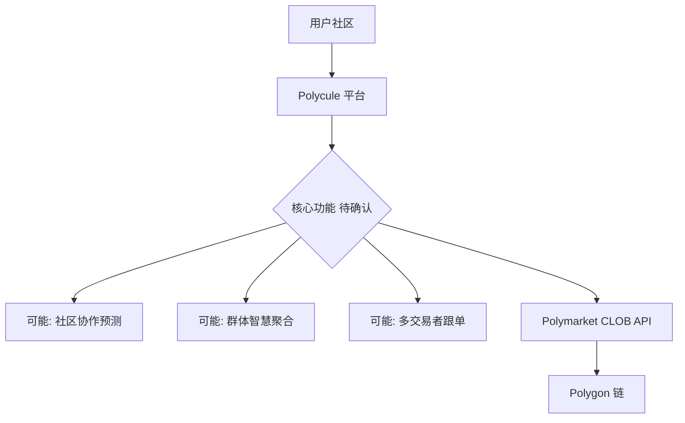
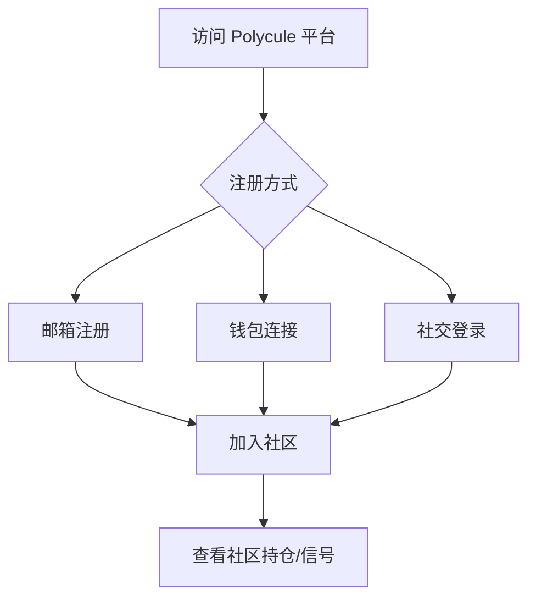
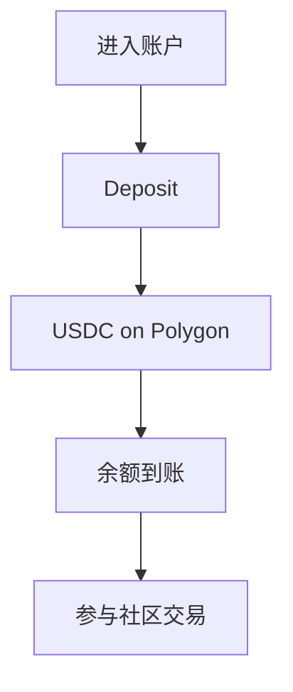
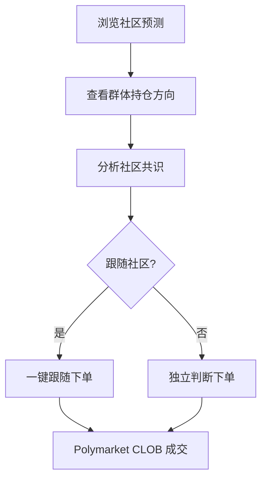
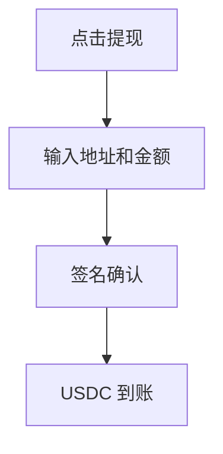
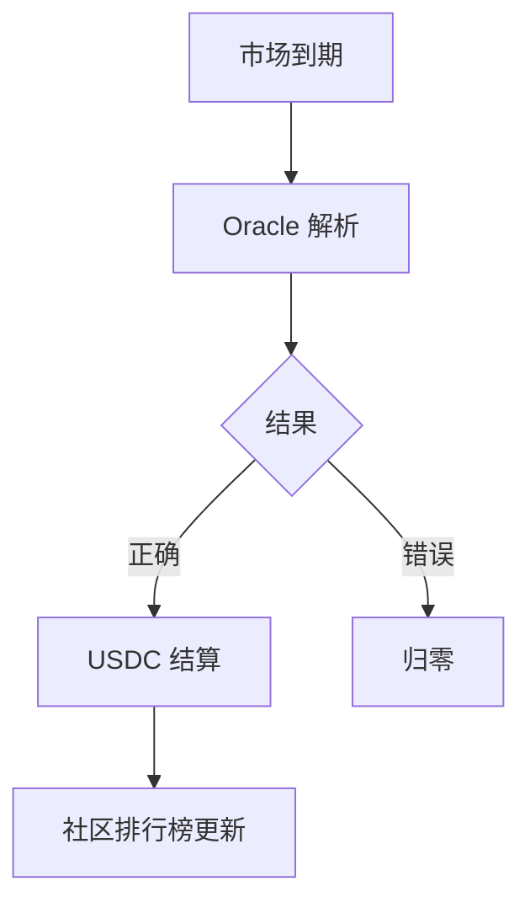

# Polycule — 深度分析报告

> 数据日期：2026-03-24  
> Polymarket Builder Program 排名：**#22**  
> 近1月交易量：**$2.06M**  
> 真实 URL：**待确认**（polycule.xyz 等均超时）

---

## 1. 已确认信息

- Builder Program 排名 **第二十二**，月交易量 **$2.06M**
- 尝试域名（均失败）：polycule.xyz / .app / .io / .trade / .fun
- 处于 #21 swaps.xyz（$2.33M）和 #23 Polymarket Eye（$1.94M）之间

### 1.1 名称含义
「Polycule」原意是多角恋关系网络（polyamorous relationship cluster），在加密语境中可能暗示：
- **多方连接**：聚合多个市场/交易者
- **社区驱动**：群体协作预测
- **网络效应**：用户之间相互关联

---

## 2. 推断定位

| 假设 | 依据 | 可能性 |
|------|------|--------|
| 社区协作预测 | 名称暗示多方关系网络 | 高 |
| 聚合交易终端 | 同量级竞品特征 | 中 |
| 复制交易社区 | 「关系网络」语义 | 中 |
| 群体智慧工具 | Polycule = 群体决策 | 中 |

---

## 3. 业务架构（推断）

---

## 4. 用户体验路径（推断）

### 2.0 注册、入金、交易、提现全流程（推断）

#### 2.0.1 注册流程（推断）

#### 2.0.2 入金流程（推断）

#### 2.0.3 核心交互流程（推断）

#### 2.0.4 提现流程（推断）

#### 2.0.5 结算流程（推断）

---

## 5. 待确认问题

- [ ] **真实网址**：在 builders.polymarket.com 点击 #22 Polycule
- [ ] 核心功能：社区协作？群体智慧？还是普通交易终端？
- [ ] 「Polycule」名称的产品含义？
- [ ] Twitter/X 账号？搜索 `polycule polymarket`
- [ ] 团队背景、融资情况？
- [ ] 费率结构？

---

## 6. 总结

Polycule 以 **$2.06M/月**（#22）位列前二十五，独特名称暗示可能有社区/协作属性。真实 URL 和产品功能需手动确认。

**TODO**：
- [ ] 获取真实 URL
- [ ] 确认产品定位
- [ ] 补充完整 UX 分析
