# Polymarket Eye — 深度分析报告

> 数据日期：2026-03-24  
> Polymarket Builder Program 排名：**#23**  
> 近1月交易量：**$1.94M**

---

## 1. 市场情况

### 1.1 市场定位
Polymarket Eye 定位为 **Polymarket 数据分析与监控平台**，提供链上行为分析、聪明钱追踪、可疑持仓识别等功能。其核心价值是帮助交易者发现「信息不对称」——哪些市场可能被操纵或错误定价。

### 1.2 核心功能（实测）

从页面内容可见以下功能模块：
- **Dashboard**：综合仪表盘
- **Geo Map**：地理分布热力图（交易者地区分布）
- **Market Fetcher**：市场筛选器
- **Smart's Tracker**：聪明钱追踪
- **X Leaderboard**：Twitter/X 影响力排行
- **Liquidity Provider**：流动性提供者分析
- **Ending Soon**：即将到期市场
- **Whale Watch**：大户监控
- **Hot & Sus**：热门 & 可疑市场
- **Gain Traction**：获得关注的市场
- **New Markets**：新上线市场

### 1.3 「Sus（可疑）」持仓分析
实测数据显示每个市场会标注：
- **New**：新进场的持仓数
- **Fresh**：刚建仓的
- **Overbet**：超额下注（相对于概率过度押注）
- **Possible Outcome**：AI 预测结果方向

---

## 2. 用户体验路径（实测）

### 2.0 注册、入金、交易、提现全流程（详细）

#### 2.0.1 访问与注册流程

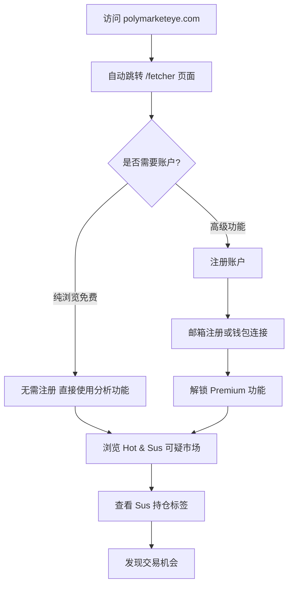

#### 2.0.2 Hot & Sus 可疑市场分析流程

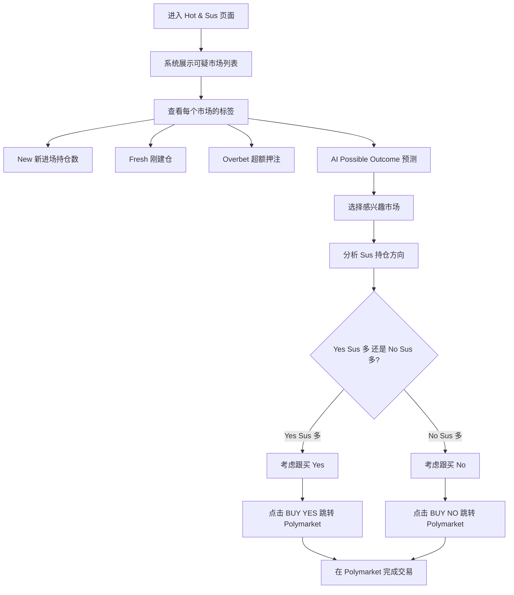

#### 2.0.3 Whale Watch 大户监控流程

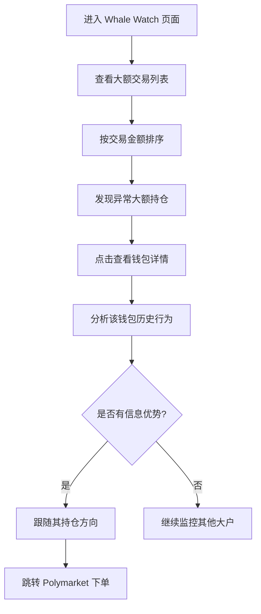

#### 2.0.4 Smart Money 聪明钱追踪流程

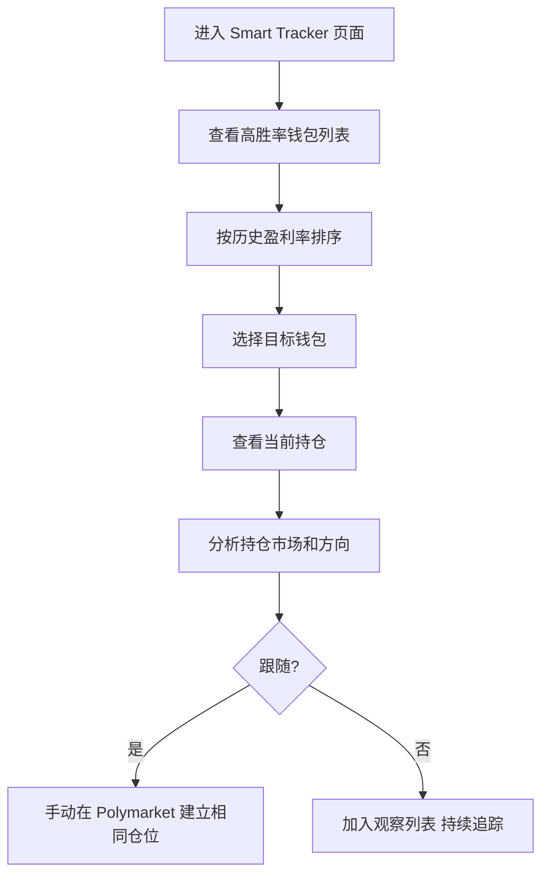

#### 2.0.5 Geo Map 地理分布分析流程

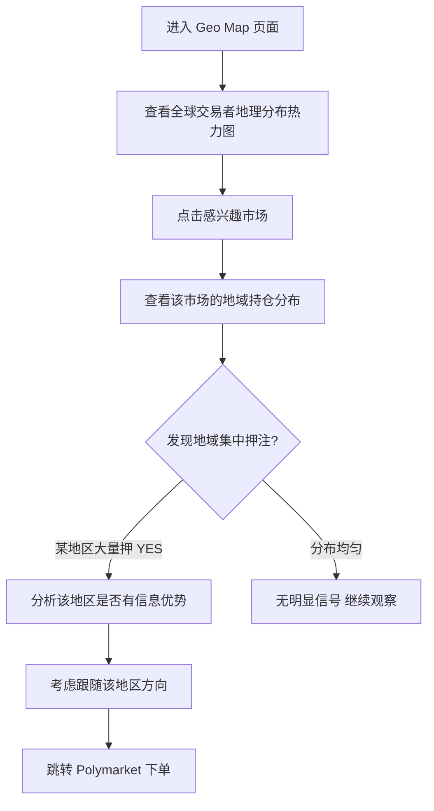

#### 2.0.6 X Leaderboard 推特影响力分析

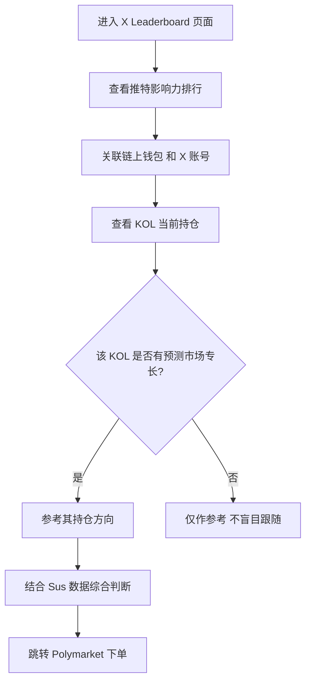

#### 2.0.7 Ending Soon 即将到期市场流程

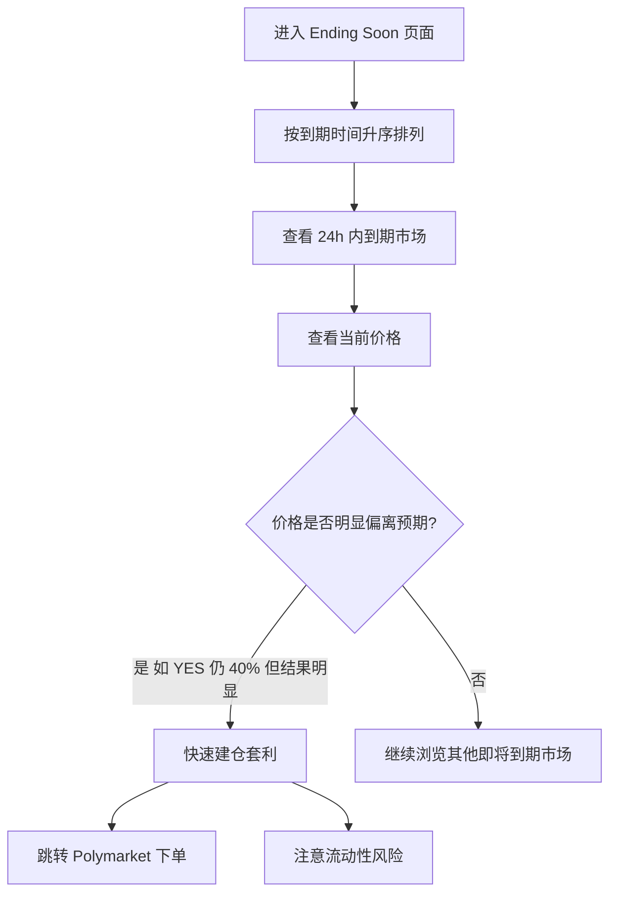

### 2.1 完整用户旅程

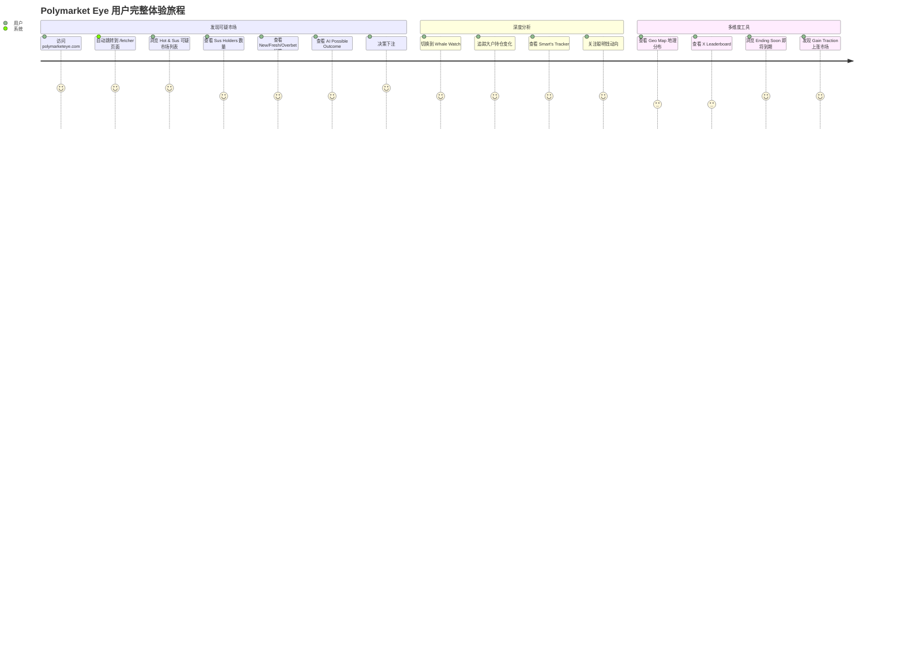

### 2.2 Hot & Sus 可疑市场分析流程

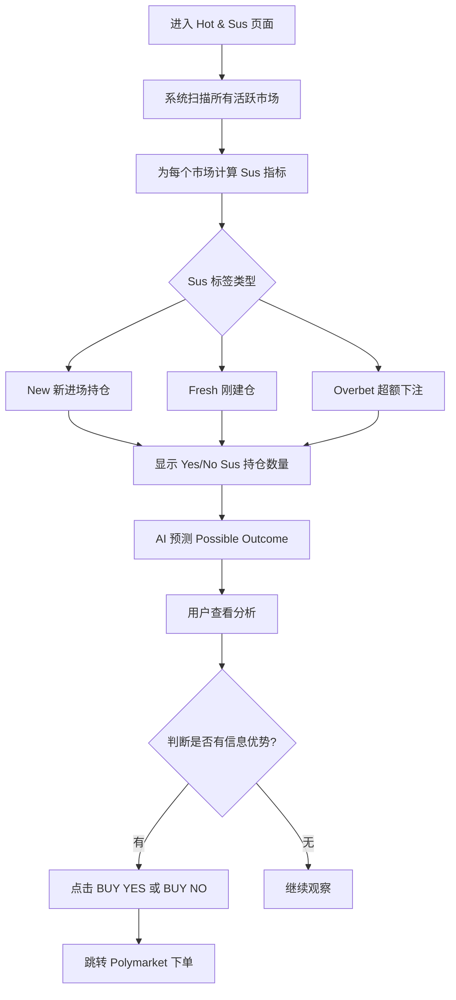

### 2.3 实测可疑市场数据（2026-03-24）

| 市场 | 交易量 | Sus 持仓 | Possible Outcome | 特征 |
|------|--------|----------|-----------------|------|
| Will Jesus Christ return before GTA VI? | $10.1M | 13 Yes / 33 No sus | **No** | Fresh 25, Overbet 18 |
| Will bitcoin hit $1m before GTA VI? | $3.7M | 5 Yes / 13 No sus | **No** | New 2, Fresh 5, Overbet 11 |
| Russia-Ukraine Ceasefire before GTA VI? | $1.4M | 1 Yes / 5 No sus | **No** | Fresh 1, Overbet 2 |
| Will China invade Taiwan before GTA VI? | $1.5M | 1 Yes / 7 No sus | **No** | New 1, Fresh 2, Overbet 5 |
| New Playboi Carti Album before GTA VI? | $707k | 1 Yes / 1 No sus | **Yes** | Overbet 2 |

**规律观察**：Overbet 越多，Sus 倾向越明显；AI Possible Outcome 与 Sus 多空持仓方向高度一致。

### 2.4 Whale Watch 大户监控流程

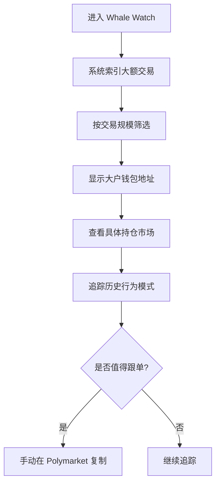

---

## 3. 业务架构

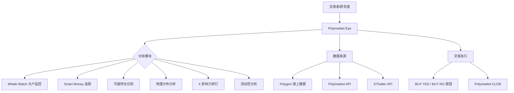

### 2.1 「Overbet」检测逻辑推断

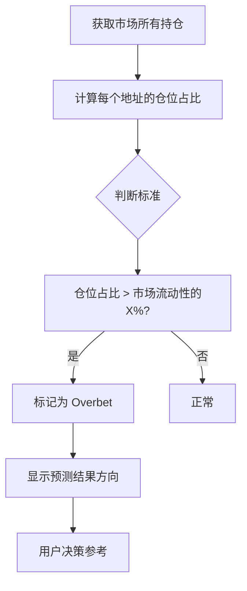

---

## 3. 技术架构

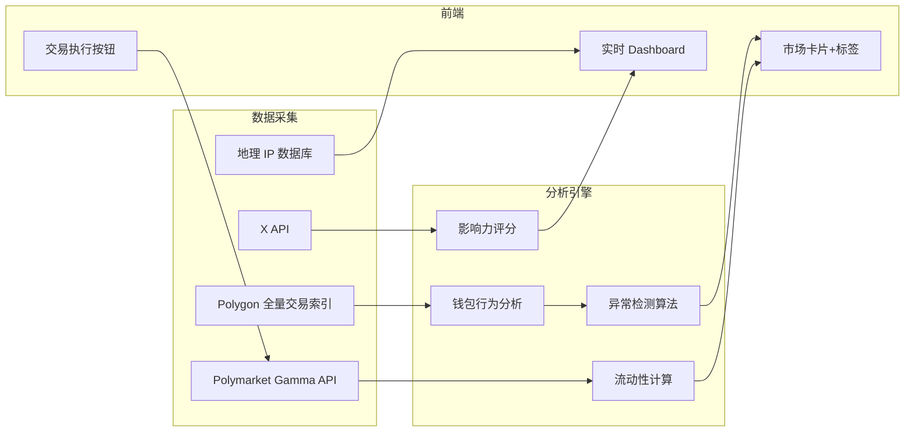

---

## 4. 核心功能与技术壁垒

### 4.1 链上数据积累壁垒
- 需要索引 Polymarket 所有历史交易（链上数据量大）
- 「Overbet」等异常检测需要统计基准，历史数据越多越准
- 地理分布分析需要 IP/地理数据库持续维护

### 4.2 信息优势工具
- Whale Watch + Smart Money + Sus 检测 = 完整的「链上侦探工具集」
- 对研究型交易者价值极高
- X Leaderboard 整合链上+链下（社媒）数据，独特

### 4.3 技术壁垒评估

| 壁垒类型 | 评分(1-10) | 说明 |
|---------|-----------|------|
| 链上数据积累 | 8 | 历史索引数据是核心资产 |
| 异常检测算法 | 7 | Sus/Overbet 检测逻辑有壁垒 |
| 多源数据整合 | 8 | 链上+X+地理 三源整合 |
| 用户独特性 | 7 | 研究型交易者是高价值用户 |

---

## 5. 商业模式

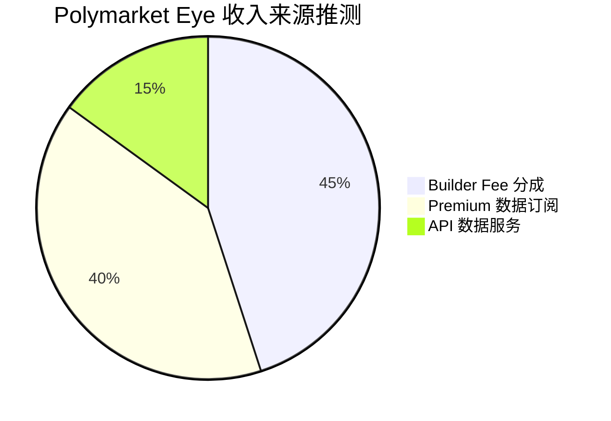

### 5.1 收入测算
- 当前：$1.94M × 0.5% ≈ **$9.7k/月** Builder Fee
- Premium 订阅（高级分析功能）可能是主要收入
- 链上数据 API 对机构有价值

---

## 6. 待确认问题

- [ ] 「Overbet」的具体判断标准和阈值？
- [ ] Geo Map 的数据来源（IP 归属 or 链上交易所关联）？
- [ ] X Leaderboard 如何关联链上钱包和 X 账号？
- [ ] Smart's Tracker 和 PolyCop/Polygun 的聪明钱有何不同？
- [ ] 是否有 Premium 订阅？定价？
- [ ] 数据 API 是否对外开放？
- [ ] 团队背景？

---

## 7. 总结

Polymarket Eye 是 Builder 生态中**数据分析工具的标杆**：
1. **功能最全面的链上分析平台**：10+ 分析模块
2. **Sus/Overbet 检测**是独特的市场操纵预警功能
3. **多源数据整合**（链上+X+地理）提供全方位市场视角
4. 月交易量 $1.94M（#23），体量适中，有增长空间
