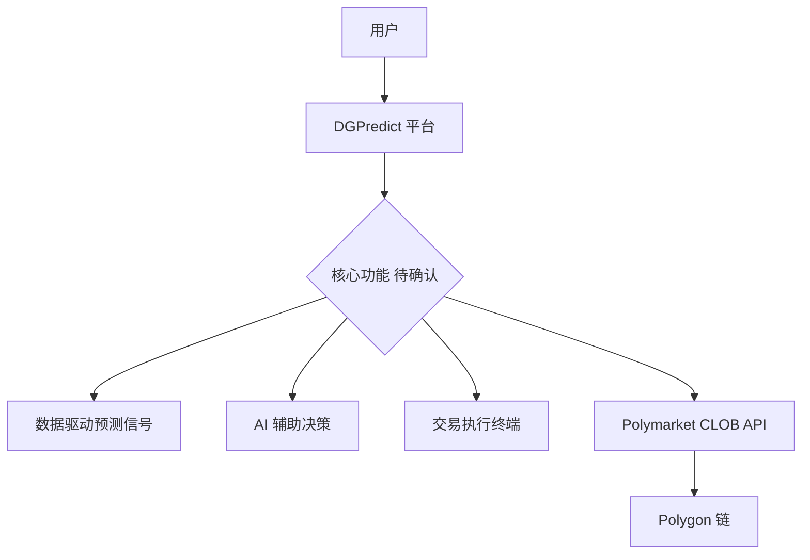
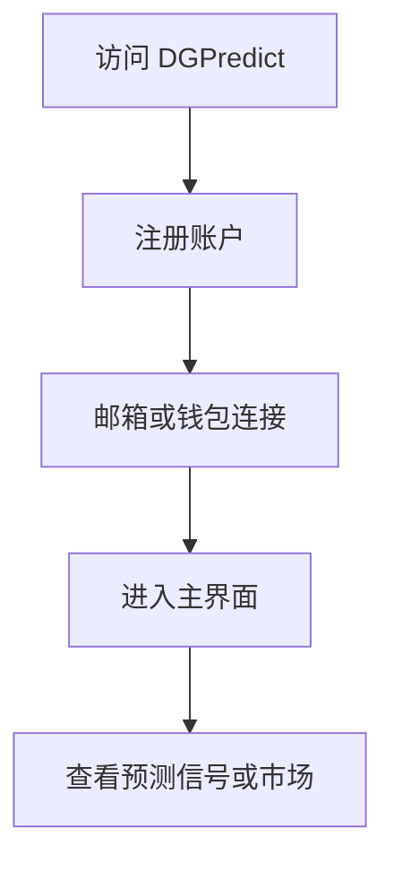
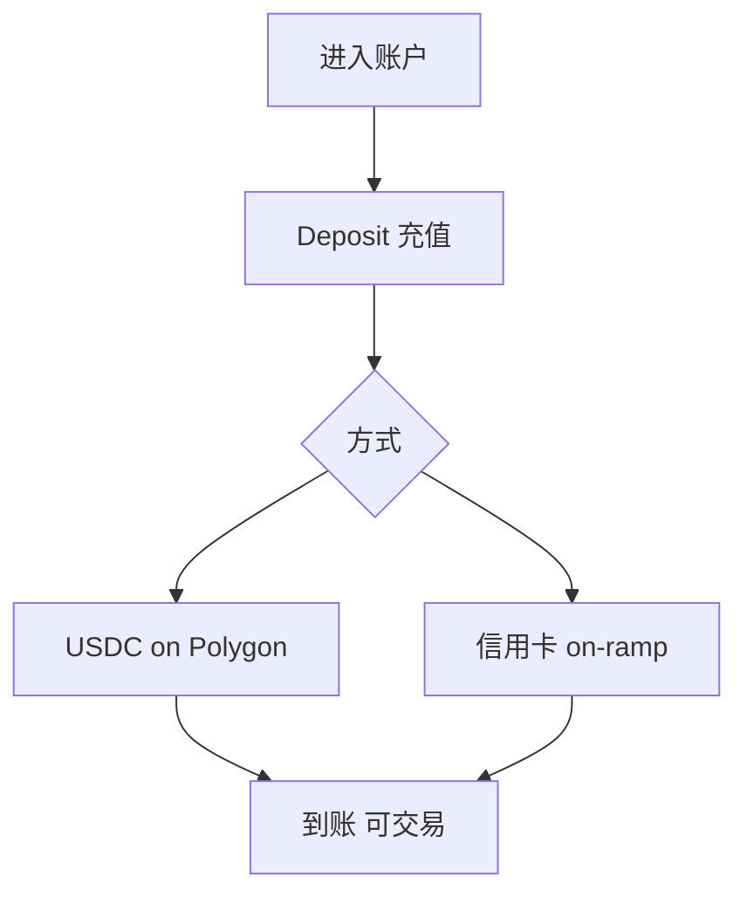
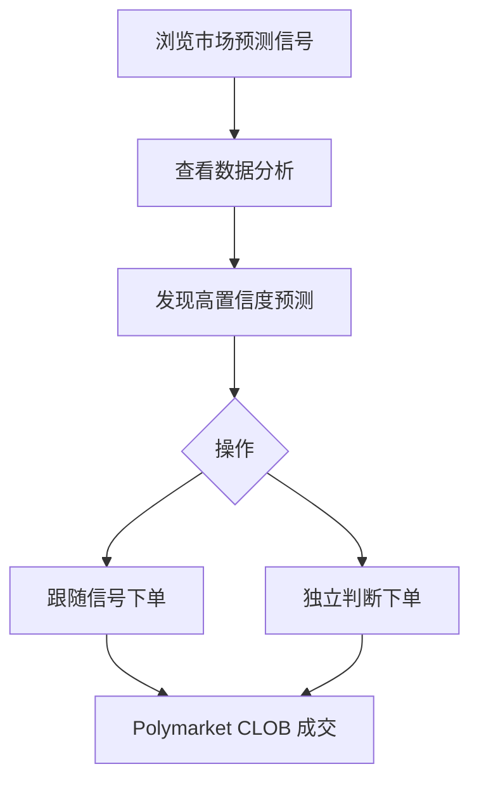
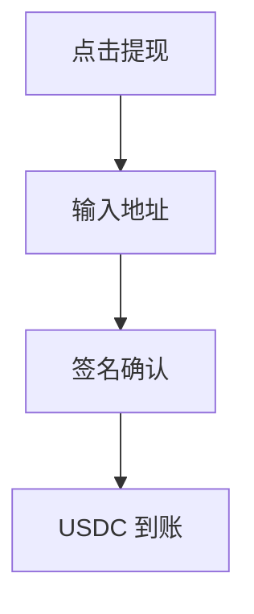
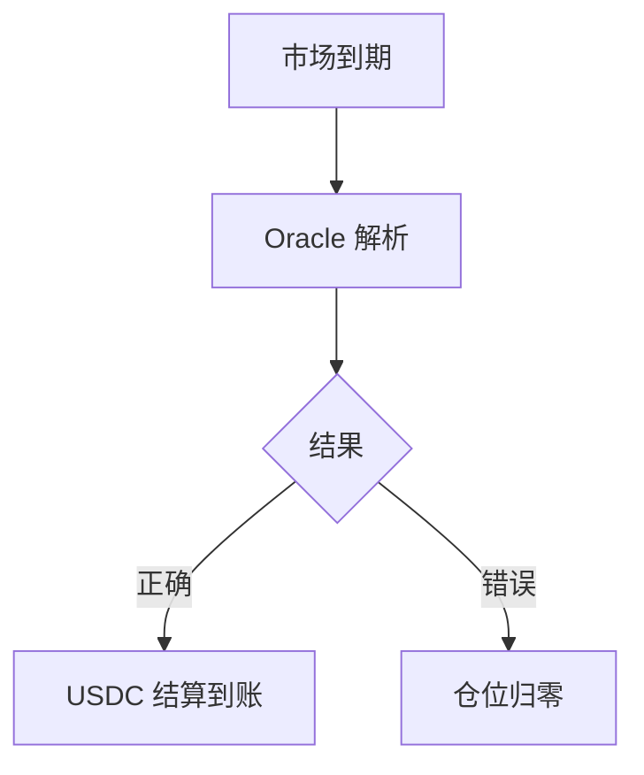

# DGPredict — 深度分析报告

> 数据日期：2026-03-24  
> Polymarket Builder Program 排名：**#24**  
> 近1月交易量：**$1.89M**  
> 真实 URL：**待确认**（dgpredict.com 等被 Cloudflare 保护，超时）

---

## 1. 已确认信息

- Builder Program 排名 **第二十四**，月交易量 **$1.89M**
- 域名尝试：dgpredict.com / .xyz / .io — 均被 Cloudflare 保护或超时
- 处于 #23 Polymarket Eye（$1.94M）和 #25 Rainbow（$1.46M）之间

### 1.1 名称含义
「DGPredict」可能含义：
- **DG** = Data-Guided（数据引导）
- **DG** = DeGen（链上投机者）
- **DG** = 某团队缩写
- **Predict** = 预测市场工具

---

## 2. 推断定位

| 假设 | 依据 | 可能性 |
|------|------|--------|
| 数据驱动预测工具 | DG = Data-Guided | 高 |
| DeGen 风格交易工具 | DG = DeGen | 中 |
| AI 预测信号 | Predict 语义 | 中 |
| 通用交易终端 | 同量级竞品 | 中 |

---

## 3. 业务架构（推断）

---

## 4. 用户体验路径（推断）

### 2.0 注册、入金、交易、提现全流程（推断）

#### 2.0.1 注册流程（推断）

#### 2.0.2 入金流程（推断）

#### 2.0.3 预测/交易流程（推断）

#### 2.0.4 提现流程（推断）

#### 2.0.5 结算流程（推断）

---

## 5. 待确认问题

- [ ] **真实网址**：在 builders.polymarket.com 点击 #24 DGPredict
- [ ] DG 代表什么？Data-Guided 还是其他？
- [ ] 核心功能：信号工具？AI 预测？还是交易终端？
- [ ] Twitter/X 账号？搜索 `dgpredict polymarket`
- [ ] 团队背景？
- [ ] 费率结构？

---

## 6. 总结

DGPredict 以 **$1.89M/月**（#24）紧跟 Polymarket Eye 之后，名称暗示数据驱动或预测信号属性。Cloudflare 保护说明有真实服务在运行，需手动访问确认。

**TODO**：
- [ ] 获取真实 URL
- [ ] 确认产品定位
- [ ] 补充完整分析
