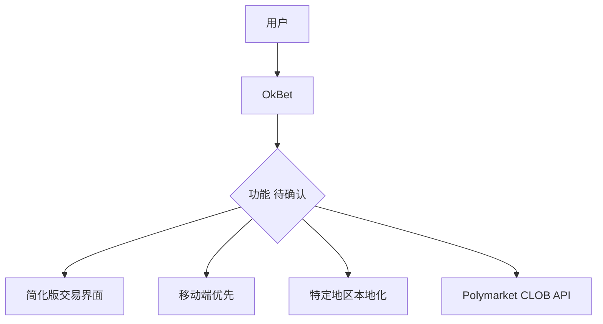
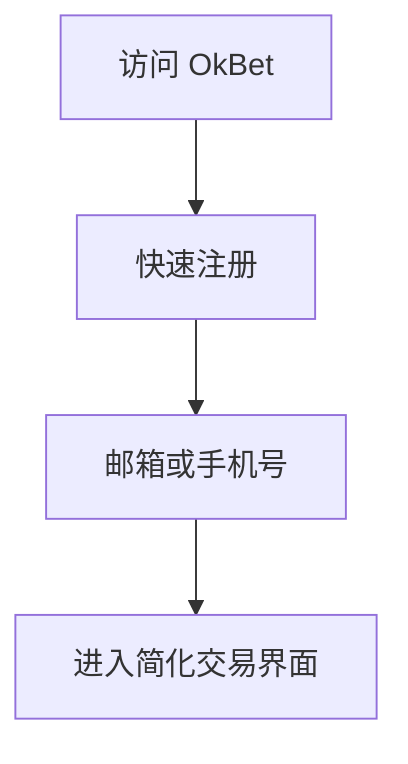
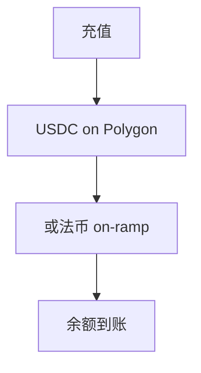
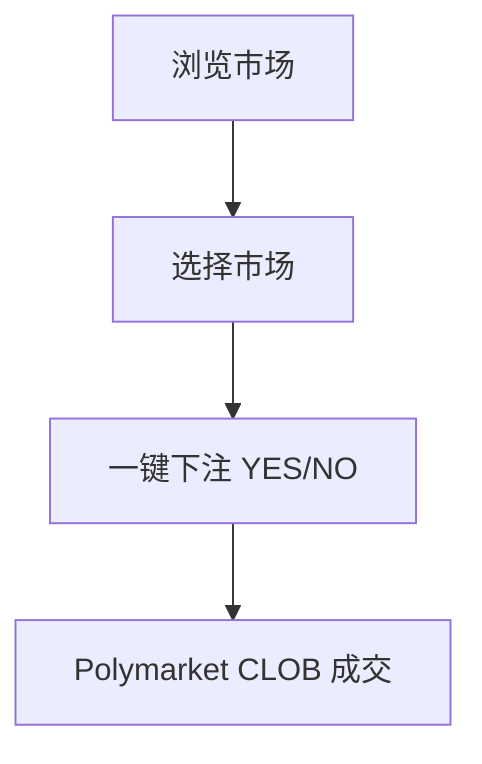
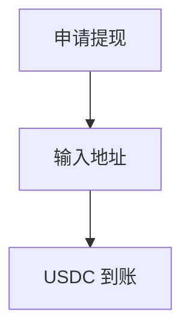
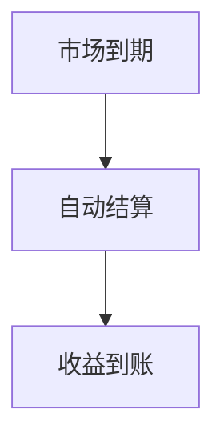

# OkBet — 深度分析报告

> 数据日期：2026-03-24  
> Polymarket Builder Program 排名：**#27**  
> 近1月交易量：**$1.18M**  
> 真实 URL：**待确认**

---

## 1. 已确认信息

- Builder Program 排名 **第二十七**，月交易量 **$1.18M**
- 名称「OkBet」直白，暗示简单易用的投注工具
- 处于 #26 Ask Gina（$1.40M）和 #28 fireplace（$1.17M）之间

### 1.1 名称含义
「OkBet」= OK + Bet，可能定位为：
- **简单易用**的投注界面（面向新手）
- **快速下单**工具
- 或为特定地区市场（东南亚等）的本地化产品

---

## 2. 推断定位

---

## 3. 用户体验路径（推断）

### 2.0 注册、入金、交易、提现全流程（推断）

#### 2.0.1 注册流程

#### 2.0.2 入金流程

#### 2.0.3 交易流程

#### 2.0.4 提现流程

#### 2.0.5 结算流程

---

## 4. 待确认问题

- [ ] 真实网址
- [ ] 目标用户群体和地区
- [ ] 是否有移动端 App
- [ ] 与同类简化终端的差异化
- [ ] 费率结构

---

## 5. 总结

OkBet 以 **$1.18M/月**（#27）运营，定位可能是简化易用的投注界面。需手动确认真实 URL 和产品形态。
