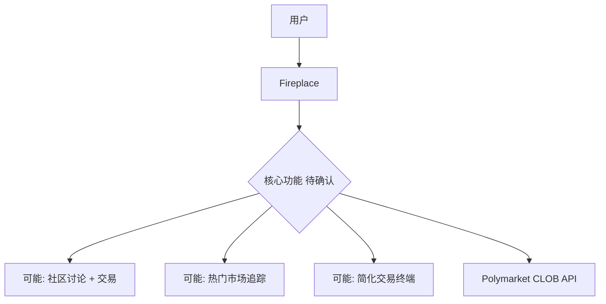
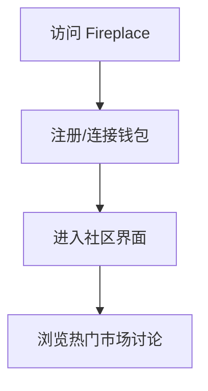
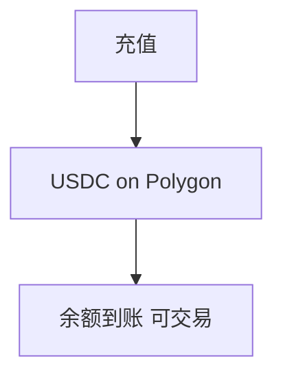
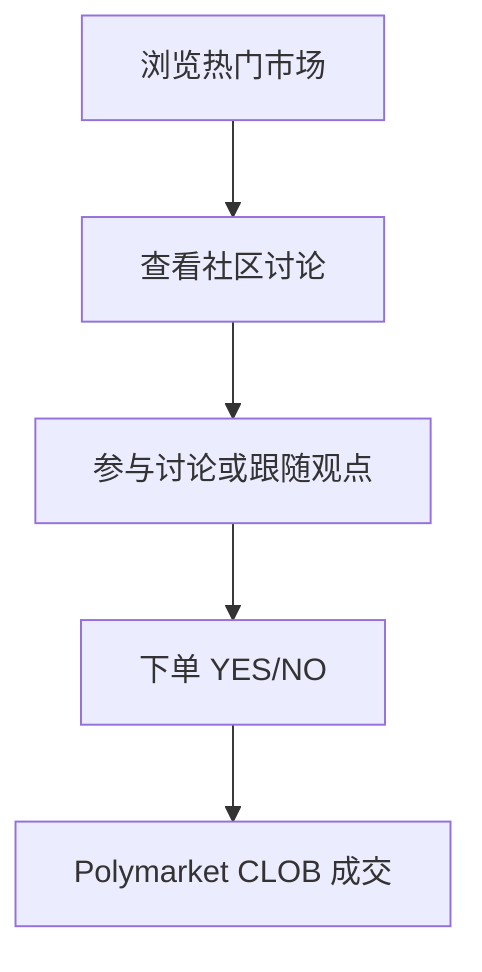
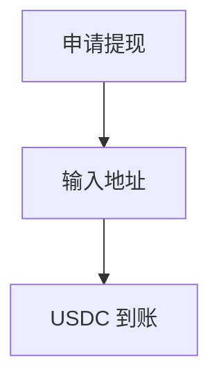
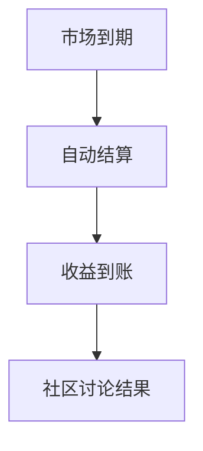

# Fireplace — 深度分析报告

> 数据日期：2026-03-24  
> Polymarket Builder Program 排名：**#28**  
> 近1月交易量：**$1.17M**  
> 真实 URL：**待确认**

---

## 1. 已确认信息

- Builder Program 排名 **第二十八**，月交易量 **$1.17M**
- 名称「Fireplace」暗示**温暖、社区聚集、围坐讨论**的氛围
- 处于 #27 OkBet（$1.18M）和 #29 NoArb（$1.15M）之间

### 1.1 名称含义
「Fireplace」可能代表：
- **社区聚集地**：围绕预测市场的讨论/交流平台
- **热度追踪**：追踪热门市场（Fire = 热门）
- **温暖品牌调性**：对比其他工具感强的产品，Fireplace 更强调社区感

---

## 2. 推断定位

---

## 3. 用户体验路径（推断）

### 2.0 注册、入金、交易、提现全流程（推断）

#### 2.0.1 注册流程

#### 2.0.2 入金流程

#### 2.0.3 核心交互流程

#### 2.0.4 提现流程

#### 2.0.5 结算流程

---

## 4. 待确认问题

- [ ] 真实网址
- [ ] 核心功能：社区平台还是交易终端？
- [ ] 是否有讨论/评论功能？
- [ ] 团队背景
- [ ] 费率结构

---

## 5. 总结

Fireplace 以 **$1.17M/月**（#28）运营，名称暗示社区属性。需手动确认真实 URL 和产品形态。
