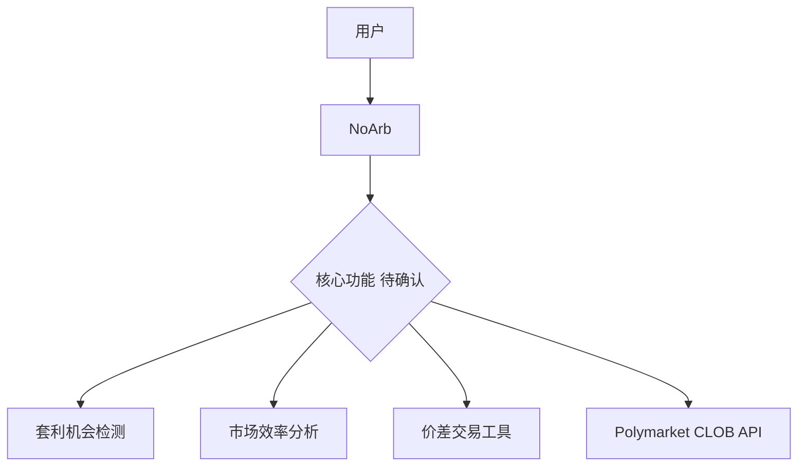
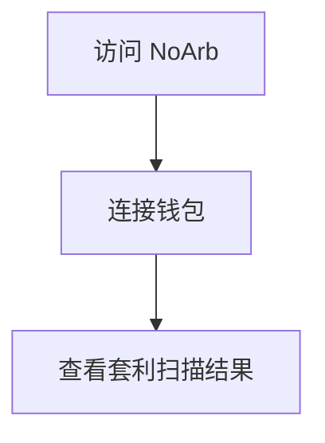
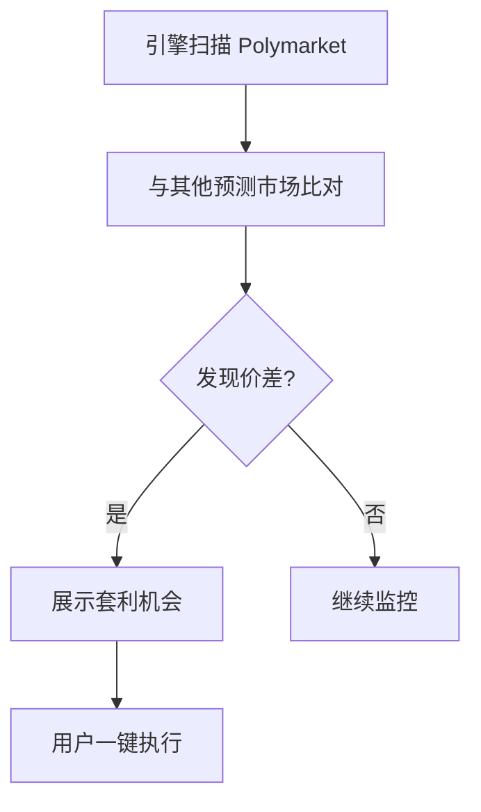
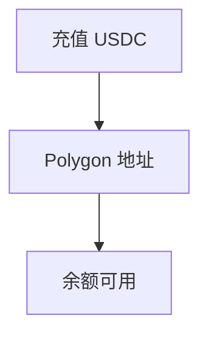
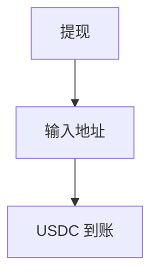
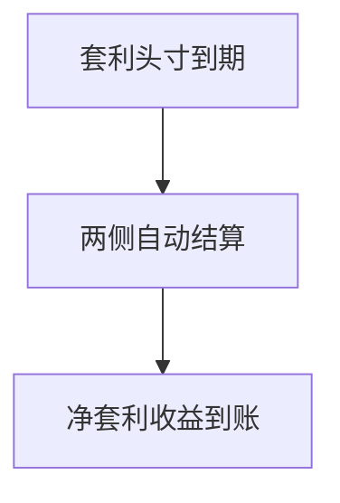

# NoArb — 深度分析报告

> 数据日期：2026-03-24  
> Polymarket Builder Program 排名：**#29**  
> 近1月交易量：**$1.15M**  
> 真实 URL：**待确认**（noarb.xyz 等连接失败）

---

## 1. 已确认信息

- Builder Program 排名 **第二十九**，月交易量 **$1.15M**
- 名称「NoArb」= No Arbitrage（无套利），含义深刻：
  - 讽刺性命名：「没有套利机会」暗示市场已高效定价
  - 或反向含义：帮助用户**发现**套利机会
  - 可能是套利检测/分析工具

---

## 2. 推断定位

---

## 3. 用户体验路径（推断）

### 2.0 注册、入金、交易、提现全流程（推断）

#### 2.0.1 注册流程

#### 2.0.2 套利发现流程

#### 2.0.3 入金流程

#### 2.0.4 提现流程

#### 2.0.5 结算流程

---

## 4. 待确认问题

- [ ] 真实网址
- [ ] NoArb 的实际产品含义（套利工具还是其他）
- [ ] 是否跨 Polymarket + Kalshi 套利
- [ ] 团队背景

---

## 5. 总结

NoArb 以 **$1.15M/月**（#29）运营，名称强烈暗示套利相关产品。需手动确认 URL。
