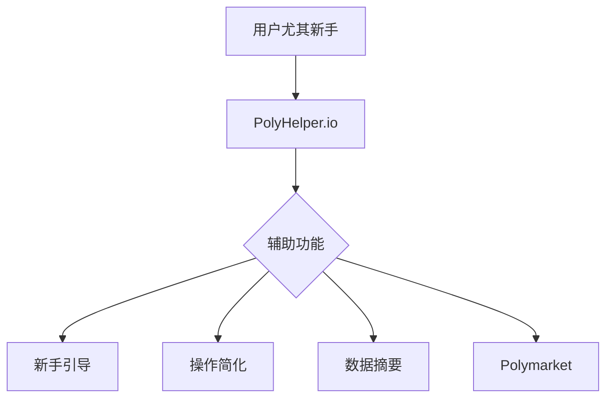
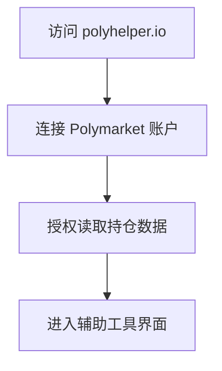
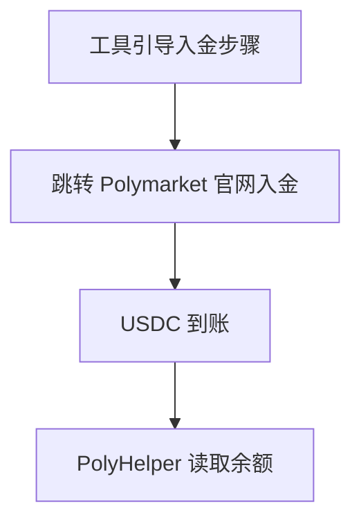
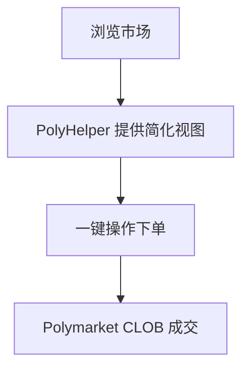
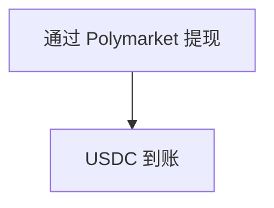
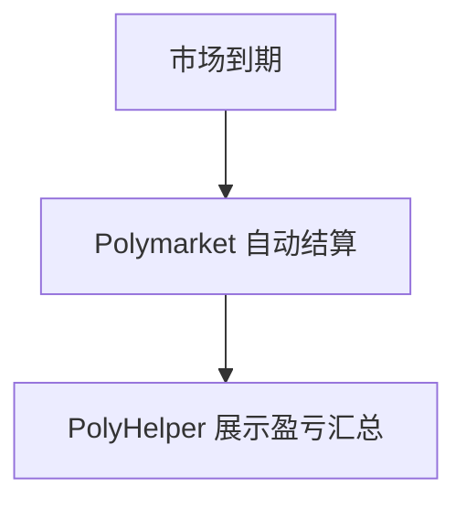

# PolyHelper.io — 深度分析报告

> 数据日期：2026-03-24  
> Polymarket Builder Program 排名：**#30**  
> 近1月交易量：**$1.09M**  
> 官网：**polyhelper.io**（待访问确认）

---

## 1. 已确认信息

- Builder Program 排名 **第三十**，月交易量 **$1.09M**
- 域名「polyhelper.io」可直接推断，名称直白
- 「PolyHelper」= Polymarket Helper，定位为**辅助工具**

### 1.1 名称含义
「PolyHelper」可能是：
- **新手辅助工具**：帮助不熟悉 Polymarket 的用户入门
- **交易助手**：自动化某些繁琐操作（如批量下单、一键平仓）
- **数据助手**：提供简化版数据分析

---

## 2. 推断定位

---

## 3. 用户体验路径（推断）

### 2.0 注册、入金、交易、提现全流程（推断）

#### 2.0.1 注册流程

#### 2.0.2 入金流程

#### 2.0.3 交易辅助流程

#### 2.0.4 提现流程

#### 2.0.5 结算流程

---

## 4. 待确认问题

- [ ] polyhelper.io 实际内容和功能
- [ ] 是独立 dApp 还是 Polymarket 套壳？
- [ ] 目标用户：新手还是进阶用户？
- [ ] 费率结构
- [ ] 团队背景

---

## 5. 总结

PolyHelper.io 以 **$1.09M/月**（#30）运营，定位为辅助工具。名称直白，可能面向 Polymarket 新手用户。
