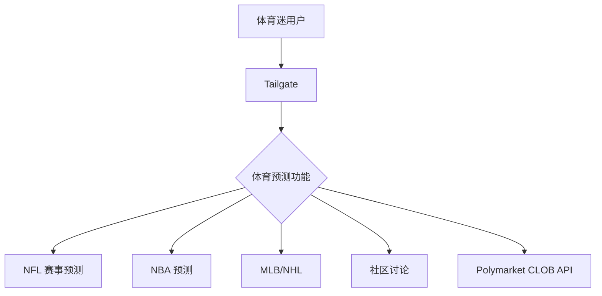
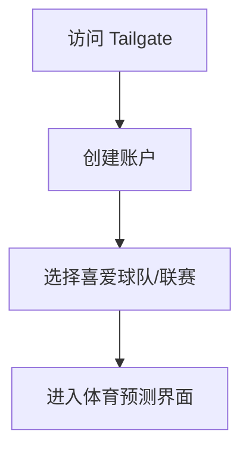
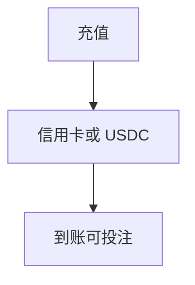
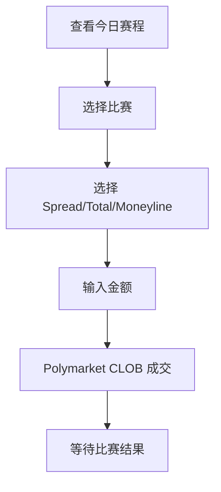
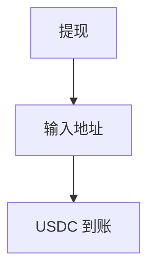
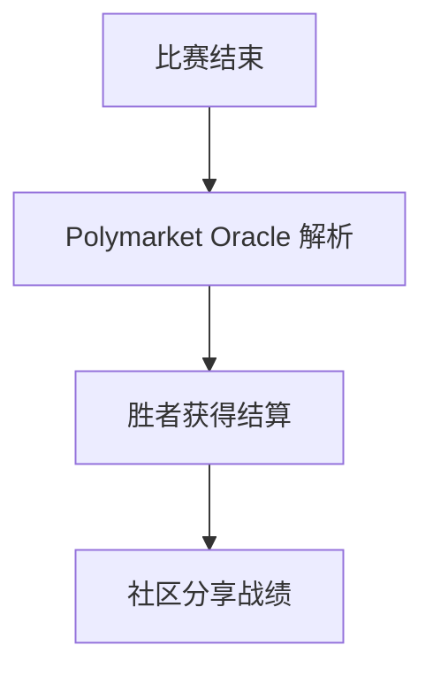

# Tailgate — 深度分析报告

> 数据日期：2026-03-24  
> Polymarket Builder Program 排名：**#31**  
> 近1月交易量：**$1.07M**  
> 真实 URL：**待确认**

---

## 1. 已确认信息

- Builder Program 排名 **第三十一**，月交易量 **$1.07M**
- 「Tailgate」= 美式足球/体育赛前聚会文化
- 强烈暗示**体育预测市场专属平台**

### 1.1 名称含义
「Tailgate」在美国文化中指体育赛事前在停车场举行的聚会，是体育迷文化的象征：
- **体育预测专区**：NFL/NBA/MLB/NHL 等
- **社区氛围**：朋友间的预测竞猜
- **赛前分析**：赛前数据和预测

---

## 2. 推断定位

---

## 3. 用户体验路径（推断）

### 2.0 注册、入金、交易、提现全流程（推断）

#### 2.0.1 注册流程

#### 2.0.2 入金流程

#### 2.0.3 体育预测交易流程

#### 2.0.4 提现流程

#### 2.0.5 结算流程

---

## 4. 待确认问题

- [ ] 真实网址
- [ ] 是否专注体育类预测市场
- [ ] 是否有社区/讨论功能
- [ ] 是否支持 Parlay（过关）投注
- [ ] 与 Olympusx Sports 模块的差异化
- [ ] 团队背景

---

## 5. 总结

Tailgate 以 **$1.07M/月**（#31）运营，名称强烈暗示体育预测市场专属平台，与美式体育文化深度绑定。
