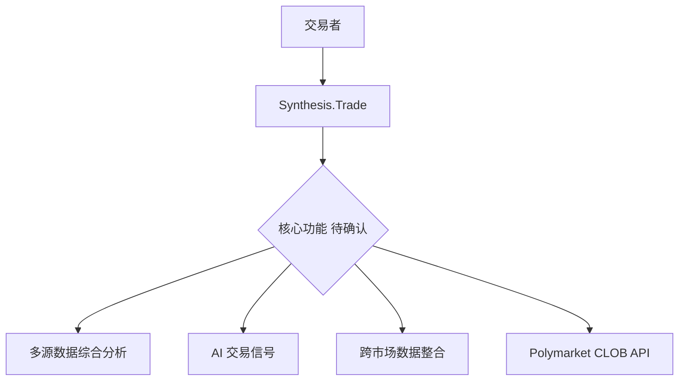
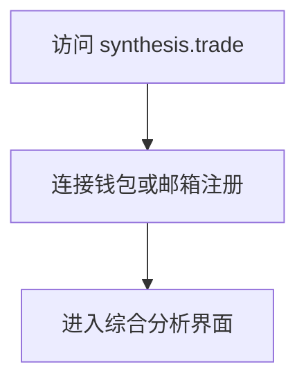
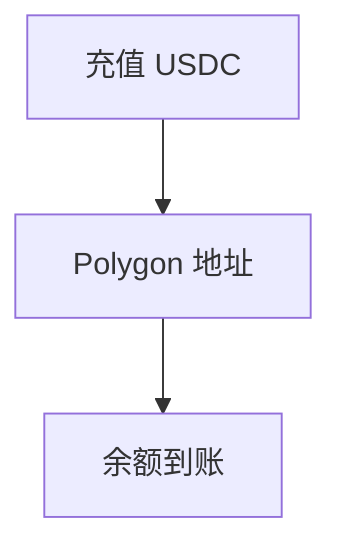
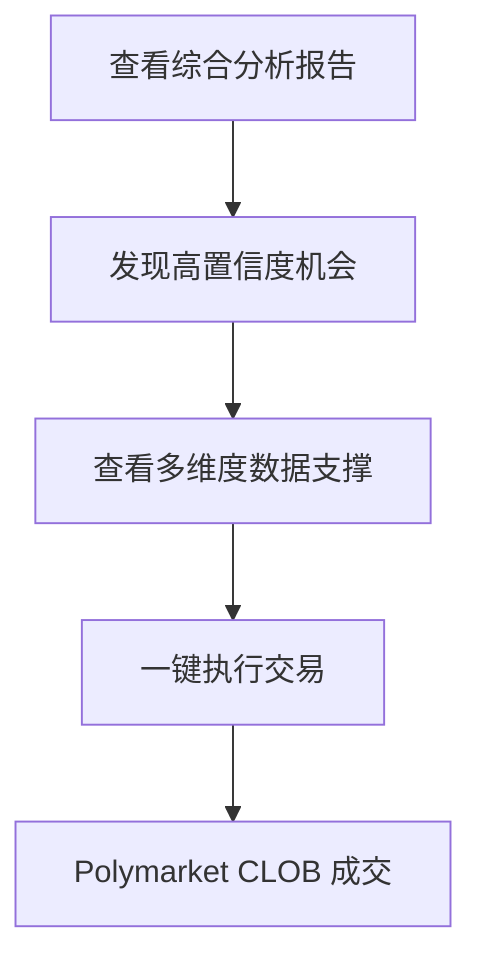
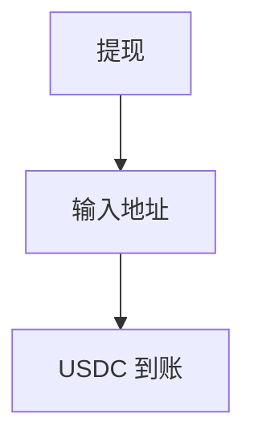
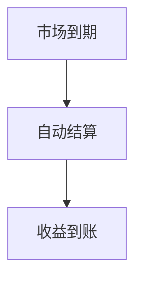

# Synthesis.Trade — 深度分析报告

> 数据日期：2026-03-24  
> Polymarket Builder Program 排名：**#32**  
> 近1月交易量：**$1.03M**  
> 真实 URL：**synthesis.trade**（待访问确认）

---

## 1. 已确认信息

- Builder Program 排名 **第三十二**，月交易量 **$1.03M**
- 「Synthesis」= 综合/合成，暗示**多数据源整合**或**合成仓位**
- 处于 #31 Tailgate（$1.07M）和 #33 Almanac（$1.02M）之间

### 1.1 名称含义
「Synthesis.Trade」可能是：
- **数据综合**：整合多来源数据提供交易信号
- **仓位合成**：构建复合策略仓位
- **跨市场综合**：聚合 Polymarket + 其他预测市场
- **AI 综合分析**：AI 综合多维度信息输出预测

---

## 2. 推断定位

---

## 3. 用户体验路径（推断）

### 2.0 注册、入金、交易、提现全流程（推断）

#### 2.0.1 注册流程

#### 2.0.2 入金流程

#### 2.0.3 综合分析交易流程

#### 2.0.4 提现流程

#### 2.0.5 结算流程

---

## 4. 待确认问题

- [ ] synthesis.trade 实际内容
- [ ] 核心功能：数据分析？AI 信号？仓位构建？
- [ ] 是否跨平台聚合（Polymarket + Kalshi）
- [ ] 团队背景
- [ ] 费率结构

---

## 5. 总结

Synthesis.Trade 以 **$1.03M/月**（#32）运营，名称暗示多数据源综合分析。与 Almanac（#33）体量相当，定位可能互补。
