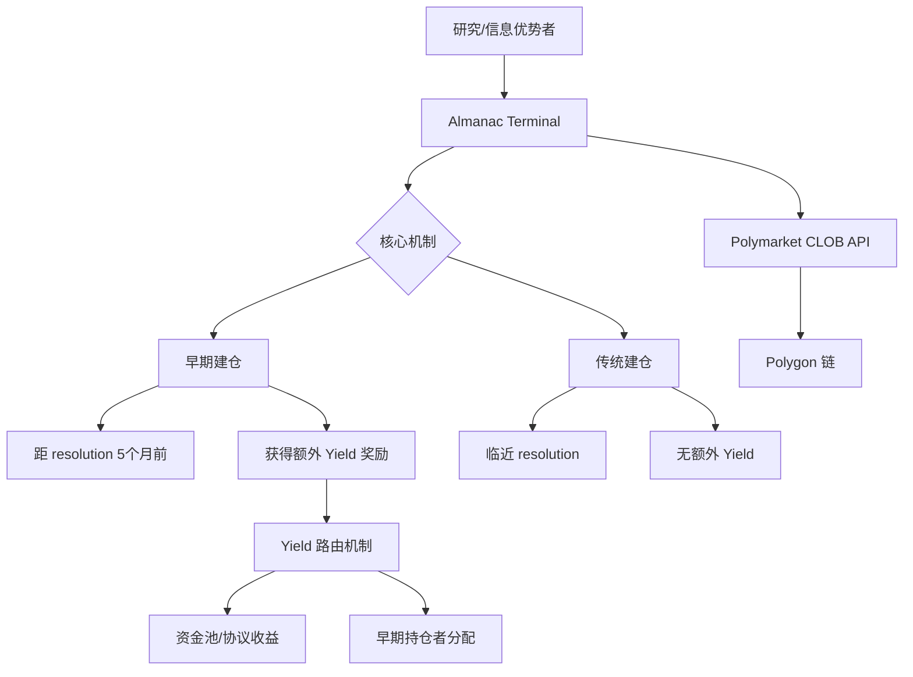
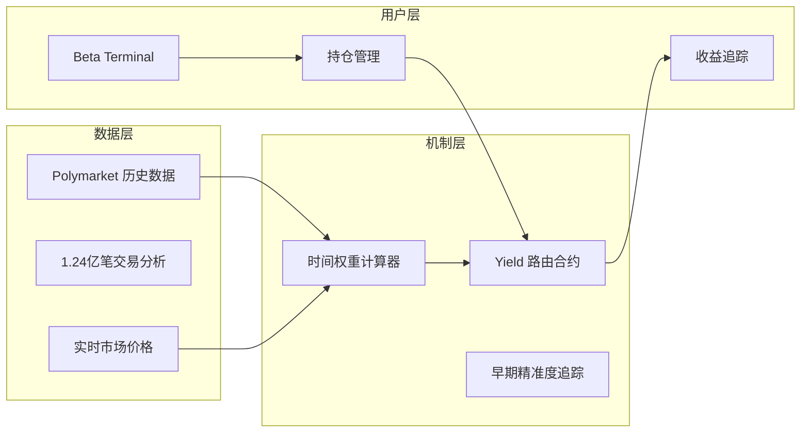
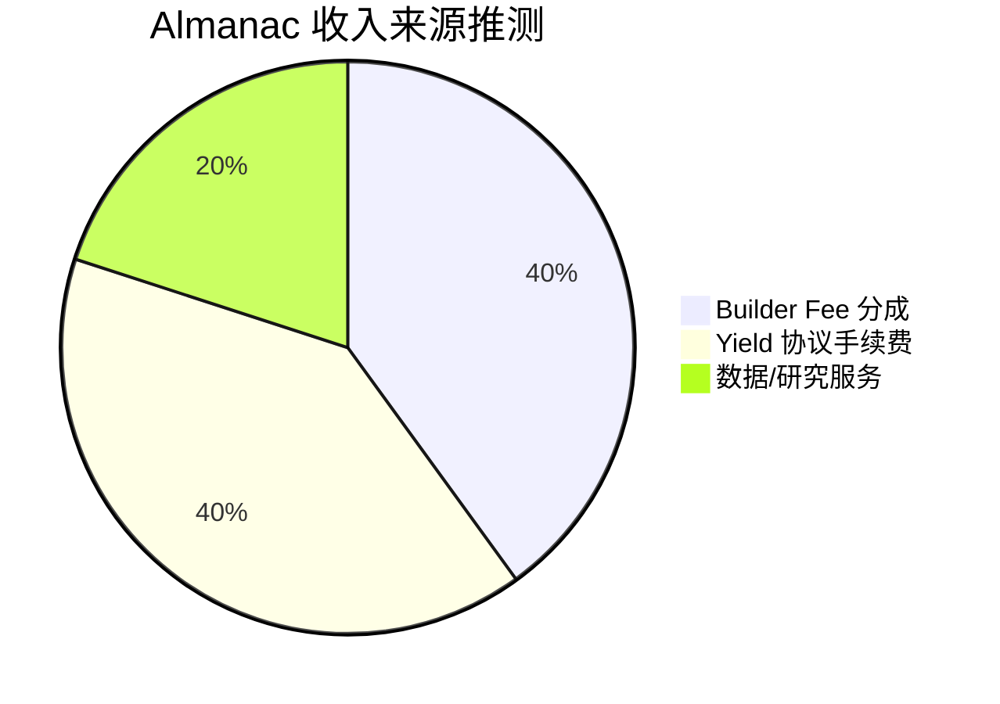

# Almanac Market — 深度分析报告

> 数据日期：2026-03-24  
> Polymarket Builder Program 排名：**#33**  
> 近1月交易量：**$1.02M**

---

## 1. 市场情况

### 1.1 市场定位
Almanac 定位极具创意：**「Accurate Before It's Obvious」（在显而易见之前做到精准）**。核心洞察是：预测市场最终会收敛到正确答案，但这种收敛发生太晚了——在决策者需要的时候，价格仍然不准确。Almanac 的使命是**奖励早期准确预测者，激励市场早期发现真相**。

### 1.2 核心问题定义（实测内容）

平台明确定义了三个问题：
- **PRB-01**：早期价格漂向 50% —— 越早的预测越接近 50/50 硬币抛掷
- **PRB-02**：最大定价错误发生在早期 —— 2025 年研究证实 1.24 亿笔 Polymarket 交易中，早期错误最大
- **PRB-03**：价格依赖型决策 —— 记者、分析师、高管都在引用预测市场价格做决策

### 1.3 解决方案
**对早期提交仓位的交易者路由额外收益（Yield）**，激励他们在信息不明朗时就做出预测。

---

## 2. 业务架构

### 2.1 Yield 路由机制推断

---

## 3. 技术架构

---

## 4. 核心功能与技术壁垒

### 4.1 「激励早期真相发现」的创新
- 这是预测市场机制设计层面的创新，不只是 UI 改进
- 通过经济激励改变用户行为，使市场更早变得准确
- 对引用预测市场数据的决策者（记者/分析师/投资者）有巨大价值

### 4.2 研究支撑
- 引用了对 **1.24 亿笔 Polymarket 交易**的 2025 年研究
- 数据驱动的产品设计，有学术可信度

### 4.3 技术壁垒评估

| 壁垒类型 | 评分(1-10) | 说明 |
|---------|-----------|------|
| 机制创新 | 9 | Yield 路由是原创机制设计 |
| 学术背书 | 7 | 研究数据支撑产品逻辑 |
| 目标用户独特 | 8 | 信息优势者/研究者是独特用户群 |
| 当前规模 | 4 | $1.02M/月，仍处早期 |
| 竞争壁垒 | 7 | 机制可被复制，但先发积累数据 |

---

## 5. 商业模式

### 5.1 收入测算
- 当前：$1.02M × 0.5% ≈ **$5.1k/月** Builder Fee
- Yield 路由机制本身可能收取一定比例的协议费
- 如果 Yield 机制做大，协议费将是主要收入

---

## 6. 待确认问题

- [ ] Yield 路由的具体实现？是链上合约还是链下结算？
- [ ] 「Beta Terminal」在 beta.almanac.market —— 实际功能如何？
- [ ] Yield 的资金来源是什么？（协议自有资金？做市商？）
- [ ] 是否需要锁定仓位一段时间？
- [ ] 团队背景？是否有学术机构合作？
- [ ] 与 Polymarket 的关系：是纯前端还是有独立合约层？

---

## 7. 总结

Almanac 是 Builder 生态中**机制设计最创新**的项目：
1. **洞察深刻**：识别了预测市场「早期不准确」这个真实痛点
2. **机制创新**：通过 Yield 路由激励早期准确预测
3. **价值主张清晰**：对信息优势者和决策者都有价值
4. 当前 $1.02M/月（#33）体量较小，但如果机制验证成功，有极大上升空间
