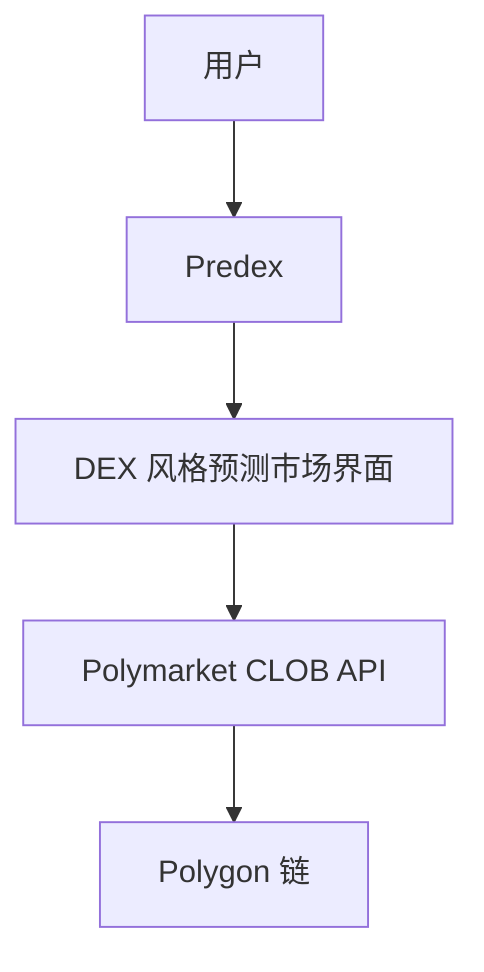
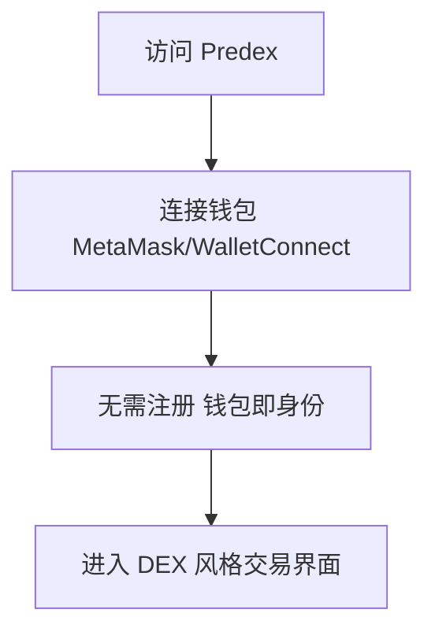
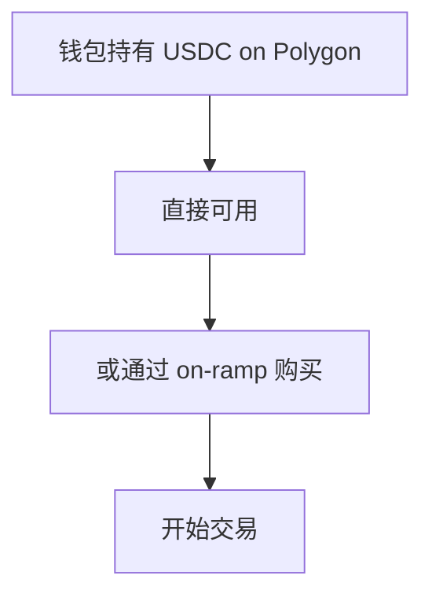
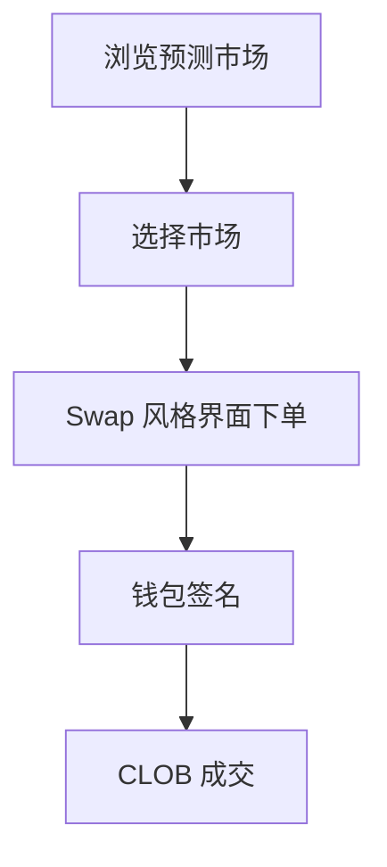
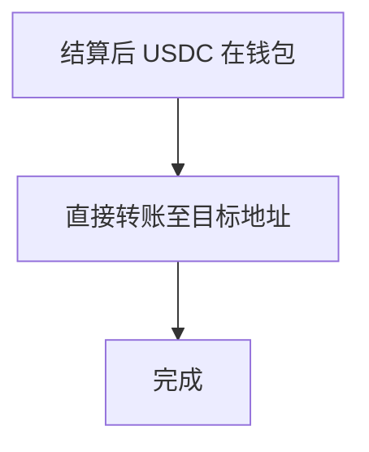
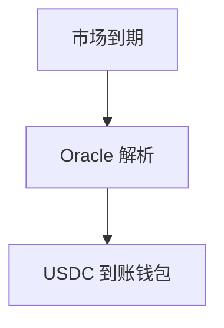

# Predex — 深度分析报告

> 数据日期：2026-03-24  
> Polymarket Builder Program 排名：**#34**  
> 近1月交易量：**$924.2k**  
> 真实 URL：**待确认**

---

## 1. 已确认信息

- Builder Program 排名 **第三十四**，月交易量 **$924.2k**
- 「Predex」= Predict + DEX，暗示**预测市场的去中心化交易所**属性
- 月交易量接近 $1M 门槛

### 1.1 名称含义
- **Pred**ict + **ex**change = 预测市场交易所
- 可能是聚合多个预测市场的 DEX 风格界面
- 或强调去中心化属性的 Polymarket 前端

---

## 2. 推断定位与 UX 路径

### 2.0 用户流程（推断）

#### 2.0.1 注册流程

#### 2.0.2 入金流程

#### 2.0.3 交易流程

#### 2.0.4 提现流程

#### 2.0.5 结算流程

---

## 3. 待确认问题

- [ ] 真实网址
- [ ] DEX 界面风格确认
- [ ] 是否支持多链
- [ ] 团队背景

## 4. 总结

Predex 月交易量 **$924.2k**（#34），名称暗示 DEX 风格预测市场前端。
