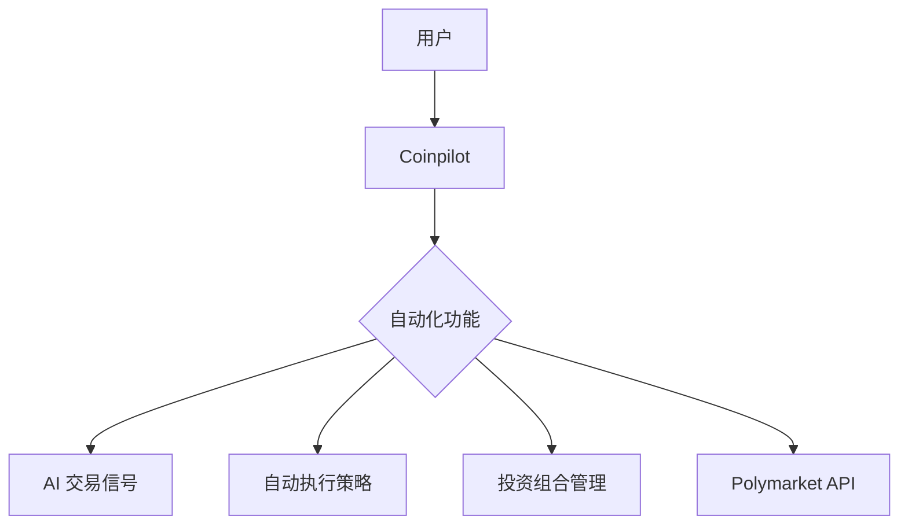
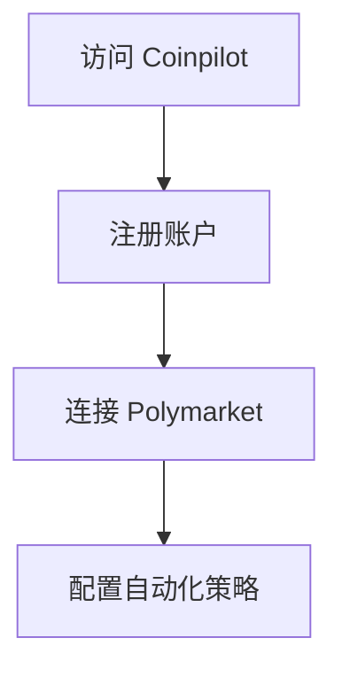
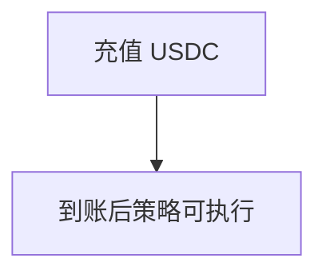
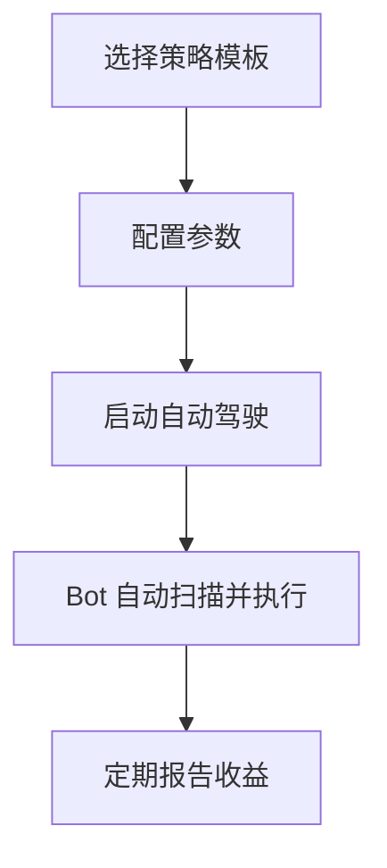
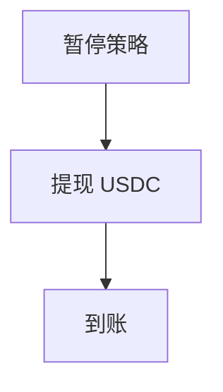
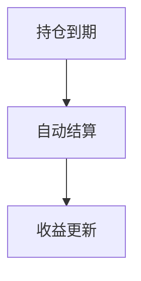

# Coinpilot — 深度分析报告

> 数据日期：2026-03-24  
> Polymarket Builder Program 排名：**#35**  
> 近1月交易量：**$879.4k**  
> 真实 URL：**待确认**

---

## 1. 已确认信息

- Builder Program 排名 **第三十五**，月交易量 **$879.4k**
- 「Coinpilot」= Coin + Pilot（飞行员/驾驶员），暗示**自动驾驶式交易工具**
- 可能是 AI 自动化交易 Bot 或投资组合管理工具

### 1.1 名称含义
- **自动化**：Pilot = 自动驾驶，交易机器人
- **投资组合管理**：驾驶你的加密资产
- **AI 交易助手**：智能飞行员帮你做决策

---

## 2. 推断定位与 UX 路径

### 2.0 用户流程（推断）

#### 2.0.1 注册流程

#### 2.0.2 入金流程

#### 2.0.3 自动化交易流程

#### 2.0.4 提现流程

#### 2.0.5 结算流程

---

## 3. 待确认问题

- [ ] 真实网址
- [ ] 核心功能：AI Bot？信号？投资组合？
- [ ] 团队背景
- [ ] 费率结构

## 4. 总结

Coinpilot 月交易量 **$879.4k**（#35），名称暗示自动化/AI 驾驶式交易工具。
