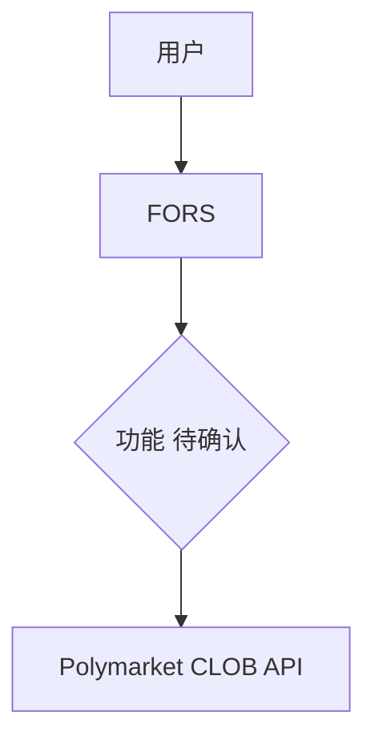
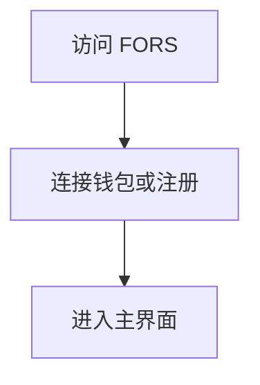
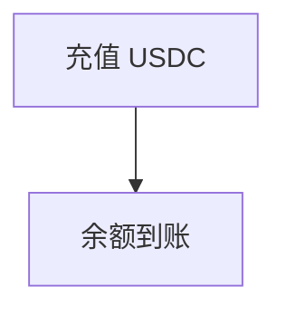
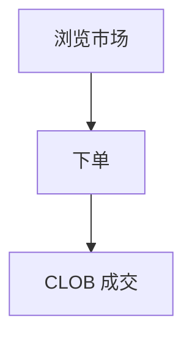
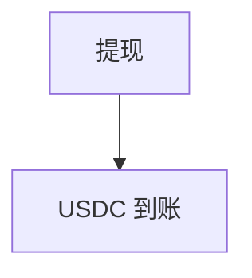
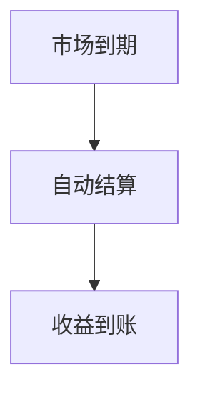

# FORS — 深度分析报告

> 数据日期：2026-03-24  
> Polymarket Builder Program 排名：**#36**  
> 近1月交易量：**$826.3k**  
> 真实 URL：**待确认**

---

## 1. 已确认信息

- Builder Program 排名 **第三十六**，月交易量 **$826.3k**
- 「FORS」可能是缩写或品牌名，含义待确认
- 可能含义：Forecasting / Forward / Force

---

## 2. 推断定位与 UX 路径

### 2.0 用户流程（推断）

#### 2.0.1 注册流程

#### 2.0.2 入金流程

#### 2.0.3 交易流程

#### 2.0.4 提现流程

#### 2.0.5 结算流程

---

## 3. 待确认问题

- [ ] 真实网址
- [ ] FORS 含义和产品定位
- [ ] 团队背景

## 4. 总结

FORS 月交易量 **$826.3k**（#36），具体产品形态待确认。
