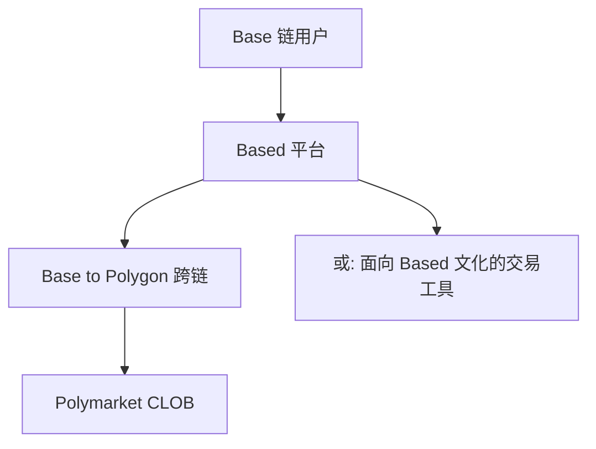
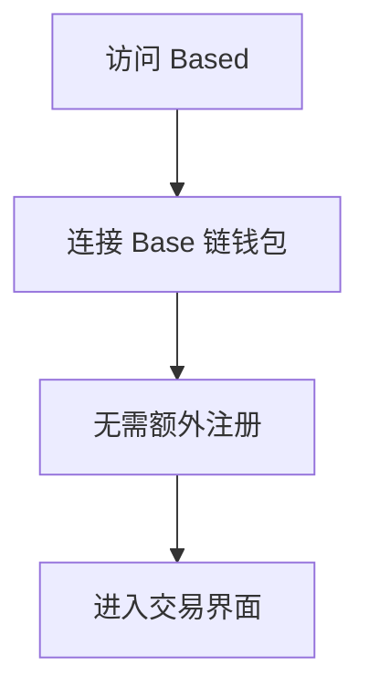
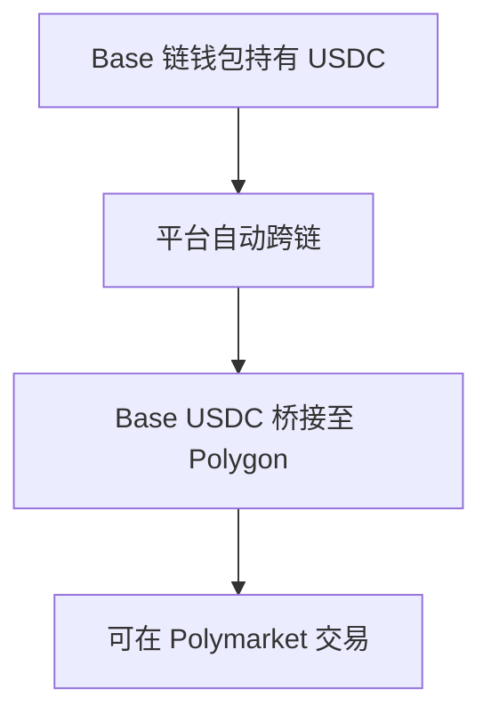
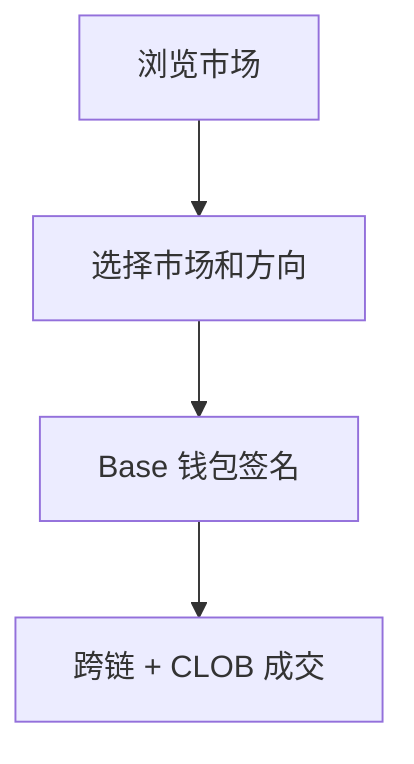
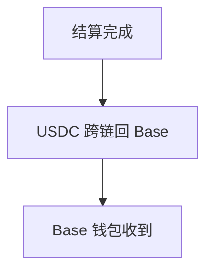
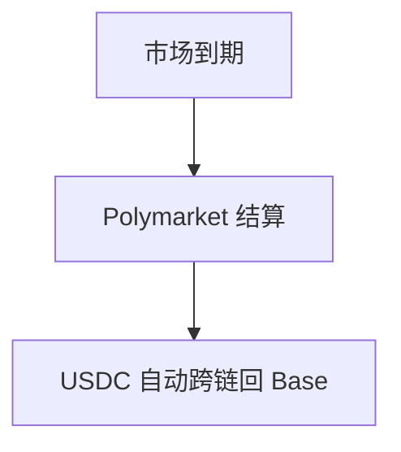

# Based — 深度分析报告

> 数据日期：2026-03-24  
> Polymarket Builder Program 排名：**#37**  
> 近1月交易量：**$799.0k**  
> 真实 URL：**待确认**

---

## 1. 已确认信息

- Builder Program 排名 **第三十七**，月交易量 **$799.0k**
- 「Based」在加密社区中是流行语，含义：
  - **Base 链**：可能是 Base 链上的 Polymarket 前端
  - **Based**（俚语）：酷、不随波逐流、有自己主见
  - **Based AI**：AI 驱动的预测工具

### 1.1 最可能的定位
「Based」强烈暗示与 **Coinbase 的 Base 链**相关，可能是：
- **Base 链用户访问 Polymarket 的桥梁**
- 通过 Base 链入金后跨链到 Polygon 交易 Polymarket
- 类似 Jupiter（Solana）对 Polymarket 的作用

---

## 2. 推断定位

### 2.0 用户流程（推断）

#### 2.0.1 注册流程

#### 2.0.2 入金流程

#### 2.0.3 交易流程

#### 2.0.4 提现流程

#### 2.0.5 结算流程

---

## 3. 待确认问题

- [ ] 真实网址
- [ ] 是否为 Base 链接入 Polymarket 的工具
- [ ] 跨链方案（CCTP/桥）
- [ ] 团队背景

## 4. 总结

Based 月交易量 **$799.0k**（#37），名称强烈暗示 Base 链相关，可能是继 Jupiter（Solana）之后另一个重要的跨链接入案例。
