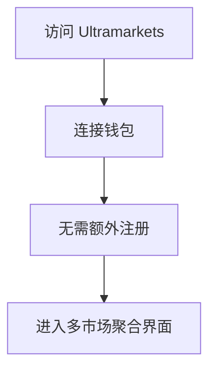
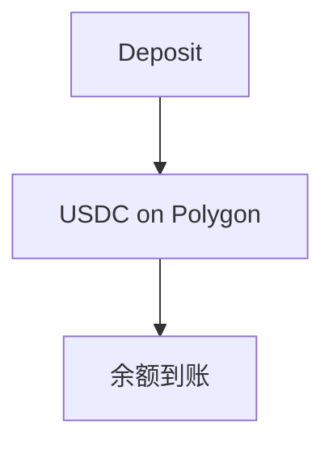
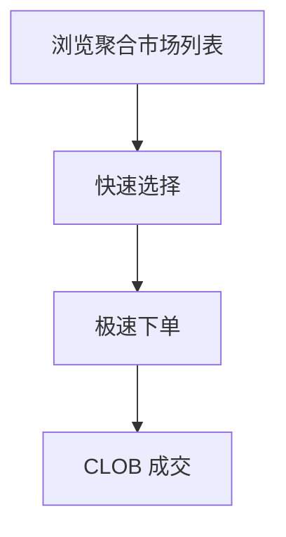
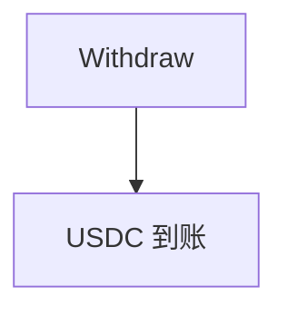
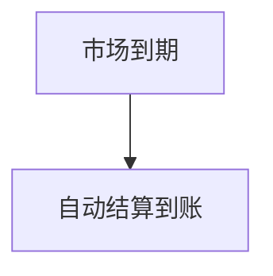

# Ultramarkets — 深度分析报告

> 数据日期：2026-03-24  
> Polymarket Builder Program 排名：**#38**  
> 近1月交易量：**$693.2k**  
> 真实 URL：**待确认**

---

## 1. 已确认信息

- Builder Program 排名 **第三十八**，月交易量 **$693.2k**
- 「Ultramarkets」= Ultra + Markets，暗示**超级市场聚合**或**极致体验**

### 1.1 名称含义
- **Ultra**：极致、超级，暗示功能全面或速度极快
- **Markets**：市场聚合，可能聚合多个预测市场
- 可能定位：高速执行终端 或 多市场聚合平台

---

## 2. 用户流程（推断）

### 2.0 注册、入金、交易、提现全流程

#### 2.0.1 注册流程

#### 2.0.2 入金流程

#### 2.0.3 交易流程

#### 2.0.4 提现流程

#### 2.0.5 结算流程

---

## 3. 待确认问题

- [ ] 真实网址
- [ ] 核心差异化：速度？聚合？
- [ ] 团队背景

## 4. 总结

Ultramarkets 月交易量 **$693.2k**（#38），定位待确认。
