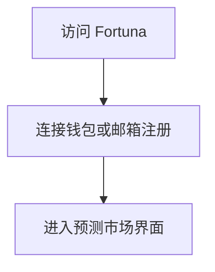
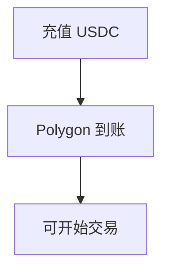
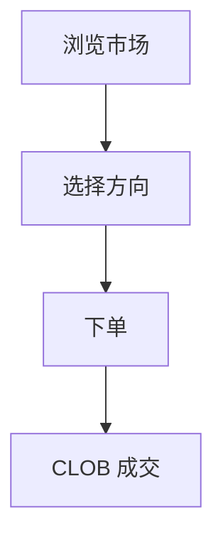
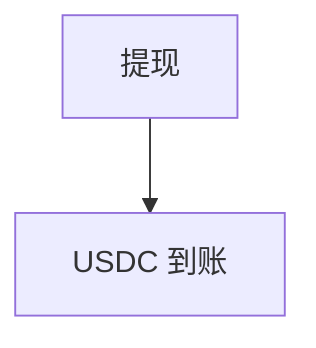
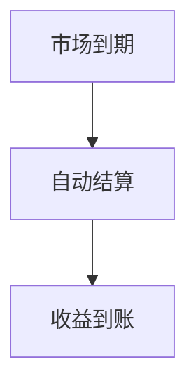

# Fortuna — 深度分析报告

> 数据日期：2026-03-24  
> Polymarket Builder Program 排名：**#39**  
> 近1月交易量：**$617.4k**  
> 真实 URL：**待确认**

---

## 1. 已确认信息

- Builder Program 排名 **第三十九**，月交易量 **$617.4k**
- 「Fortuna」= 罗马命运女神，寓意**运气/财富/命运**
- 在预测市场语境中暗示：命运预测、财富积累工具

---

## 2. 用户流程（推断）

### 2.0 注册、入金、交易、提现全流程

#### 2.0.1 注册流程

#### 2.0.2 入金流程

#### 2.0.3 交易流程

#### 2.0.4 提现流程

#### 2.0.5 结算流程

---

## 3. 待确认问题

- [ ] 真实网址
- [ ] 核心功能定位
- [ ] 是否有代币/激励机制
- [ ] 团队背景

## 4. 总结

Fortuna 月交易量 **$617.4k**（#39），古典神话命名暗示宏大愿景，具体产品待确认。
