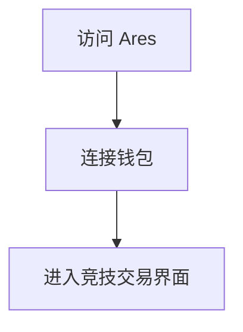
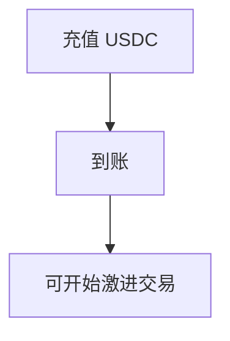
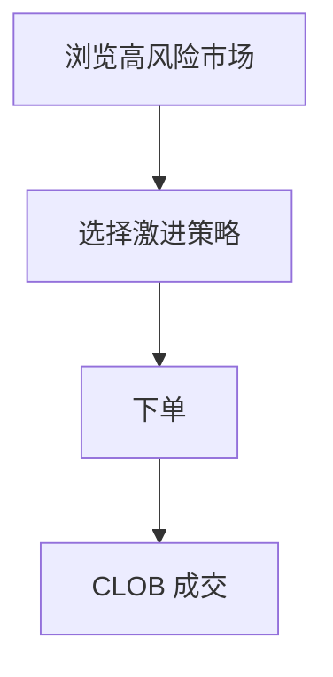
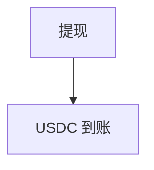
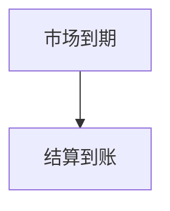

# Ares — 深度分析报告

> 数据日期：2026-03-24  
> Polymarket Builder Program 排名：**#40**  
> 近1月交易量：**$575.0k**  
> 真实 URL：**待确认**

---

## 1. 已确认信息

- Builder Program 排名 **第四十**，月交易量 **$575.0k**
- 「Ares」= 希腊战神，寓意**战斗、竞争、激进策略**
- 可能是激进/高风险交易工具，或竞技性预测平台

---

## 2. 用户流程（推断）

### 2.0 注册、入金、交易、提现全流程

#### 2.0.1 注册流程

#### 2.0.2 入金流程

#### 2.0.3 交易流程

#### 2.0.4 提现流程

#### 2.0.5 结算流程

---

## 3. 待确认问题

- [ ] 真实网址
- [ ] 是否有竞技/PvP 机制
- [ ] 团队背景

## 4. 总结

Ares 月交易量 **$575.0k**（#40），战神命名暗示竞技/激进风格，具体产品待确认。
