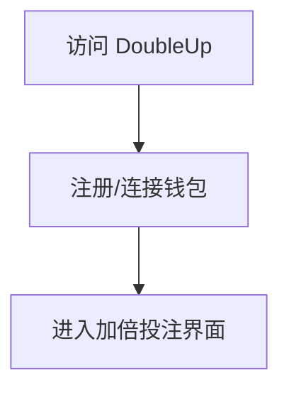
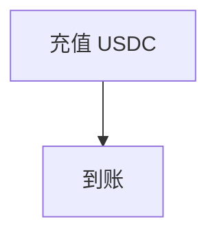
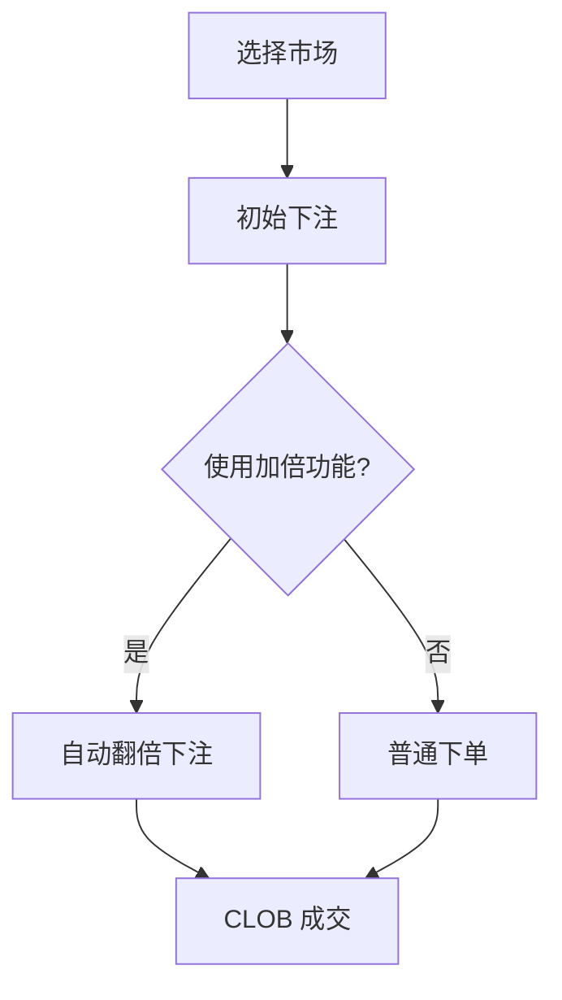
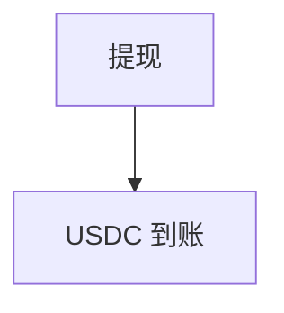
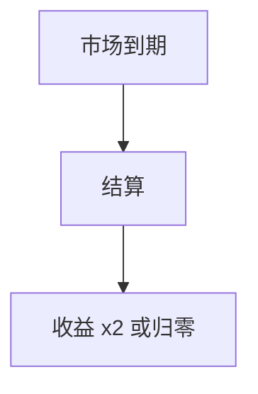

# DoubleUp — 深度分析报告

> 数据日期：2026-03-24  
> Polymarket Builder Program 排名：**#41**  
> 近1月交易量：**$570.9k**  
> 真实 URL：**待确认**

---

## 1. 已确认信息

- Builder Program 排名 **第四十一**，月交易量 **$570.9k**
- 「DoubleUp」= 加倍下注，博彩术语
- 可能是**加倍/组合投注工具**，或**跟注放大**功能

---

## 2. 用户流程（推断）

### 2.0 注册、入金、交易、提现全流程

#### 2.0.1 注册流程

#### 2.0.2 入金流程

#### 2.0.3 加倍投注流程

#### 2.0.4 提现流程

#### 2.0.5 结算流程

---

## 3. 待确认问题

- [ ] 真实网址
- [ ] 加倍机制具体实现
- [ ] 是否有组合投注 Parlay 功能
- [ ] 团队背景

## 4. 总结

DoubleUp 月交易量 **$570.9k**（#41），加倍投注定位独特，面向风险偏好较高的用户。
