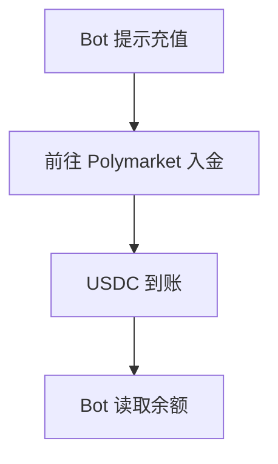
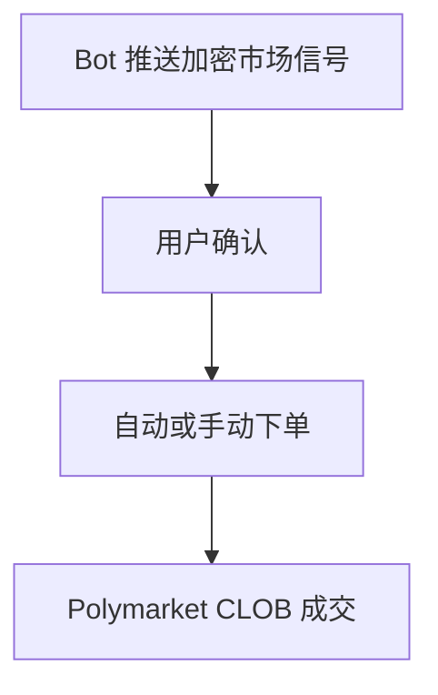
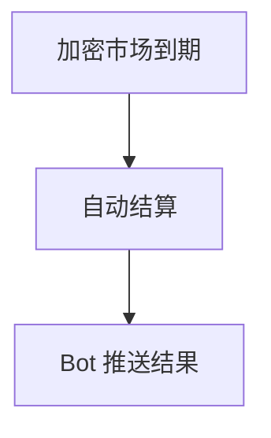

# PolyCrypto Bot — 深度分析报告

> 数据日期：2026-03-24  
> Polymarket Builder Program 排名：**#42**  
> 近1月交易量：**$520.4k**

---

## 1. 概况

- 排名 **#42**，月交易量 **$520.4k**
- 名称直白：Polymarket + Crypto + Bot = **加密货币市场专属 Bot**
- 可能专注于**加密货币类预测市场**（BTC/ETH 价格、链上事件等）

---

## 2. 用户流程（推断）

### 2.0 核心 UX 路径

#### 2.0.1 注册流程

```mermaid
flowchart TD
    A[在 Telegram/Discord 搜索 PolyCrypto Bot] --> B[/start 启动]
    B --> C[绑定 Polymarket 账户]
    C --> D[配置加密货币市场关注列表]
```

#### 2.0.2 入金流程



#### 2.0.3 交易流程



#### 2.0.4 提现流程

```mermaid
flowchart TD
    A[/withdraw 指令] --> B[USDC 到账]
```

#### 2.0.5 结算流程



---

## 3. 待确认问题

- [ ] 平台（Telegram/Discord/Web）
- [ ] 专注哪些加密货币市场类型
- [ ] 团队背景

## 4. 总结

PolyCrypto Bot 月交易量 **$520.4k**（#42），专注加密货币预测市场的 Bot 工具。
