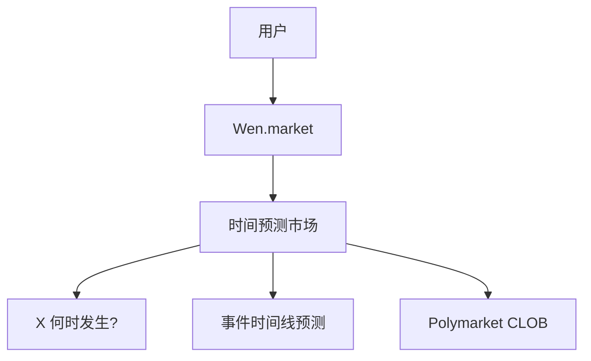
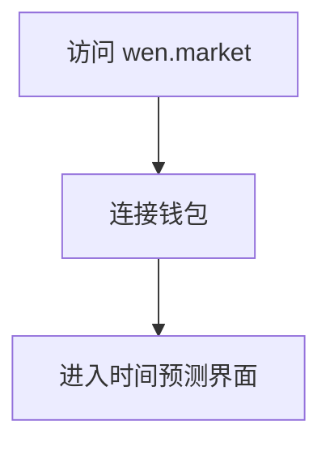
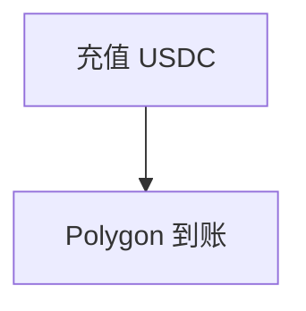
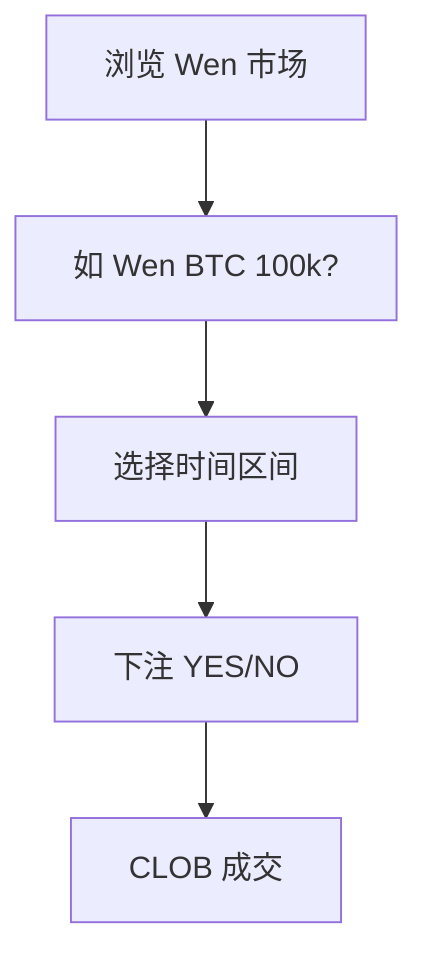
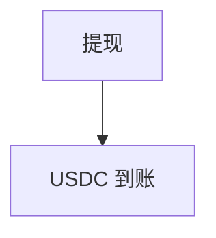
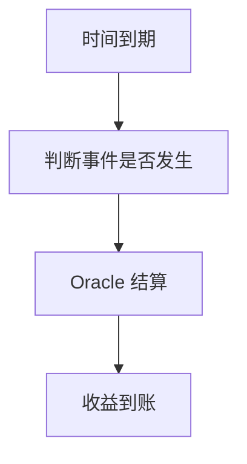

# Wen.market — 深度分析报告

> 数据日期：2026-03-24  
> Polymarket Builder Program 排名：**#43**  
> 近1月交易量：**$495.1k**

---

## 1. 概况

- 排名 **#43**，月交易量 **$495.1k**
- 「Wen」= 加密社区流行语，询问「什么时候？」（When？）
- 可能专注于**时间类预测市场**：「X 何时发生？」
- 示例：「BTC 何时突破 $100k？」「ETH 合并何时完成？」

---

## 2. 推断定位

---

## 3. 用户流程（推断）

### 2.0 核心 UX 路径

#### 2.0.1 注册流程

#### 2.0.2 入金流程

#### 2.0.3 时间预测交易流程

#### 2.0.4 提现流程

#### 2.0.5 结算流程

---

## 3. 待确认问题

- [ ] wen.market 实际内容
- [ ] 是否专注时间类预测
- [ ] 团队背景

## 4. 总结

Wen.market 月交易量 **$495.1k**（#43），「Wen」语义暗示时间预测专属平台，在加密社区有文化共鸣。
