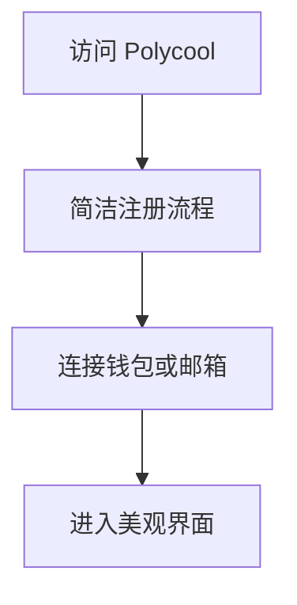
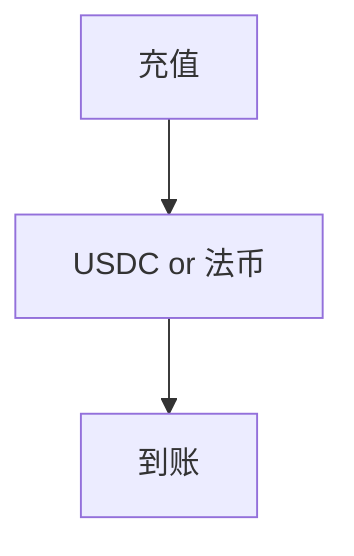
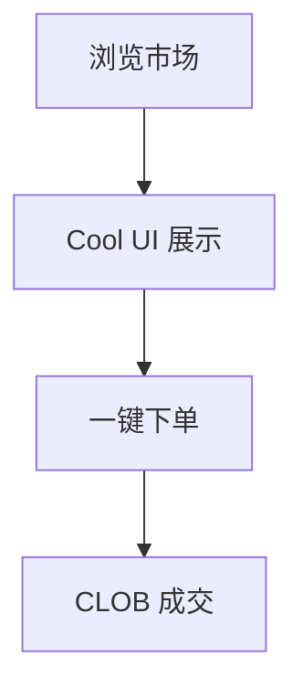
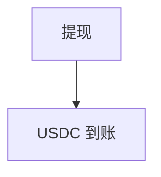
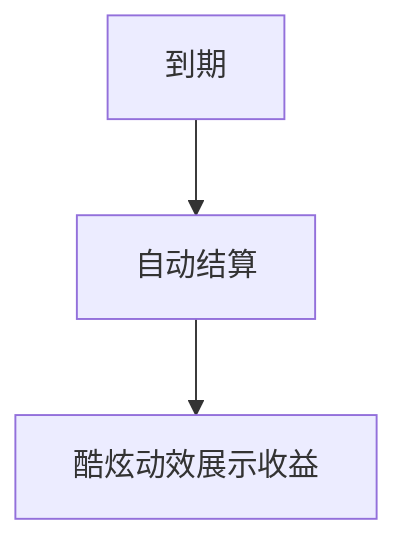

# Polycool — 深度分析报告

> 数据日期：2026-03-24  
> Polymarket Builder Program 排名：**#44**  
> 近1月交易量：**$477.0k**

---

## 1. 概况

- 排名 **#44**，月交易量 **$477.0k**
- 「Polycool」= Polymarket + Cool，品牌调性轻松有趣
- 可能面向年轻用户、注重 UI/UX 体验的交易终端

---

## 2. 用户流程（推断）

### 2.0 核心 UX 路径

#### 2.0.1 注册流程

#### 2.0.2 入金流程

#### 2.0.3 交易流程

#### 2.0.4 提现流程

#### 2.0.5 结算流程

---

## 3. 待确认问题

- [ ] 真实网址
- [ ] UI 风格特点
- [ ] 目标用户（年轻用户？NFT 社区？）
- [ ] 团队背景

## 4. 总结

Polycool 月交易量 **$477.0k**（#44），品牌调性轻松，可能是注重设计感的 Polymarket 前端。
