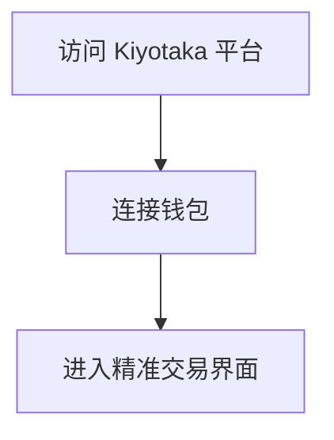
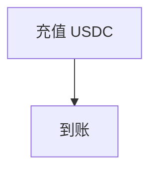
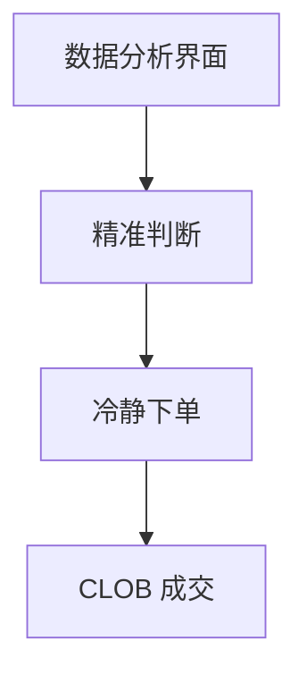
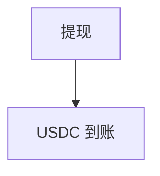
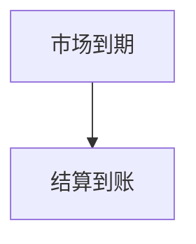

# Kiyotaka — 深度分析报告

> 数据日期：2026-03-24  
> Polymarket Builder Program 排名：**#45**  
> 近1月交易量：**$468.1k**

---

## 1. 概况

- 排名 **#45**，月交易量 **$468.1k**
- 「Kiyotaka」= 日文名字（清高），可能是团队成员名字或动漫角色
- 著名动漫角色：《Classroom of the Elite》中的 Ayanokoji Kiyotaka，以冷静计算著称
- 产品调性可能：**冷静数据驱动、精确计算的交易工具**

---

## 2. 用户流程（推断）

### 2.0 核心 UX 路径

#### 2.0.1 注册流程

#### 2.0.2 入金流程

#### 2.0.3 交易流程

#### 2.0.4 提现流程

#### 2.0.5 结算流程

---

## 3. 待确认问题

- [ ] 真实网址
- [ ] 与动漫文化的实际关联
- [ ] 核心功能定位
- [ ] 团队背景（是否为日本团队）

## 4. 总结

Kiyotaka 月交易量 **$468.1k**（#45），独特的日文命名在加密社区中有文化辨识度。
