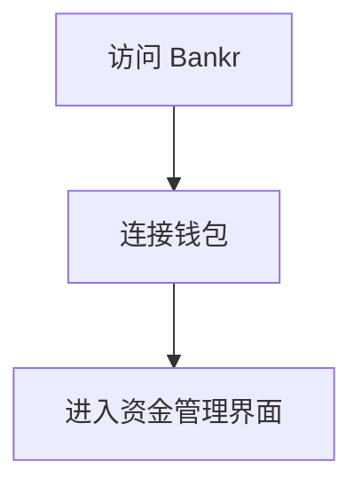
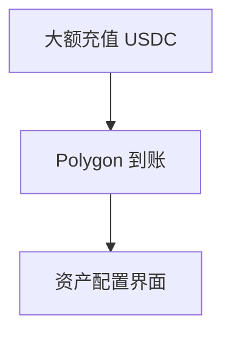
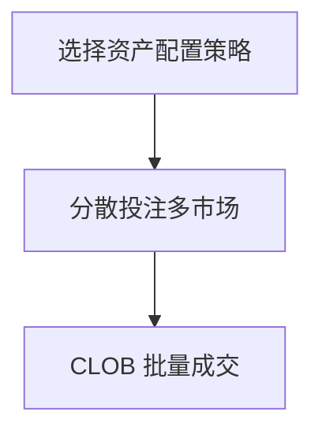
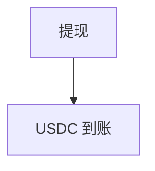
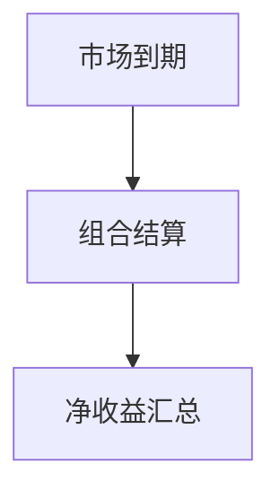

# Bankr — 深度分析报告

> 数据日期：2026-03-24  
> Polymarket Builder Program 排名：**#46**  
> 近1月交易量：**$464.9k**

---

## 1. 概况

- 排名 **#46**，月交易量 **$464.9k**
- 「Bankr」= Banker（银行家）的赛博朋克缩写
- 可能定位：**机构/大资金交易工具**，或 **AI 银行家式资产管理**
- 也可能是「Bankrupt」的幽默命名（高风险玩法）

---

## 2. 用户流程（推断）

### 2.0 核心 UX 路径

#### 2.0.1 注册流程

#### 2.0.2 入金流程

#### 2.0.3 交易流程

#### 2.0.4 提现流程

#### 2.0.5 结算流程

---

## 3. 待确认问题

- [ ] 真实网址
- [ ] 目标用户：机构还是散户
- [ ] 是否有批量下单/组合管理功能
- [ ] 团队背景

## 4. 总结

Bankr 月交易量 **$464.9k**（#46），银行家定位暗示面向大资金用户的专业工具。
