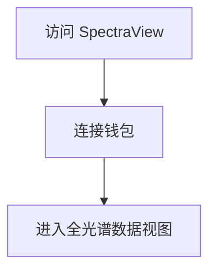
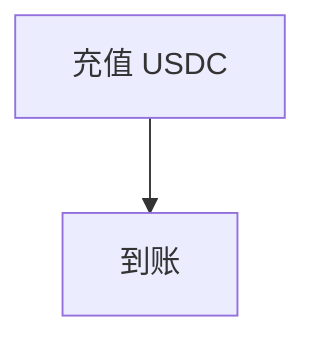
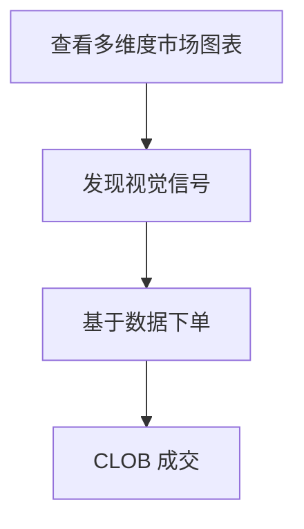
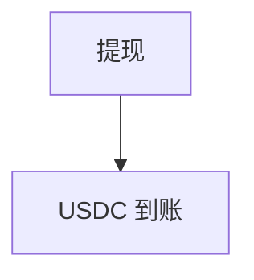
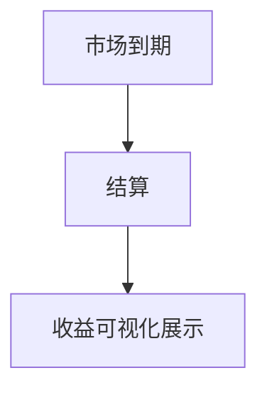

# SpectraView — 深度分析报告

> 数据日期：2026-03-24  
> Polymarket Builder Program 排名：**#47**  
> 近1月交易量：**$444.1k**

---

## 1. 概况

- 排名 **#47**，月交易量 **$444.1k**
- 「SpectraView」= Spectra（光谱）+ View（视图）
- 暗示：**全光谱数据可视化**，多维度市场视角
- 可能是**高级数据可视化分析工具**

---

## 2. 用户流程（推断）

### 2.0 核心 UX 路径

#### 2.0.1 注册流程

#### 2.0.2 入金流程

#### 2.0.3 数据可视化交易流程

#### 2.0.4 提现流程

#### 2.0.5 结算流程

---

## 3. 待确认问题

- [ ] 真实网址
- [ ] 可视化功能的具体形式
- [ ] 是否支持自定义图表
- [ ] 团队背景

## 4. 总结

SpectraView 月交易量 **$444.1k**（#47），光谱命名暗示全面的数据可视化工具。
